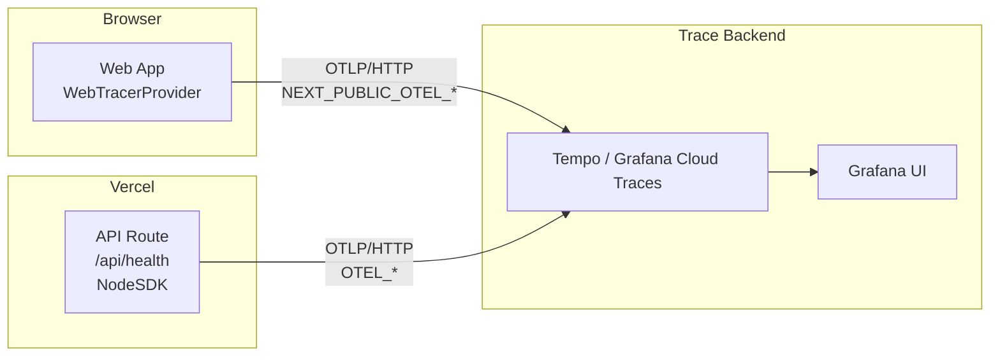

# OpenTelemetry × Grafana デプロイガイド

obsidian-replica（Next.js 15.5）に仕込まれた OpenTelemetry 計装を、
Grafana Cloud（無料枠）または自前 Grafana + Tempo にぶら下げて
監視できる状態にするまでの手順書。

> 関連ドキュメント：
> - 通常デプロイ手順は [`VERCEL_DEPLOYMENT.md`](./VERCEL_DEPLOYMENT.md)
> - 本ドキュメントは「OTel を有効化して可観測性を立ち上げる」専用

---

## 1. 概要

このアプリでは以下を OTel で計装している：

- **クライアント (RUM)** — ブラウザで動く Web SDK
  - Document Load / Fetch / User Interaction の自動計装
  - Web Vitals (CLS / LCP / INP / TTFB / FCP) を Span として送出
  - `window.error` / `unhandledrejection` を Span exception として捕捉
- **サーバー (API)** — Next.js Node ランタイムで動く `@vercel/otel`
  - HTTP / fetch の自動計装（Vercel 公式の Next.js OTel ラッパー）
  - `/api/health` を含む API Route のリクエストごとに Span 生成
  - 明示的な Span（`GET /api/health` 等）も追加

> **なぜ `@vercel/otel`？** 当初は `@opentelemetry/sdk-node` を使ったが、
> NodeSDK が gRPC 系 exporter を transitively に取り込み、Next.js 15 の
> webpack で edge runtime 向け bundling に失敗する。`@vercel/otel` は
> HTTP-only exporter のみで Next.js の instrumentation hook と一緒に動くよう
> 設計されているため、複雑な webpack 設定なしで動く。

OTel エンドポイント環境変数が **未設定なら何も起動しない**（壊れない）設計。

---

## 2. アーキテクチャ



クライアントとサーバーは**別 service.name**（`obsidian-replica` / `obsidian-replica-api`）で送られるが、
fetch propagation 経由でトレースが繋がる（`/api/*` 宛のみ trace context を伝播する設定）。

---

## 3. 環境変数

| 変数名 | 必須 | スコープ | 用途 | 例 |
| --- | :---: | :---: | --- | --- |
| `NEXT_PUBLIC_OTEL_EXPORTER_OTLP_TRACES_ENDPOINT` | ◯ (client) | client | ブラウザからの OTLP/HTTP 送信先 | `https://otlp-gateway-prod-us-east-0.grafana.net/otlp/v1/traces` |
| `NEXT_PUBLIC_OTEL_EXPORTER_OTLP_HEADERS` | △ | client | 認証ヘッダ。`key=val,key2=val2` 形式 | `Authorization=Basic xxxxx` |
| `NEXT_PUBLIC_OTEL_SERVICE_NAME` | ✕ | client | デフォルト `obsidian-replica` | `obsidian-replica-staging` |
| `NEXT_PUBLIC_APP_VERSION` | ✕ | client | リソース属性 `service.version` | `1.2.3` |
| `OTEL_EXPORTER_OTLP_TRACES_ENDPOINT` | ◯ (server) | server | API Route → OTel Backend | `https://otlp-gateway-prod-us-east-0.grafana.net/otlp/v1/traces` |
| `OTEL_EXPORTER_OTLP_HEADERS` | △ | server | 認証ヘッダ | `Authorization=Basic xxxxx` |
| `OTEL_SERVICE_NAME` | ✕ | server | デフォルト `obsidian-replica-api` | `obsidian-replica-api-staging` |

> **未設定なら OTel は起動しない** — `*_TRACES_ENDPOINT` がなければ SDK ごと
> 初期化スキップ。完全に従来動作。

### ⚠️ セキュリティ警告（最重要）

`NEXT_PUBLIC_*` で始まる変数は **client bundle に埋め込まれて公開**される。
DevTools の Sources タブから誰でも読める。Grafana Cloud の通常 API Token を
ここに入れると **書き込み・読み込み権限ごと公開**してしまう。

**必ず "send-only" / "write-only" のトークンを発行**：

- **Grafana Cloud**：Settings → API keys → **scope: `traces:write` のみ** で発行
- **自前 OTel Collector**：Collector の前に「書き込みのみ許可」する Reverse Proxy
  または Collector 自身の auth extension で書き込み専用トークンを発行
- **CORS**：書き込み専用エンドポイントが `Origin: https://your-vercel-domain` を
  Allow するように設定

サーバー側 (`OTEL_*`) はブラウザに露出しないので通常 token で OK。

---

## 4. Grafana Cloud 無料枠でのセットアップ

> 50GB Traces / 14日保管 / クレカ不要 でスタート可。

### 4-a. アカウント作成

1. https://grafana.com/auth/sign-up/create-user で無料サインアップ
2. **Stack** が自動で1つ作られる（例：`yourname.grafana.net`）

### 4-b. OTLP エンドポイントとトークン取得

1. Stack の左サイドバー → **Connections** → **Add new connection**
2. **OpenTelemetry (OTLP)** を検索して選択
3. 表示される **OTLP Endpoint** 例：
   `https://otlp-gateway-prod-us-east-0.grafana.net/otlp`
   - traces 用 URL は `${OTLP_ENDPOINT}/v1/traces`
4. **Generate API Token** で：
   - **Name**：`obsidian-replica-traces-write`
   - **Scopes**：`traces:write` **のみ**チェック
   - 他のスコープは絶対つけない（クライアント側に晒すため）
5. 表示される `Authorization: Basic <base64(instanceID:token)>` を控える
   - Grafana Cloud の OTLP は HTTP Basic 認証
   - `<instanceID>` は Stack 詳細ページに表示される数字

### 4-c. Vercel に環境変数を設定

Vercel ダッシュボード → Project → **Settings** → **Environment Variables**

| Variable | Value | Environment |
| --- | --- | --- |
| `NEXT_PUBLIC_OTEL_EXPORTER_OTLP_TRACES_ENDPOINT` | `https://otlp-gateway-prod-us-east-0.grafana.net/otlp/v1/traces` | Production / Preview |
| `NEXT_PUBLIC_OTEL_EXPORTER_OTLP_HEADERS` | `Authorization=Basic <base64>` | Production / Preview |
| `OTEL_EXPORTER_OTLP_TRACES_ENDPOINT` | 同上（サーバー側も同じ宛先で OK） | Production / Preview |
| `OTEL_EXPORTER_OTLP_HEADERS` | 同上 | Production / Preview |

**Development** は付けない方が安全（ローカル dev では Console 出力のみで十分）。

### 4-d. CORS 確認

Grafana Cloud の OTLP gateway は `Origin: *` を許容済み（公式に動作確認済み）。
追加設定は不要。

---

## 5. 自前 Tempo + Grafana の docker-compose 代替

Grafana Cloud に依存せず手元で確認したいときの最小構成。

`docker-compose.otel.yml`：

```yaml
version: "3.9"
services:
  tempo:
    image: grafana/tempo:latest
    command: ["-config.file=/etc/tempo.yaml"]
    volumes:
      - ./tempo.yaml:/etc/tempo.yaml
    ports:
      - "4318:4318"   # OTLP/HTTP
      - "3200:3200"   # Tempo HTTP API

  otel-collector:
    image: otel/opentelemetry-collector-contrib:latest
    command: ["--config=/etc/otel-collector.yaml"]
    volumes:
      - ./otel-collector.yaml:/etc/otel-collector.yaml
    ports:
      - "4319:4318"   # OTLP/HTTP for browser (with CORS)
    depends_on: [tempo]

  grafana:
    image: grafana/grafana:latest
    environment:
      - GF_AUTH_ANONYMOUS_ENABLED=true
      - GF_AUTH_ANONYMOUS_ORG_ROLE=Admin
    ports:
      - "3001:3000"
    depends_on: [tempo]
```

`otel-collector.yaml`（CORS 付きで browser 受け）：

```yaml
receivers:
  otlp:
    protocols:
      http:
        endpoint: 0.0.0.0:4318
        cors:
          allowed_origins: ["http://localhost:3000"]
          allowed_headers: ["*"]
exporters:
  otlp:
    endpoint: tempo:4317
    tls: { insecure: true }
service:
  pipelines:
    traces:
      receivers: [otlp]
      exporters: [otlp]
```

`tempo.yaml`（最小）：

```yaml
server: { http_listen_port: 3200 }
distributor:
  receivers:
    otlp:
      protocols:
        http: { endpoint: 0.0.0.0:4318 }
storage:
  trace:
    backend: local
    local: { path: /tmp/tempo/blocks }
    wal: { path: /tmp/tempo/wal }
```

起動：

```bash
docker compose -f docker-compose.otel.yml up -d
# .env.local に
echo 'NEXT_PUBLIC_OTEL_EXPORTER_OTLP_TRACES_ENDPOINT=http://localhost:4319/v1/traces' >> .env.local
echo 'OTEL_EXPORTER_OTLP_TRACES_ENDPOINT=http://localhost:4319/v1/traces' >> .env.local
npm run dev
# Grafana: http://localhost:3001 → Add Tempo data source → URL: http://tempo:3200
```

---

## 6. Vercel デプロイ手順

1. [`VERCEL_DEPLOYMENT.md`](./VERCEL_DEPLOYMENT.md) §1〜§3 を完了
2. §4（環境変数）に上記の `NEXT_PUBLIC_OTEL_*` / `OTEL_*` を Production / Preview に設定
3. **Save** → **Redeploy** で env 反映
4. 反映ターゲット：
   - **Production**：本番ユーザの RUM
   - **Preview**：PR ごとの可観測性（オプション）
   - **Development**：通常は OFF（ローカル `.env.local` で個別管理）

---

## 7. 動作確認

### ローカル（dev）

```bash
# OTel エンドポイント未設定 → 何も起こらない（既存と同じ）
npm run dev

# Console 出力だけで動作確認したい場合
# .env.local
NEXT_PUBLIC_OTEL_EXPORTER_OTLP_TRACES_ENDPOINT=http://localhost:4318/v1/traces
OTEL_EXPORTER_OTLP_TRACES_ENDPOINT=http://localhost:4318/v1/traces

npm run dev
# 別シェルで
curl http://localhost:3000/api/health
# → サーバー側 NodeSDK が span を生成 → エクスポート失敗するが Console には出る
# ブラウザで http://localhost:3000/ を開く → DevTools console に span 出力
```

### 本番

1. Vercel デプロイ完了後、サイトをブラウザで開く
2. 数十秒待つ（BatchSpanProcessor の flush 周期）
3. Grafana → **Explore** → Data source: **Traces** (Tempo)
4. **Search** タブで以下が見えれば成功：
   - Service: `obsidian-replica`（クライアント）
   - Service: `obsidian-replica-api`（API）
   - Span name: `documentLoad`, `web-vital LCP`, `GET /api/health` 等
5. `curl https://your-domain.vercel.app/api/health` を叩いて、
   サーバー側 trace が出ることも確認

---

## 8. 推奨ダッシュボード

Grafana → **Dashboards** → **New** → **Add visualization**

| パネル | データソース | クエリ例 |
| --- | --- | --- |
| **LCP p75** | Tempo (TraceQL) | `{ name="web-vital LCP" } \| quantile_over_time(.web_vital.value, 0.75)` |
| **CLS p75** | Tempo | `{ name="web-vital CLS" } \| quantile_over_time(.web_vital.value, 0.75)` |
| **INP p75** | Tempo | `{ name="web-vital INP" } \| quantile_over_time(.web_vital.value, 0.75)` |
| **API レイテンシ p95** | Tempo | `{ resource.service.name="obsidian-replica-api" } \| quantile_over_time(duration, 0.95)` |
| **API エラー率** | Tempo | `{ resource.service.name="obsidian-replica-api" && status=error } \| rate()` |
| **JS エラー数** | Tempo | `{ name="window.error" \|\| name="unhandledrejection" } \| rate()` |

Grafana Cloud の場合は **Application Observability** プラグインがあれば
RED メトリクス（Rate / Errors / Duration）が自動で出る。

---

## 9. コスト考察

| Backend | 無料枠 | 超過時 |
| --- | --- | --- |
| Grafana Cloud | 50 GB traces/月、14日保管 | $0.50/GB |
| Self-host (docker) | 機材費のみ | ストレージ次第 |

obsidian-replica の規模（個人運用、月数百〜数千 PV 想定）であれば
**Grafana Cloud 無料枠で完全に収まる**。

トラフィック増加時の節約策：
- `BatchSpanProcessor` の `maxQueueSize` を下げる
- Web Vitals を全数 → サンプリング（`onCLS({ reportAllChanges: false })` 等）
- API 側で `parentBased` sampler に切り替え（10%サンプリング等）

---

## 10. トラブルシューティング

| 症状 | 原因 | 対処 |
| --- | --- | --- |
| Grafana に何も出ない | env 未設定 | Vercel の env を確認、再デプロイ |
| ブラウザ console に CORS エラー | OTLP エンドポイントが Origin を許可していない | Grafana Cloud は許可済み。自前 collector は `cors.allowed_origins` を設定 |
| 認証 401 | token スコープが `traces:write` でない / Basic 認証の base64 形式ミス | Grafana Cloud で再発行、`echo -n "instanceID:token" \| base64` で再生成 |
| サーバー span が出ない | API Route が edge runtime で動いている | `route.ts` 冒頭に `export const runtime = "nodejs"` を追加（`/api/health` は対応済み） |
| ページ離脱直後の span が消える | flush 前に unload | `BatchSpanProcessor` を `SimpleSpanProcessor` 併用、または `onvisibilitychange` で `forceFlush()` 呼ぶ |
| 本番だけ JS エラー `process is not defined` | クライアントで `process.env.NODE_ENV` 以外を読んでる | `NEXT_PUBLIC_*` 経由で読む（既に対応済み） |
| `next build` で `@opentelemetry/sdk-node` が edge bundling エラー | Webpack が edge runtime に node モジュールを巻き込んだ | `next.config.ts` の `serverExternalPackages` で除外（既に対応済み） |

### dev 中の Console span 確認

`NODE_ENV=development` 時は `SimpleSpanProcessor + ConsoleSpanExporter` が
追加されるので、ブラウザの DevTools Console に span オブジェクトが出る：

```
{
  traceId: '...',
  parentId: '...',
  name: 'documentLoad',
  ...
}
```

サーバー側 (`/api/health`) は **Next.js のターミナル**に span が出る
（NodeSDK は OTLP exporter のみ。Console exporter を入れたい場合は
`src/instrumentation.ts` に追加）。

---

## 11. 将来拡張

- **Sentry 移行/併用**：エラー詳細＆ソースマップが必要なら Sentry を別途導入。
  OTel と並行運用も可能（重複データに注意）。
- **Metrics 追加**：`@opentelemetry/sdk-metrics` + `@opentelemetry/exporter-metrics-otlp-http`
  で counter/histogram を追加。Grafana Cloud Metrics（Prometheus 互換）にも送れる。
- **Logs 追加**：`@opentelemetry/sdk-logs` + Loki exporter。Vercel Build Logs を
  Loki に転送するのは別途 Vercel Log Drains 経由で。
- **Frontend Faro**：Grafana の RUM 専用 SDK `@grafana/faro-web-sdk`。本ガイドは
  ベンダーロックインを避けるため OTel 直接を採用。Faro に切り替えるなら
  `instrumentation-client.ts` を差し替えるだけ。
- **Sampling**：トラフィック増加に備えて `parentBased` + `traceIdRatioBased(0.1)` 等の
  sampler を NodeSDK / WebTracerProvider のコンストラクタ引数に追加。
- **Custom spans**：API 内部で外部 API を叩く処理ごとに `tracer.startActiveSpan(...)`
  でラップして可視化粒度を上げる。

---

最終更新日: 2026-05-05
