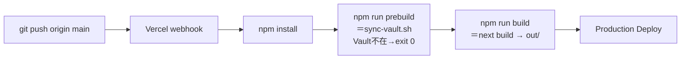
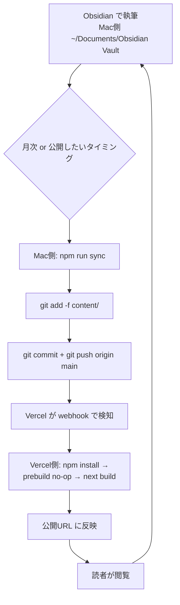

# Vercel デプロイガイド

このドキュメントは `baisonhero/obsidian-replica`（Next.js 15 / static export）を
Vercel に公開するために必要な手順をまとめたものです。

> 想定リーダー：このリポジトリを `git clone` した後、自分の Vercel アカウントで
> 本番デプロイしたい人。Mac 側でやる作業と Vercel 側でやる作業を明示的に分けています。

---

## 1. 前提

| 項目 | 内容 |
| --- | --- |
| フレームワーク | Next.js 15 (App Router) |
| 出力形態 | `output: "export"`（静的サイト、`out/` 配下） |
| Node バージョン | 20.x（Vercel デフォルトでOK） |
| パッケージマネージャ | npm（`package-lock.json` 同梱） |
| コンテンツソース | `content/`（Obsidian Vault からの同期成果物） |

ローカルで動作確認してから Vercel に上げる流れを推奨します。

```bash
# Mac側
npm install
npm run sync     # ~/Documents/Obsidian Vault → content/
npm run build    # out/ が生成される
```

---

## 2. Vercel にプロジェクトを import する

### 2-a. Web UI で import（推奨：初回はこちら）

1. https://vercel.com/new を開く
2. **Import Git Repository** で `baisonhero/obsidian-replica` を選択
3. **Framework Preset**：自動で `Next.js` が選ばれることを確認
4. 後述の **Build & Output Settings** はデフォルトでOK（Next.js プリセットが
   `next build` と `.next/` を選ぶが、`output: "export"` のおかげで
   実体として `out/` が静的配信される）
5. **Deploy** を押す

### 2-b. Vercel CLI で import

```bash
# Mac側
npm i -g vercel
cd /path/to/obsidian-replica
vercel login
vercel link            # 既存プロジェクトに紐付け or 新規作成
vercel --prod          # 本番デプロイ
```

`vercel link` の対話で「Set up and deploy?」→ Yes、「Which scope?」→ 自分のチーム、
「Link to existing project?」→ N、「Project name?」→ `obsidian-replica` を選択する。

---

## 3. Build & Output Settings

Vercel ダッシュボード → Project → **Settings** → **Build & Development Settings**

| 設定項目 | 値 |
| --- | --- |
| Framework Preset | `Next.js` |
| Build Command | `npm run build`（既定でOK） |
| Output Directory | （空欄＝Vercel に Next.js として委譲。`output: "export"` なので実際は `out/` を配信） |
| Install Command | `npm install`（既定でOK） |
| Root Directory | `./`（リポジトリ直下） |
| Node.js Version | 20.x |

> **注意**：`Output Directory` を `out` に明示すると Vercel が「静的サイトとして配信」
> モードに切り替わり、ISR/Edge Functions は使えなくなります。本プロジェクトは
> 完全静的なのでどちらでも動作しますが、Next.js プリセットのまま空欄にしておくのが無難です。

---

## 4. 環境変数

現状、ビルド時/ランタイムで必須の環境変数は **ありません**。

将来的に Vault パスを切り替えたい場合のみ：

| 変数名 | 用途 | 例 |
| --- | --- | --- |
| `VAULT_PATH` | `sync-vault.sh` が参照する Obsidian Vault のパス | `/Users/me/Documents/Obsidian Vault` |

Vercel 上では Vault が存在しないため、この変数を設定しても効きません（後述）。

---

## 4. `content/` の取り扱い（Vercel 特有の課題）

### 問題

`scripts/sync-vault.sh` は `~/Documents/Obsidian Vault/` から `content/` を
rsync しますが、**Vercel ビルド環境ではその Vault に到達できません**。
`prebuild` で空 `content/` ができてしまい、ビルドは通っても 0ノートのサイトが
できあがる、という事故が起きえます。

### 解決策の比較

| 方式 | 仕組み | メリット | デメリット | 推奨度 |
| --- | --- | --- | --- | --- |
| **a. `content/` をリポジトリにコミット** | `.gitignore` から `content/` を外し、Vault更新のたびに `npm run sync` → `git commit` → `git push` | 最もシンプル、CIが何も知らなくて済む | Vault 更新ごとに手動コミットが必要、巨大Vaultだとリポジトリが膨らむ | △ |
| **b. `sync-vault.sh` を Vault不在時 no-op 化（採用済み）** | スクリプトが `[ ! -d "$VAULT_PATH" ] && exit 0` で抜けるので、Vercel では何もせず最後に commit された `content/` を使う | a の運用に加えてローカルでは自動同期される。最小変更 | a と同じく commit は手動 | ◎（推奨） |
| **c. GitHub Actions + 自前マシン cron で同期PR自動化** | 自宅Mac の cron が `sync` → push、もしくは Self-hosted Runner で Vault マウント | 完全自動 | 自宅マシン稼働が前提、運用コスト中、セキュリティ設計が要 | ○（自動化したくなったら） |

### 推奨フロー（方式 b）

`sync-vault.sh` は既に Vault 不在時に `exit 0` する実装です（`scripts/sync-vault.sh:10-15`）。
あとは **Vercel 側で参照する `content/` をリポジトリに入れる** だけ：

```bash
# Mac側 — 月次 or Vault更新の節目に
npm run sync                        # ローカルの content/ を最新化
git add -f content/                 # .gitignore に入っていても -f で追加
git commit -m "chore(content): sync vault $(date +%Y-%m-%d)"
git push origin main                # Vercel が自動で再ビルド・再デプロイ
```

> **重要**：`.gitignore` に `content/` が含まれているため、初回だけ `git add -f` が必要です。
> 「Vault は手元の真実、リポジトリ上の `content/` はビルド入力のスナップショット」と
> 役割を分けて運用します。

`content/` をリポジトリに常駐させたくなった場合は `.gitignore` から `content/` の
行を消して `git add content/` するだけです。その場合は `npm run sync` →
`git commit -am 'sync'` がワンライナーになります。

---

## 5. 推奨実装の現状と差分

| 項目 | 状態 |
| --- | --- |
| `sync-vault.sh` の Vault 不在時 no-op | ✅ 実装済（`exit 0`） |
| `next.config.ts` の dev/prod 切り替え | ✅ 実装済（`PHASE_DEVELOPMENT_SERVER` で分岐） |
| `.gitignore` に `content/` を含める | ✅ 実装済（手動 `git add -f` で投入する運用） |

ローカル dev：

```bash
npm run sync   # Vault → content/
npm run dev    # next dev（output: "export" は外れる）
```

Vercel ビルド：

```bash
npm install
npm run prebuild   # sync-vault.sh が走るが Vault 不在 → exit 0
npm run build      # next build → out/ 生成
```

---

## 6. 初回デプロイ後の確認チェックリスト

デプロイ完了後、Vercel が払い出す `https://obsidian-replica-xxxx.vercel.app` で
下記を順に確認します。

- [ ] `/` が MOC Home（トップページ）を表示する
- [ ] `/notes/<slug>/` が個別ノートを表示する（リンクから遷移できる）
- [ ] **日本語 slug** が 200 で開く（例：`/notes/Kubernetes基礎/`、URL は自動で
      percent-encode される）
- [ ] `/search/` で substring 検索ができ、ハイライトが効く
- [ ] `/tags/` がタグ一覧を表示し、`/tags/<tag>/` で絞り込める
- [ ] ノート末尾に **バックリンク** セクションが出る
- [ ] 404 ページ（`/not-found`）が出る（存在しない slug を叩く）
- [ ] `out/` の容量が極端に大きくない（巨大画像が混入していないか）

---

## 7. 自動デプロイの動き

`main` ブランチに push すると Vercel が即座に検知してビルド＆本番デプロイします。



PR を作ると **Preview Deploy** が走り、PR コメントに固有の Preview URL
（`obsidian-replica-git-<branch>-<scope>.vercel.app`）が貼られます。レビュー時は
そこで挙動を確認できます。

---

## 8. カスタムドメイン設定（オプション）

1. Vercel ダッシュボード → Project → **Settings** → **Domains**
2. **Add** に独自ドメイン（例：`notes.example.com`）を入力
3. Vercel が要求する DNS レコードを、ドメインレジストラ（Cloudflare、お名前.com 等）に追加：

| レコード種別 | 値の例 | 用途 |
| --- | --- | --- |
| `CNAME` | `cname.vercel-dns.com.` | サブドメイン（推奨） |
| `A` | `76.76.21.21` | apex（ルート）ドメイン |

4. 反映後、Vercel が自動で Let's Encrypt 証明書を取得します（数分）

---

## 9. トラブルシューティング

### ビルドが `ENOENT: no such file or directory, scandir '.../content'` で落ちる

`prebuild` で `content/` ディレクトリが作られていない可能性があります。
`sync-vault.sh` 末尾の `mkdir -p "$CONTENT_PATH"` がカバーしますが、念のため：

```bash
# Mac側で確認
bash scripts/sync-vault.sh
ls -la content/
```

それでも空なら、**方式 b の運用**通り `git add -f content/` でコミットして push。

### 日本語 slug のページが 404

- `next.config.ts` で `output: "export"` が production phase で効いているか確認
- `out/notes/<日本語slug>/index.html` がビルド成果物に存在するか
  （`find out -type d -name '*Kubernetes*'` 等で確認）
- `trailingSlash: true` のため URL 末尾の `/` が必須。リンクが `/notes/foo` だと 308 → 404 になる

### `rsync: command not found` が Vercel 側で出る

通常 Vercel のビルド環境（Amazon Linux 2 ベース）には rsync が入っています。
万一 no-op を期待していたのに `prebuild` が rsync を呼ぶ場合は、Vault パスを
意図せず指していないか確認：

```bash
# Vercel の Build Logs で
echo "VAULT_PATH=$VAULT_PATH"
```

何も設定していなければデフォルトの `~/Documents/Obsidian Vault` を見にいくが、
Vercel に該当ディレクトリは無いので `exit 0` になるはず。

### ビルドは通るがノート 0 件のサイトになる

`content/` が空のまま push された状態。Mac 側で：

```bash
npm run sync
git add -f content/
git commit -m "chore(content): bootstrap"
git push
```

---

## 10. 月次運用フロー



テキスト版：

1. **Mac側**：Obsidian で書く（Vault は git 管理外）
2. **Mac側**：`npm run sync` で Vault → `content/` を rsync
3. **Mac側**：`git add -f content/ && git commit && git push origin main`
4. **Vercel側**：webhook 受信 → ビルド → 本番反映（数十秒〜数分）
5. 公開URL（または独自ドメイン）に最新 Vault が反映される

---

最終更新日: 2026-05-04
