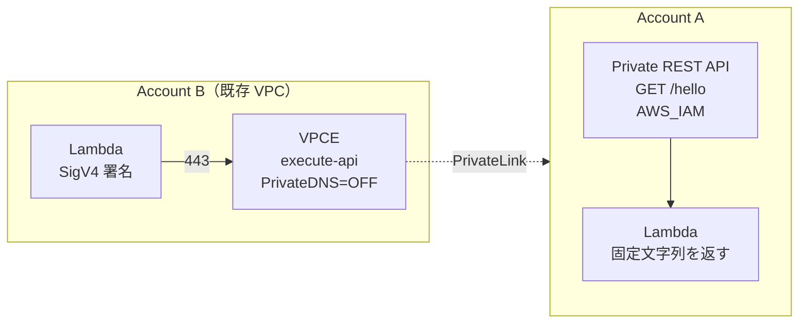

# AWS Cross-Account Private API GW 試作環境 — Terraform 仕様

作成日: 2026-05-11
対象リージョン: `ap-northeast-1`（同一リージョン前提）
方針: pptx 提案書で確定した「AWS_IAM 認証 + VPCE 固有 URL（Private DNS OFF）」構成を、Terraform で **動く最小構成** として試作する。

---

## 1. ゴール

- **作るもの**: Account B の private subnet にある Lambda が、VPCE 経由で Account A の Private API GW（裏は Lambda）を叩き、固定文字列 `"I'm account A!"` を取得する一連の経路。
- **確認したいこと**: Cross-Account × Private API GW × AWS_IAM 認証 × VPCE 固有 URL の組み合わせが、想定どおりインターネットを経由せず疎通すること、および Resource Policy で送信元 VPCE を絞れること（ネガティブ含む）。

---

## 2. 全体アーキテクチャ

### 通信経路

```
[B Lambda]
   │ (private subnet, no IGW/NAT)
   │ HTTPS GET + SigV4 (Host: {apiId}-{vpceId}.execute-api.ap-northeast-1.amazonaws.com)
   ▼
[B VPC Endpoint (Interface, execute-api)]
   │ PrivateLink / AWS backbone (インターネット非経由)
   ▼
[A Private API Gateway /hello (GET, AWS_IAM)]
   │ Lambda Proxy Integration
   ▼
[A Lambda]  → returns {"message":"I'm account A!"}
```

### Mermaid（参考）



---

## 3. Account A 側のリソース

### 3.1 ネットワーク

- Account A 側に VPC は **不要**。
- Private API Gateway は AWS マネージド側の VPC エンドポイントに紐づくだけで、Account A の VPC は経由しない。Lambda も VPC 統合しないシンプル構成にする（Lambda → ネット出ない、API GW から呼ばれるだけ）。

### 3.2 IAM（A 側 Lambda 実行ロール）

| 項目 | 値 |
| --- | --- |
| 名前（例） | `a-hello-lambda-exec-role` |
| 信頼ポリシー | `lambda.amazonaws.com` の `sts:AssumeRole` |
| アタッチ Managed Policy | `AWSLambdaBasicExecutionRole`（CloudWatch Logs 用） |
| 追加ポリシー | なし |

### 3.3 Lambda 関数（バックエンド）

| 項目 | 値 |
| --- | --- |
| 関数名（例） | `a-hello` |
| ランタイム | `python3.12` |
| アーキテクチャ | `arm64` |
| メモリ | `128` MB |
| タイムアウト | `5` 秒 |
| ハンドラ | `index.lambda_handler` |
| 環境変数 | なし |
| VPC 設定 | なし |
| ログ保持 | CloudWatch Logs Group `/aws/lambda/a-hello`、retention `7 days` |

**実装サンプル（`index.py`）**

```python
import json

def lambda_handler(event, context):
    return {
        "statusCode": 200,
        "headers": {"Content-Type": "application/json"},
        "body": json.dumps({"message": "I'm account A!"})
    }
```

### 3.4 API Gateway（REST、Private）

| 項目 | 値 |
| --- | --- |
| 名前（例） | `a-private-api` |
| タイプ | REST API |
| endpoint_configuration.types | `["PRIVATE"]` |
| endpoint_configuration.vpc_endpoint_ids | **空配列でも可**。指定すると Route 53 Private DNS が自動付与されるが、今回は cross-account かつ Private DNS OFF で使うため **指定しない** |
| リソース | `/hello`（GET） |
| 統合タイプ | `AWS_PROXY`（Lambda Proxy Integration） |
| 統合ターゲット | 3.3 の Lambda の invoke ARN |
| メソッド認証 | `AWS_IAM` |
| ステージ名 | `test` |
| stage.cache | 無効 |
| stage.xray_tracing | 任意（off で OK） |

**Lambda Permission**: API GW が Lambda を呼べるよう、Lambda 側に `aws_lambda_permission`（principal=`apigateway.amazonaws.com`、source_arn=`{api-arn}/*/GET/hello`）が必要。

### 3.5 Resource Policy（API Gateway の resource policy）

ロジック:

- **Allow**: `Principal.AWS = <B の Lambda 実行ロール ARN>` かつ `aws:SourceVpce = <B の VPCE-ID>` のとき、`execute-api:Invoke` を許可。
- **Deny**: 上記条件に合致しないリクエストはすべて拒否（明示 Deny で安全側に倒す）。

**JSON 雛形（リテラル置換前）**

```json
{
  "Version": "2012-10-17",
  "Statement": [
    {
      "Sid": "AllowFromAccountBViaVpce",
      "Effect": "Allow",
      "Principal": { "AWS": "${B_LAMBDA_ROLE_ARN}" },
      "Action": "execute-api:Invoke",
      "Resource": "${A_API_EXECUTE_ARN}/test/GET/hello",
      "Condition": {
        "StringEquals": { "aws:SourceVpce": "${B_VPCE_ID}" }
      }
    },
    {
      "Sid": "DenyOthers",
      "Effect": "Deny",
      "Principal": "*",
      "Action": "execute-api:Invoke",
      "Resource": "${A_API_EXECUTE_ARN}/*/*/*",
      "Condition": {
        "StringNotEquals": { "aws:SourceVpce": "${B_VPCE_ID}" }
      }
    }
  ]
}
```

`${A_API_EXECUTE_ARN}` は `arn:aws:execute-api:ap-northeast-1:<A-account-id>:<api-id>` 形式。

### 3.6 ステージ・デプロイメント

- `aws_api_gateway_deployment` + `aws_api_gateway_stage` を分けて作る。
- メソッド / 統合 / Resource Policy を変更したら `triggers` に hash を入れて再デプロイされるようにする。

---

## 4. Account B 側のリソース

### 4.1 ネットワーク（既存利用前提）

| 変数名 | 説明 |
| --- | --- |
| `existing_vpc_id` | 既存 VPC ID |
| `existing_private_subnet_ids` | プライベートサブネット ID のリスト（**最低 2 AZ**） |

> サブネットはルートが NAT/IGW を持っていなくて良い。VPCE 経由で API GW に到達するため。

### 4.2 VPC Endpoint

| 項目 | 値 |
| --- | --- |
| サービス名 | `com.amazonaws.ap-northeast-1.execute-api` |
| タイプ | `Interface` |
| サブネット | `existing_private_subnet_ids` |
| セキュリティグループ | `b-vpce-sg`（後述） |
| Private DNS | **OFF**（`private_dns_enabled = false`） |
| Policy | デフォルト（フルアクセス）で OK。ガードは A 側 Resource Policy 側でかける |

> Private DNS を ON にすると同一 AWS アカウント内の API GW 名前解決は楽だが、cross-account の場合は Route53 Private Hosted Zone の関連付けが面倒になる。今回は **VPCE 固有 URL 直打ち** で揃える。

### 4.3 セキュリティグループ

#### `b-vpce-sg`（VPCE 用）

| 方向 | プロトコル | ポート | ソース/宛先 |
| --- | --- | --- | --- |
| inbound | TCP | 443 | `b-lambda-sg` のみ |
| outbound | All | All | （明示しない場合 TF default の `0.0.0.0/0` でも害は薄いが、絞るなら不要） |

#### `b-lambda-sg`（Lambda 用）

| 方向 | プロトコル | ポート | ソース/宛先 |
| --- | --- | --- | --- |
| inbound | なし | — | — |
| outbound | TCP | 443 | `b-vpce-sg` のみ |

> Lambda の outbound はインターネット禁止。VPCE への 443 だけ通す。

### 4.4 IAM（B 側 Lambda 実行ロール）

| 項目 | 値 |
| --- | --- |
| 名前（例） | `b-caller-lambda-exec-role` |
| 信頼ポリシー | `lambda.amazonaws.com` の `sts:AssumeRole` |
| アタッチ Managed Policy | `AWSLambdaVPCAccessExecutionRole`（ENI 操作 + Logs） |
| 追加インラインポリシー | 下記「execute-api:Invoke」 |

**追加インラインポリシー**

```json
{
  "Version": "2012-10-17",
  "Statement": [
    {
      "Effect": "Allow",
      "Action": "execute-api:Invoke",
      "Resource": "arn:aws:execute-api:ap-northeast-1:${A_ACCOUNT_ID}:${A_API_ID}/test/GET/hello"
    }
  ]
}
```

### 4.5 Lambda 関数（呼び出し側）

| 項目 | 値 |
| --- | --- |
| 関数名（例） | `b-caller` |
| ランタイム | `python3.12` |
| アーキテクチャ | `arm64` |
| メモリ | `256` MB |
| タイムアウト | `10` 秒 |
| ハンドラ | `index.lambda_handler` |
| VPC 設定 | サブネット = `existing_private_subnet_ids`、SG = `b-lambda-sg` |
| 環境変数 | `A_API_ID`, `A_REGION`, `A_STAGE`, `A_PATH`, `B_VPCE_ID` |

**実装サンプル（`index.py`、SigV4 署名付き GET）**

```python
import os
import json
import urllib.request

import boto3
from botocore.auth import SigV4Auth
from botocore.awsrequest import AWSRequest

A_API_ID  = os.environ["A_API_ID"]
A_REGION  = os.environ["A_REGION"]
A_STAGE   = os.environ["A_STAGE"]
A_PATH    = os.environ["A_PATH"]      # e.g. "/hello"
B_VPCE_ID = os.environ["B_VPCE_ID"]   # e.g. "vpce-0123456789abcdef0"

# VPCE 固有 URL（Private DNS OFF）
# 形式: https://{api-id}-{vpce-id}.execute-api.{region}.amazonaws.com/{stage}{path}
URL = (
    f"https://{A_API_ID}-{B_VPCE_ID}.execute-api.{A_REGION}.amazonaws.com"
    f"/{A_STAGE}{A_PATH}"
)

_credentials = boto3.Session().get_credentials()

def lambda_handler(event, context):
    req = AWSRequest(method="GET", url=URL)
    SigV4Auth(_credentials, "execute-api", A_REGION).add_auth(req)

    http_req = urllib.request.Request(URL, headers=dict(req.headers))
    with urllib.request.urlopen(http_req, timeout=8) as res:
        body = res.read().decode("utf-8")
        status = res.status

    return {
        "statusCode": status,
        "body": body,
    }
```

> `boto3` / `botocore` は Lambda の Python ランタイムに同梱されているので、追加レイヤ不要。

### 4.6 CloudWatch Logs

- `/aws/lambda/b-caller`、retention `7 days`。

---

## 5. クロスアカウント連携（受け渡しデータ）

### B → A に渡す情報

| キー | 値 | どこで使う |
| --- | --- | --- |
| `B_VPCE_ID` | B 側で作成した VPCE ID | A の Resource Policy `aws:SourceVpce` |
| `B_LAMBDA_ROLE_ARN` | B の Lambda 実行ロール ARN | A の Resource Policy `Principal.AWS` |

### A → B に渡す情報

| キー | 値 | どこで使う |
| --- | --- | --- |
| `A_ACCOUNT_ID` | A の AWS Account ID | B の IAM Policy `Resource` の ARN |
| `A_API_ID` | A の Rest API ID | B Lambda 環境変数 / IAM Policy / URL 組み立て |
| `A_REGION` | リージョン（`ap-northeast-1`） | URL 組み立て |
| `A_STAGE` | `test` | URL 組み立て |
| `A_PATH` | `/hello` | URL 組み立て |
| `A_API_RESOURCE_ARN` | `arn:aws:execute-api:...:.../test/GET/hello` | B の IAM Policy（IAM 認証のため） |

> 「1 Terraform、provider alias 構成」にすればこの受け渡しは Terraform の参照（`aws_api_gateway_rest_api.a.id` など）で自動的に解決される。下記「8. Terraform 構成ファイル提案」参照。

---

## 6. Apply 順序（重要）

A の Resource Policy は B の VPCE-ID を要求し、B の Lambda は A の API ID を要求する **相互依存** がある。

### パターン X: 1 ディレクトリ + provider alias（推奨）

Terraform の DAG が依存を解決するので 1 回の `terraform apply` で OK。Resource Policy は `aws_api_gateway_rest_api_policy` を `aws_vpc_endpoint.b` 作成後に参照する形で書けば自然に正しい順で作られる。

```
terraform init
terraform plan
terraform apply
```

### パターン Y: 2 ディレクトリ（accounts/a, accounts/b）

state を別に分ける場合は 3 phase apply。

| Phase | 場所 | 内容 |
| --- | --- | --- |
| 1 | `accounts/a` | API GW + Lambda + IAM を apply。Resource Policy は **暫定で全 Deny**（あるいは未設定）。output: `api_id`, `region`, `stage`, `api_resource_arn`, `account_id` |
| 2 | `accounts/b` | VPCE + Lambda + IAM を apply（Phase 1 の output を `terraform_remote_state` か手動 tfvars で受け取り）。output: `vpce_id`, `lambda_role_arn` |
| 3 | `accounts/a` | Resource Policy を更新（Phase 2 の output を tfvars で渡し、`apply -refresh-only=false` で再 apply） |

---

## 7. テスト手順

### 7.1 正常系

1. AWS CLI で B の Lambda を invoke。

   ```bash
   aws lambda invoke \
     --function-name b-caller \
     --profile accountB \
     --region ap-northeast-1 \
     /tmp/out.json
   cat /tmp/out.json
   ```

2. 期待: HTTP 200、`body` が `{"message":"I'm account A!"}`。
3. CloudWatch Logs（B `/aws/lambda/b-caller`）に SigV4 署名付き GET のログ。
4. CloudWatch Logs（A `/aws/lambda/a-hello`）に呼び出し記録。

### 7.2 ネガティブ系（Resource Policy が効いていることの確認）

1. A の Resource Policy で `aws:SourceVpce` の許可値を別の架空 VPCE-ID に書き換えて `apply`。
2. B Lambda を再 invoke。
3. 期待: HTTP **403**（`User: ... is not authorized to perform: execute-api:Invoke`）。
4. 確認後、policy を戻す。

### 7.3 経路の確認（任意）

- B Lambda のログに `urllib.request` で得たレスポンスの `X-Amz-...` ヘッダや本文を一度だけ debug 出力すると、AWS_IAM 認証が刺さっていることが分かりやすい。
- VPC Flow Logs を一時的に有効化すれば 443 トラフィックが VPCE ENI に向いていることが見える（必須ではない）。

---

## 8. Terraform 構成ファイル提案

### 提案: **1 ディレクトリ + provider alias（一票）**

```
terraform/
├── versions.tf          # required_providers, required_version
├── providers.tf         # provider "aws" { alias = "a" } / { alias = "b" }
├── variables.tf
├── terraform.tfvars     # 機密は git 外（または tfvars.example だけ commit）
├── account_a.tf         # A 側リソース一式
├── account_b.tf         # B 側リソース一式
├── outputs.tf
└── lambda_src/
    ├── a_hello/index.py
    └── b_caller/index.py
```

**理由**:

- 試作で state が 1 つで済み、相互依存が自然に解ける（B の VPCE 作成 → A の Resource Policy という順を TF が DAG で処理）。
- Output 受け渡しの手作業が消える。
- 後片付け（destroy）も 1 コマンド。

**留意点**:

- 1 つの Terraform 実行コンテキストで A / B 両アカウントの credential を同時に握る必要がある。CI/CD で本番運用するなら 2 ディレクトリ化＋ remote state（S3）参照に分ける方が無難。
- 今回は **個人検証 / 試作** なのでローカルから両アカウントへ AssumeRole or 個別プロファイルで触れる前提なら 1 ディレクトリで十分。

### 代替: 2 ディレクトリ

```
terraform/
├── accounts/
│   ├── a/  (state-a)
│   └── b/  (state-b)
└── modules/
```

本番運用やチームでアカウント担当が分かれている場合はこちら。Phase 3 apply の手間と output 受け渡し（`terraform_remote_state` か tfvars）を許容できるなら。

---

## 9. 変数（variables.tf に入れるべきもの）

### 共通

| 変数 | 型 | 例 | 説明 |
| --- | --- | --- | --- |
| `region` | string | `ap-northeast-1` | 単一リージョン |
| `project` | string | `xacc-priv-api-poc` | タグ / 命名 prefix |

### A 側

| 変数 | 型 | 例 | 説明 |
| --- | --- | --- | --- |
| `a_account_id` | string | `111111111111` | Account A の ID |
| `a_stage_name` | string | `test` | ステージ名 |
| `a_log_retention_days` | number | `7` | Lambda Logs 保持 |

### B 側

| 変数 | 型 | 例 | 説明 |
| --- | --- | --- | --- |
| `b_account_id` | string | `222222222222` | Account B の ID |
| `existing_vpc_id` | string | `vpc-0abc...` | 既存 VPC |
| `existing_private_subnet_ids` | list(string) | `["subnet-...","subnet-..."]` | 最低 2 AZ |
| `b_log_retention_days` | number | `7` | Lambda Logs 保持 |

### Provider alias（参考）

```hcl
provider "aws" {
  alias   = "a"
  region  = var.region
  profile = "accountA"   # or assume_role { role_arn = ... }
}

provider "aws" {
  alias   = "b"
  region  = var.region
  profile = "accountB"
}
```

---

## 10. クリーンアップ

### 1 ディレクトリ構成の場合

```bash
terraform destroy
```

> Lambda が VPC に紐づいているため ENI 削除に最大 20 分程度かかることがある（AWS 側の eventual cleanup）。Terraform はリトライする。

### 2 ディレクトリ構成の場合

1. **B を先に destroy**（VPCE / Lambda / SG / IAM）。VPCE が消えると A 側 Resource Policy が参照していた VPCE-ID が dangling になるが、policy 自体は文字列として残るだけなので問題なし。
2. **A を destroy**（API GW / Lambda / IAM）。

理由: 順序を逆にしても致命的ではないが、A を先に消すと B 側 Lambda の IAM Policy の Resource ARN が dangling になり、テスト invoke がエラーで終わる。気持ち悪いので B → A。

---

## 11. 想定コスト

| 項目 | 単価 | 1 日試算 | 1 ヶ月放置 |
| --- | --- | --- | --- |
| Interface VPCE（execute-api、1 AZ） | $0.014 / h | 約 $0.34 | 約 $10 |
| Interface VPCE（execute-api、2 AZ） | $0.014 / h × 2 ENI | 約 $0.67 | 約 $20 |
| API Gateway REST | $3.50 / 100 万リクエスト | 数 cent 未満 | — |
| Lambda（A・B 合計、128〜256MB、数百回） | ほぼ無料枠内 | $0 | $0〜 |
| CloudWatch Logs（取り込み + 保管） | $0.50/GB ingest 他 | 数 cent | — |

**結論**: 1 日検証なら **$1 行かない** 程度。最大のコストは VPCE。試験が終わったら **必ず destroy**（特に VPCE）。

---

## 補足: ハマりどころメモ（実装前に読むべし）

1. **VPCE 固有 URL の形式に注意**: `https://{api-id}-{vpce-id}.execute-api.{region}.amazonaws.com/{stage}{path}`。`{vpce-id}` はハイフン入りの `vpce-xxxxx` をそのまま入れる。
2. **Private DNS を ON にしてはいけない**: ON にすると同アカウント内の `*.execute-api.amazonaws.com` を全部 VPCE で解決しに行くため、cross-account で別アカウントの API を叩く際にちぐはぐになる。固有 URL 直打ちが安全。
3. **Resource Policy 反映には再デプロイ必要**: `aws_api_gateway_rest_api_policy` を変更したら stage を redeploy しないと反映されないケースがある。`aws_api_gateway_deployment.triggers` に policy の sha を入れる。
4. **AWS_IAM 認証 + Lambda Proxy Integration の組み合わせ**: 認証は API GW のメソッドに紐づくので、Lambda 側は通常どおりイベントを受けるだけ。ただし B 側 IAM Policy の Resource ARN は `arn:aws:execute-api:...:.../{stage}/{method}/{path}` の正確な形でないと 403。
5. **B 側 Lambda の VPC 配置忘れ**: VPC 統合しないと素のインターネット経由で API GW のパブリックエンドポイント名前解決しに行って失敗する。**VPC 設定必須**。
6. **両 AZ にサブネット必須**: VPCE は 2 AZ 以上に配置するのが安定。Lambda 側も 2 AZ 指定する。
7. **Lambda の cold start で SigV4 credentials 取得が遅い**: `boto3.Session().get_credentials()` をハンドラ外で呼んでおく（上記サンプルどおり）。
