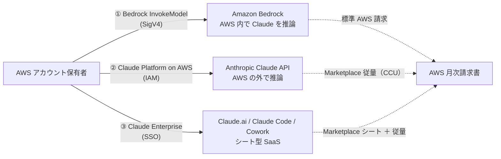

# AWS で Claude を利用する 3 つの選択肢 — Bedrock / Claude Platform on AWS / Claude Enterprise

> [!summary]
> AWS 経由で [[Anthropic]] [[Claude API|Claude]] を使う方法は **3 つ**: ① **[[Amazon Bedrock]]**（AWS 内で Claude 推論、AWS 視点では 3rd party モデル）、② **Claude Platform on AWS**（Anthropic 1st party API を AWS の調達レイヤ経由で叩く、データは AWS の外）、③ **Claude Enterprise in AWS Marketplace**（[[Claude.ai]] / [[Claude Code]] / [[Cowork]] のシート契約、開発 API は含まれない）。本ノートは「1st party / 3rd party」が視点で意味が変わる混乱の解きほぐし、[[AWS Marketplace]] の役割、3 つの選択肢の比較表、判断軸、落とし穴（別 Anthropic 組織がプロビジョニング等）をまとめる。

関連トピック: [[Amazon Bedrock]] / [[Claude API]] / [[AWS Marketplace]] / [[CloudTrail]] / [[IAM]] / [[Claude Code]] / [[Anthropic]]

## 1. ひとことで言うと

| 選択肢 | データ境界 | 課金経路 | 用途 |
|---|---|---|---|
| **① Amazon Bedrock** | **AWS 内**（Claude を AWS 上でホスト） | 標準 AWS 請求 | API 利用、データレジデンシー重視 |
| **② Claude Platform on AWS** | Anthropic 側（API は外） | AWS Marketplace（CCU 従量） | Anthropic ネイティブ機能・ベータ機能優先 |
| **③ Claude Enterprise** | Anthropic 側（SaaS） | AWS Marketplace（シート前払い ＋ 従量） | 従業員に Claude.ai / Code / Cowork を配る |

## 2. 「1st party / 3rd party」の混乱を解く

ここが一番混乱するポイント。**「party」が誰の視点かでラベルが入れ替わる**:

- **AWS 視点で 3rd party**: Bedrock 上の Claude は「**AWS から見て第三者（Anthropic）が作ったモデル**」だから 3rd party モデルと呼ばれる。Amazon 自身が開発した Nova 等は 1st party モデル
- **Anthropic 視点で 1st party**: Claude Platform on AWS は「**Anthropic 自身が運営するプラットフォーム**」だから 1st party プラットフォームと呼ばれる

→ **同じ Claude でも、語る側の視点でラベルが入れ替わる**。「3rd party だから危ない」「1st party だから安心」という単純な話ではない。

### 2.1 Bedrock の Claude（AWS 視点で 3rd party）

3rd party モデルだが、**データは AWS 境界内で完結**:

- 推論データ・学習データは明示的に設定しない限り保管されない
- Claude モデルは AWS にホストされているため Anthropic 側からは顧客データを閲覧できない
- 通信は AWS バックボーン経由

### 2.2 Claude Platform on AWS（Anthropic 視点で 1st party）

1st party プラットフォームだが、**データは AWS 境界の外**で Anthropic が処理:

- AWS は調達・認証・請求・監査の入口を提供するだけ
- 推論リクエストそのものは Anthropic 側のインフラに直接到達
- Bedrock のような厳密なデータレジデンシーは期待できない

## 3. AWS Marketplace の役割

[[AWS Marketplace]] は **「ソフトウェア・サービスを調達して請求を AWS アカウントに一本化する仕組み」**。Claude 関連での登場場面は 2 つ:

1. **Claude Enterprise のシート購入**（後述）
2. **Claude Platform on AWS の課金経路**

実務上のメリットは**調達と請求の AWS 統合**:

- Anthropic と個別契約してクレカ払いではなく、**既存の AWS 請求フローに乗る**
- EDP（Enterprise Discount Program）や PPA コミットメントの適用が可能
- 部門の承認フロー・調達ルールも AWS のものを流用できる

**重要**: Marketplace は **「契約・請求の通り道」**であって、**API トラフィック自体が Marketplace を経由するわけではない**。データプレーンは別。

## 4. 3 つの選択肢を整理

### 4.1 ① Amazon Bedrock 経由（API 利用）

- AWS マネージドな AI モデルプラットフォーム
- Claude を含む複数 3rd party モデル ＋ Amazon Nova（1st party）を統一 API で扱える
- **データは AWS 境界内**（Anthropic 側からは見えない）
- 認証: **AWS SigV4**（標準的 AWS API 認証）
- 課金: AWS 標準請求（Marketplace を経由しない）
- 統合機能: Guardrails、Knowledge Bases、PrivateLink、リージョン別データレジデンシー
- 用途: 自社アプリで Claude API を使う、**データ統制を重視する**ケース

### 4.2 ② Claude Platform on AWS（API 利用）

- **Anthropic の `claude.com` / `docs.claude.com` にある API と同一のもの**を、AWS の入口経由で使う
- 認証: **AWS IAM**（Anthropic API キーではない）
- 課金: AWS Marketplace の **CCU（Compute Credit Unit）** 従量。**1 CCU = $0.01**
- 監査: CloudTrail
- データプレーン（推論リクエスト）は Anthropic に直接到達
- 用途: **Anthropic ネイティブ機能・ベータ機能への早期アクセス**、Anthropic Console を使いたい
- **2026 年 5 月 11 日に一般提供開始**。東京リージョンも対応（ただしエントリポイントの話で、データ処理は Anthropic 側）

### 4.3 ③ Claude Enterprise in AWS Marketplace（シート利用）

- **Claude.ai（チャット）/ [[Claude Code]] / [[Cowork]]** といった **アプリ製品**を従業員に配るシート契約
- **API 利用は含まれない**（社内アプリの裏側で Claude API を叩きたいなら Bedrock か Claude Platform on AWS が別途必要）
- エンタープライズ統制: SSO、SCIM、監査ログ、ロールベース権限
- 課金: **シート単位の前払い**（例: 25 シート × 12 ヶ月をまとめて前払い）＋ Token 利用に応じた従量
- 価格: **$40 / user / 月**（2026 年 3 月時点）、**最低 25 シート**
- 用途: 従業員に Claude のアプリ製品を配布したい

## 5. 比較表

| | ① Bedrock | ② Claude Platform on AWS | ③ Claude Enterprise |
|---|---|---|---|
| 買うもの | API 利用枠（従量） | API 利用枠（CCU 従量） | アプリのシート |
| 使う人 | 開発者・アプリ | 開発者・アプリ | **従業員（エンドユーザー）** |
| データ境界 | **AWS 内** | Anthropic 側 | Anthropic 側 |
| 認証 | AWS SigV4 | AWS IAM | SSO |
| 課金経路 | AWS 標準請求 | AWS Marketplace（CCU） | AWS Marketplace（シート ＋ 従量） |
| 監査 | CloudTrail | CloudTrail | アプリの監査ログ |
| 統合機能 | Guardrails、KB、PrivateLink | Anthropic Console、ベータ機能 | SSO、SCIM |
| Marketplace の役割 | なし | 課金・調達経路 | 課金・調達経路 |

## 6. 「Claude Platform on AWS は Bedrock を使わない」を再確認

引っかかりやすいので明示しておく:

- **Claude Platform on AWS は Amazon Bedrock を経由しません**
- Bedrock 上の Claude モデルの新機能ではなく、**Anthropic の Claude Platform を AWS の入口経由で使う別物**
- データプレーン（推論）は Anthropic、コントロールプレーン（認証・課金・監査）は AWS、という構図
- 「**Anthropic 直契約の Claude API を、契約・認証・請求・監査だけ AWS に付け替えたもの**」と言い換えると正確

## 7. 落とし穴 / 注意点

### 7.1 Anthropic 組織は共通にならない

複数の選択肢を契約しても **Anthropic 側の組織は共通にならない**:

- AWS Console から **Claude Platform on AWS にサインアップすると、AWS アカウントに紐づいた新しい Anthropic 組織がプロビジョニング**される
- これは AWS Marketplace 経由で調達した **Claude Enterprise 組織とは別物**
- **API キー、ワークスペース、Claude Console の設定は引き継がれない**
- → 後で統合運用したい場合、組織分離が現実的な制約になる

### 7.2 シートと API の混同に注意

- Claude Enterprise（$40 / user / 月）は **シートライセンス**であって API 利用枠ではない
- 「Enterprise 買ったから API も使える」と勘違いしやすいが**含まれていない**
- 見積もり時に混同しないよう注意

### 7.3 データ境界の違い

- Bedrock = **AWS 境界内**（厳密なデータレジデンシー）
- Claude Platform on AWS = **エントリポイントは AWS、推論データは Anthropic 側**
- 規制業種・データレジデンシー要件があるなら Bedrock 必須

## 8. どれを選ぶか — 判断軸

| 状況 | 推奨 |
|---|---|
| 自社アプリで Claude API を叩きたい、データを AWS 境界内に保ちたい | **① Bedrock** |
| API を使いたい、かつ Anthropic ネイティブ機能・ベータ機能を優先したい | **② Claude Platform on AWS** |
| 統一 API で複数モデルを切り替えたい（Claude / Nova / Llama 等） | **① Bedrock** |
| Guardrails / Knowledge Bases / PrivateLink を使いたい | **① Bedrock** |
| 従業員に Claude.ai / Claude Code / Cowork を配りたい | **③ Claude Enterprise** |
| 調達・請求を AWS に寄せたいが API は Anthropic ネイティブで使いたい | **② Claude Platform on AWS** |
| 規制業種・データレジデンシー要件あり | **① Bedrock** |

実務的によくあるのは「**Bedrock を API 基盤、Claude Enterprise を従業員向け**」の併用パターン。**Claude Platform on AWS** は「ベータ機能・新機能を最速で触りたい」「Anthropic Console をそのまま使いたい」場合に追加で検討する選択肢。

## 9. まとめ

- AWS で Claude を使う選択肢は **3 つ**: Bedrock / Claude Platform on AWS / Claude Enterprise
- 「1st party / 3rd party」は **視点で意味が変わる**（AWS 視点と Anthropic 視点）
- **AWS Marketplace は調達・請求の通り道**であって、API トラフィックは通らない
- **Bedrock と Claude Platform on AWS は別物**（Platform on AWS は Bedrock を経由しない）
- 落とし穴: Anthropic 組織は契約ごとに別、シート ≠ API、データ境界も別
- 一般的な使い方: **Bedrock を API、Claude Enterprise をシート**の併用。+α で **Claude Platform on AWS**

## 関連MOC

- [[MOC AWS]]
- [[MOC AI Engineering]]
- [[MOC Business]]
- [[MOC Learning]]

## 関連ノート

- [[AI 利用コストの予算設計]] — Uber 事例。AI コストは計画なく使うと事故る
- [[Claude Code]] — Anthropic のコーディング CLI
- [[Claude Life OS 設計書]] — Claude を中心に据えた個人 OS の設計
