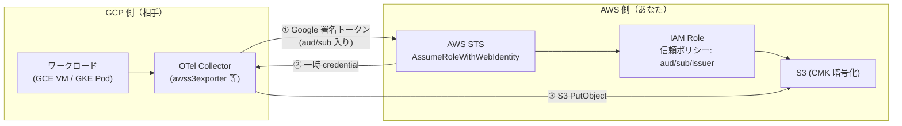
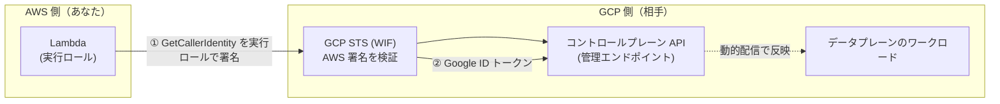

# AWS と GCP のクロスクラウド連携 — 長期キー無しの双方向 ID フェデレーション設計メモ

> [!summary]
> AWS 側チーム（S3・Lambda・IAM を持つ）と GCP 側チーム（ワークロードを運用する）を、**長期キー（IAM ユーザキー / SA キー / API キー）を一切使わず**に双方向で接続する設計。AWS 側は **[[AWS STS]]（Security Token Service）** で外部 ID を受け入れ、GCP 側は **[[Workload Identity Federation]]（WIF）** で AWS の身元を受け入れる。2 方向の具体例として ① **GCP のワークロード → AWS S3 へデータ書き込み**（OTel テレメトリ等）、② **AWS Lambda → GCP のコントロールプレーン API を叩いて設定変更**、を扱う。本ノートは値の受け渡し（誰が決めて誰に伝えるか）を中心に、両側の作業リストと相手への質問リストまで整理する。**aud は自分発、sub / issuer は相手発**、が読み方の芯。

関連トピック: [[AWS STS]] / [[Workload Identity Federation]] / [[OIDC]] / [[IAM]] / [[KMS]] / [[SSE-KMS]] / [[OpenTelemetry]] / [[Cognito OAuth 実装と JWT 検証リファレンス]]

## 1. ひとことで言うと

**「長期キーを持ち回さずに、AWS と GCP の間でお互いの身元だけを信じる」設計**。

- AWS 側 → GCP 側: **[[Workload Identity Federation]]（WIF）** で受け入れ
- GCP 側 → AWS 側: **[[AWS STS]] `AssumeRoleWithWebIdentity`** で受け入れ

どちらも「**署名トークンを相手の STS が検証して、一時的な credential を返す**」という同じ骨格。長期キーは一切使わない。

これは **「認証（誰か）」の設計**。何を許すか（認可）は身元確定後にロールへ付ける権限ポリシー側の**別レイヤ**。

## 2. なぜ「長期キー無し」が重要か

- IAM ユーザキー / SA キー / API キーは**漏れると悪用が続く**。ローテーションも運用が重い
- クロスクラウド連携のたびに長期キーを持ち回すと**攻撃面が増える**
- STS / WIF は **短命なトークン**を都度発行 → 漏れても短時間で失効
- 「**誰が何をできるか**」を身元＋ロールの組み合わせで表現できる（監査もしやすい）

## 3. 用語集

| 略称 | 正式名 | ざっくり |
|---|---|---|
| **STS** | Security Token Service (AWS) | 一時的な認証情報を発行。キーを持ち歩かない |
| **WIF** | Workload Identity Federation (GCP) | 外部 ID でキー無し GCP アクセス。STS の対 |
| **OIDC** | OpenID Connect | OAuth2.0 上の本人確認標準。署名トークンを発行 |
| **aud** | audience | トークンの宛先。「このトークンはどこ向けか」のラベル |
| **sub** | subject | トークンの主体。「誰か」を表す ID。絞り込みの主役 |
| **SA / KSA** | Service Account / Kubernetes SA | プログラム用アカウント / Pod 用アカウント |
| **CMK** | Customer Managed Key | 利用者が管理する暗号鍵（S3 暗号化に使用） |
| **KMS / SSE-KMS** | Key Management Service | 鍵管理サービス / S3 の KMS 暗号化方式 |
| **GCE / GKE** | Compute Engine / Kubernetes Engine | GCP の VM / マネージド k8s（EC2 / EKS 相当） |
| **IAP** | Identity-Aware Proxy | GCP の認証付き前段プロキシ |
| **ARN** | Amazon Resource Name | AWS リソースの一意な名前（ロール等の識別） |

## 4. ★ 最重要 — 値の出どころの読み方

**aud はあなた発、sub / issuer は相手発**。これを覚えると全てが読める。

| 値 | 誰が決める | 方向 |
|---|---|---|
| **aud** | **あなたが決める**（任意の文字列） | あなた → 相手 |
| **sub** | **相手が決まる / 命名する**（GCE=SA の数値 ID、GKE=KSA 名） | 相手 → あなた |
| **issuer** | 相手のクラスタ等に固有 | 相手 → あなた |

- 信頼ポリシーに aud / sub / issuer を書く ＝ **「この値の身元だけ信じる」**
- aud は「自分がこう呼ぶ」と決めて相手にラベルを伝える
- sub は相手が既に持っている ID（SA の uniqueId や KSA 名）を教えてもらって埋める

## 5. パターン① — GCP のワークロード → AWS S3 へデータ書き込み

**ユースケース**: GCP 側で動いている [[OpenTelemetry]] Collector（`awss3exporter`）や、任意のワークロードが、AWS 側の S3 バケット（CMK 暗号化済み）にデータを書き込む。

### 5.1 全体像



流れ:

1. GCP 側のワークロードが Google 署名トークン（aud / sub 入り）を取得
2. AWS STS が aud / sub を照合 → 一時 credential を発行
3. その credential で S3 に PutObject（CMK で自動暗号化）

**高頻度でも STS は非問題**（1 時間キャッシュ）。効くのは KMS: SSE-KMS は PUT ごとに `GenerateDataKey` が走るので、**S3 Bucket Keys を有効化**＋バッチ粒度を大きくするのが定石。

### 5.2 AWS 側（あなた）がやること

- **IAM ロールを作る**
  - 信頼ポリシー: aud / sub / issuer で相手を限定
  - 権限ポリシー: `s3:PutObject` ＋ KMS 権限（`kms:GenerateDataKey`、`kms:Decrypt`）
- **KMS 鍵ポリシー**にロールを追加（鍵をロックダウンしている場合）
- **S3 バケット**: default 暗号化 = CMK、Bucket Keys = ON
- GKE のときのみ: OIDC provider を登録（相手のクラスタ issuer URL を使う）

**相手に渡す**:
1. ロールの ARN
2. 決めた aud の値
3. バケット名・リージョン（SSE 強制なら KMS 鍵 ID）

**信頼ポリシー例（GCE + 組み込み provider）**:

```json
{
  "Effect": "Allow",
  "Principal": { "Federated": "accounts.google.com" },
  "Action": "sts:AssumeRoleWithWebIdentity",
  "Condition": {
    "StringEquals": {
      "accounts.google.com:aud": "aws-otel-s3",
      "accounts.google.com:sub": "<SA uniqueId>"
    }
  }
}
```

**権限ポリシー側**:

```json
"Action": "s3:PutObject",
"Action": ["kms:GenerateDataKey", "kms:Decrypt"]
```

⚠️ **典型ハマり**: `GenerateDataKey` が無いと CMK PUT が AccessDenied で落ちる。

### 5.3 GCP 側（相手）がやること

- Collector の実行基盤を用意（GCE VM か GKE Pod）
- **SA（GCE）/ KSA（GKE）** を割り当てる ← これが sub になる
- `awss3exporter` に **Web Identity** を設定: `AWS_ROLE_ARN` ＋ トークンファイル
- あなたが決めた aud でトークンを要求（GCE = メタデータ / GKE = projected token）

**あなたに渡してもらう**:
- GCE → SA のメール ＋ uniqueId (sub)
- GKE → `system:serviceaccount:ns:ksa` (sub) ＋ クラスタの OIDC issuer URL

**相手側の設定イメージ**:

```yaml
# awss3exporter
exporters:
  awss3:
    s3uploader:
      region: ap-northeast-1
      s3_bucket: my-otel-bucket
```

```bash
# プロセスに渡す環境変数（= 身元）
AWS_ROLE_ARN=arn:aws:iam::<acct>:role/otel-s3-writer
AWS_WEB_IDENTITY_TOKEN_FILE=/var/run/token

# GCE でトークン取得（aud = あなた指定値）
curl -H "Metadata-Flavor: Google" \
  ".../identity?audience=aws-otel-s3&format=full"

# sub 確認: JWT をデコード → aud / sub
gcloud iam service-accounts describe SA --format='value(uniqueId)'  # ← sub
```

### 5.4 値の受け渡し表

| 値 | 誰が決める / 作る | 方向 |
|---|---|---|
| aud | あなた（AWS）が決める | あなた → 相手 |
| ロール ARN | あなた（AWS）が作る | あなた → 相手 |
| バケット名 / リージョン | あなた（AWS）が決める | あなた → 相手 |
| sub（GCE） | 相手: SA 作成で自動採番（数値 ID） | 相手 → あなた |
| sub（GKE） | 相手: KSA を命名（ns:ksa） | 相手 → あなた |
| OIDC issuer URL（GKE） | 相手: クラスタ固有 | 相手 → あなた |

**ポイント**: aud 以外（sub・issuer）はすべて相手発。だから**相手にまず「GCE か GKE か」を聞くのが最初**。

## 6. パターン② — AWS Lambda → GCP のコントロールプレーン API を叩く

**ユースケース**: AWS 側の Lambda が、GCP 側で動くサービスの**設定変更**をコントロールプレーン API に指示する（例: プロジェクト A のルーティング先を変更する等）。

### 6.1 全体像



流れ:

1. Lambda が実行ロールで `GetCallerIdentity` を署名（AWS 署名）
2. GCP STS（WIF）がその署名を検証 → Google の ID トークンを発行
3. Lambda が `Authorization: Bearer <ID>` でコントロールプレーン API を叩く
4. コントロールプレーン API が受け取ったルール変更を、データプレーンのワークロードへ**動的に配信**して反映

**重要な原則**: **データプレーンの管理エンドポイント（`/runtime_modify` の類）を直接叩かない**。認証が弱いことが多いので、**手前のコントロールプレーン API 経由**で反映するのが正攻法。

### 6.2 AWS 側（あなた）がやること

- Lambda ＋ 実行ロールを用意（このロール ARN が相手側の絞り込みキー）
- **`external_account`（WIF）を設定**。SA キーは不要
- 目的 audience の ID トークンを取得（管理 API の URL or IAP client ID）
- `Authorization: Bearer` で管理 API を叩く
- Lambda は IMDS 無し → **環境変数ベース**で AWS 資格を取得

**相手に渡す**:
1. あなたの AWS アカウント ID
2. Lambda 実行ロールの ARN（相手が属性条件で絞る）

**`external_account.json`（WIF・Lambda 用イメージ）**:

```json
{
  "type": "external_account",
  "audience": "//iam.googleapis.com/projects/<num>/locations/global/workloadIdentityPools/<pool>/providers/<provider>",
  "subject_token_type": "urn:...:aws:token-type:aws4_request",
  "token_url": "https://sts.googleapis.com/v1/token",
  "credential_source": {
    "environment_id": "aws1",
    "regional_cred_verification_url": "https://sts.{region}.amazonaws.com?Action=GetCallerIdentity..."
  },
  "service_account_impersonation_url": ".../<sa-email>:generateAccessToken"
}
```

### 6.3 GCP 側（相手）がやること

- **Workload Identity Pool** を作る（外部 ID の受け皿）
- **AWS Provider** を追加: あなたの Account ID を登録、**属性条件で Lambda ロール ARN に絞る**
- impersonate 用 SA を用意し、外部 ID に `workloadIdentityUser` を付与
- **コントロールプレーン API** を用意（Cloud Run / IAP / 自前）＋ 認証方式 ＋ ルールのスキーマ

**あなたに渡してもらう**:
1. pool / provider のリソース名（= audience）
2. impersonate 先 SA のメール
3. コントロールプレーン API の URL ＋ 認証方式（→ 使う audience が決まる）
4. ルール API のスキーマ

**provider 属性条件（ARN で絞る例）**:

```yaml
attribute_mapping:
  google.subject = "assertion.arn"

# あなたの Lambda 実行ロールだけ許可
attribute_condition:
  assertion.arn.startsWith(
    "arn:aws:sts::<your-acct>:assumed-role/<lambda-role>"
  )
```

**ルール変更 API 呼び出し例**:

```
POST /rules  Authorization: Bearer <ID>
{ "project": "A", "route": "localLLM" }
        → コントロールプレーンが動的配信でワークロードへ反映
```

### 6.4 値の受け渡し表

| 値 | 誰が決める / 作る | 方向 |
|---|---|---|
| AWS アカウント ID | あなた（AWS） | あなた → 相手 |
| Lambda 実行ロール ARN | あなた（AWS）が作る | あなた → 相手 |
| pool / provider 名（= audience） | 相手: WIF 作成で決まる | 相手 → あなた |
| impersonate 先 SA メール | 相手が作る | 相手 → あなた |
| コントロールプレーン API URL ＋ 認証方式 | 相手が用意 | 相手 → あなた |
| ルール API のスキーマ | 相手が定義 | 相手 → あなた |

**ポイント**: こちらは逆向き。**あなたが渡すのは 2 つ（Account ID・ロール ARN）だけ**で、残りは相手発。

## 7. 相手（GCP 側）への質問リスト

これが揃えば両側の値が埋まる:

### ① データ流入（OTel → S3）

- **Q1**: Collector は GCE VM か GKE Pod か？（sub と provider 登録要否が決まる）
- **Q2**: （GCE）SA のメールと数値 uniqueId は？／（GKE）ns ＋ KSA 名 と クラスタの OIDC issuer URL は？
- **Q3**: `awss3exporter` で Web Identity を使える構成か？ aud は指定した値でよいか？
- **Q4**: Collector のバッチ粒度は調整可能か？（KMS コスト・small-file 対策）

### ② 制御流出（Lambda → ルール変更）

- **Q5**: コントロールプレーンは何か？（自前 / Cloud Run / GKE ＋ IAP）。データプレーン直叩きは無しで合意か？
- **Q6**: ルール変更の正式 API の URL とスキーマは？（project → route を渡す形）
- **Q7**: 入口の認証方式は？（Cloud Run / IAP / 自前 JWT）＝ 使う audience が決まる
- **Q8**: WIF Pool ＋ AWS Provider を作れるか？（Account ID・Lambda ロール ARN を渡す）
- **Q9**: impersonate 先 SA と、その SA に付ける権限（`run.invoker` 等）は？

### 共通

- **Q10**: GCP プロジェクト番号 / リージョン / 命名規則は？

## 8. 実装の落とし穴

- **CMK PUT の AccessDenied**: 権限ポリシーに `kms:GenerateDataKey` を入れ忘れると PUT が通らない
- **KMS コスト**: SSE-KMS は PUT ごとに GenerateDataKey → S3 Bucket Keys 有効化 ＋ バッチ粒度を大きくする
- **STS のキャッシュ**: 1 時間キャッシュされるので、頻度が高くても STS はボトルネックにならない
- **Lambda は IMDS 無し**: 資格取得は環境変数ベース。`external_account.json` の `credential_source.environment_id: aws1` を使う
- **属性条件で絞る**: WIF Provider 側で ARN prefix 絞りをやっておかないと、AWS アカウント全体が入ってこられてしまう
- **管理エンドポイントを直叩きしない**: 認証が弱いことが多いのでコントロールプレーン API 経由が正攻法
- **GKE の場合の projected token**: SA ではなく KSA が sub になるので、命名規則（`system:serviceaccount:ns:ksa`）を最初に握る

## 9. まとめ・次アクション

**芯**:
- **aud だけあなた発**、sub / issuer と ② の大半は相手発
- 両方向とも**長期キー無し**（STS ⇔ WIF）
- 効くのは **KMS → Bucket Keys**
- コントロールプレーン API 経由で反映（データプレーン直叩き禁止）

**次アクション**:
1. まず相手に **Q1**（GCE / GKE）と **Q5**（コントロールプレーンの形）を確認 — ここで sub の形と audience が決まる
2. 相手から値を受け取る: sub・issuer（①）／ pool・provider・SA・管理 API の URL（②）
3. あなたが値を渡す: ① ロール ARN・aud・バケット ／ ② AWS アカウント ID・Lambda ロール ARN
4. 両側を確定し疎通テスト: ① Collector から 1 件 PUT（CMK 暗号確認）／ ② Lambda からルール 1 件変更（配信反映確認）

## 関連MOC

- [[MOC AWS]]
- [[MOC Security]]
- [[MOC Learning]]

## 関連ノート

- [[S3 暗号化方式と CMK 移行戦略]] — SSE-KMS / Bucket Keys のコスト最適化
- [[Cognito OAuth 実装と JWT 検証リファレンス]] — JWT / OIDC の基礎（aud / sub / issuer の考え方）
- [[OAuth 認証フローと Cognito クロスアプリ連携]] — フェデレーション設計の姉妹ノート
- [[インフラセキュリティ運用]] — 長期キー無しの運用設計
