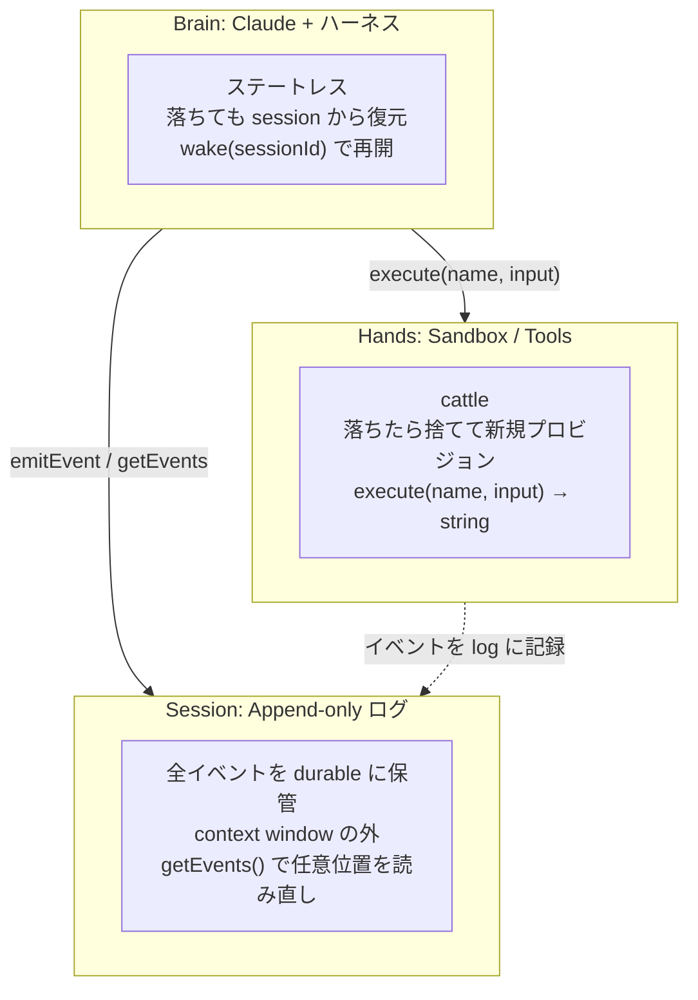

# Claude Managed Agents — エージェント開発の裏方を Anthropic が肩代わりする meta-harness

> [!summary]
> **Claude Managed Agents** ＝ Anthropic がホストする「長時間動くエージェントを動かすためのランタイム」。2026 年 4 月 8 日に Claude Platform 上で発表。社内共有の AI 基盤ではなく、**開発者がエージェントを作るときの土台**で、Brain（Claude ＋ ハーネス）／Hands（sandbox・ツール）／Session（イベントログ）の 3 層に**仮想化**して分離している。コンテナ管理・状態保存・リトライ・コンテキスト溢れ対応・多エージェント分業といった「自前で書くと面倒な共通部分」を Anthropic 側で肩代わりする。開発者は依然として**エージェントのロジック（meta-harness）は書く**が、その下のインフラ管理から解放される。OS が process / file system を仮想化してアプリ開発者を解放したのと同じ発想。2026 年 5 月に Dreaming・Outcomes・Multi-agent Orchestration の 3 機能が追加（Netflix 採用）。本ノートはアーキテクチャ／3 つの新機能／何ではないか／既存選択肢との位置付け／使う動機まで整理する。

関連トピック: [[Claude API]] / [[Claude Code]] / [[Claude Agent SDK]] / [[Anthropic]] / [[AWS で Claude を利用する 3 つの選択肢]] / [[MCP]]

## 1. ひとことで言うと

**「エージェントを動かすためのめんどくさい裏方を Anthropic が肩代わりしてくれる」サービス**。社内で誰でも使える AI 基盤ではなく、**開発者がエージェントを作るときの土台**。

ポイントは「**meta-harness**（ハーネスのためのハーネス）」というポジション:

- ハーネスのロジックは依然として開発者が書く
- でもその下の **session 管理・コンテナ管理・復旧・多エージェント連携**は Anthropic 側
- 開発者は「エージェントが何をするか」に集中できる

## 2. 何を肩代わりしてくれるか

自前でエージェントを作ろうとすると、こういう面倒なことを書く必要がある:

- 状態をどこに保存する？（DB、ファイル、Redis…）
- 落ちたらどう再起動する？
- コンテキストが溢れたらどう要約する？
- ツール実行用のサンドボックス（コンテナ）はどう管理？
- 並列でサブエージェントを動かしたいけどどう調停する？

**これら全部を Anthropic 側のクラウドが面倒見てくれる**のが Managed Agents。開発者は「**こういう仕事をして欲しい**」と頼むだけで、上の運用部分は API の向こう側でよしなにやってくれる、と理解すれば OK。

## 3. アーキテクチャ — Brain / Hands / Session の 3 分離

Managed Agents の心臓部。Anthropic 自身が **"decoupling the brain from the hands"** と表現していて、OS が process / file を仮想化したのと同じ発想で**エージェントの構成要素を仮想化**している。

**Brain（脳）**: Claude モデル ＋ ハーネス（エージェントループ）。落ちたら `wake(sessionId)` で別ハーネスが起動し直し、`getSession(id)` で続きから再開できる。

**Hands（手）**: サンドボックス・ツール（コンテナ・MCP・カスタムツール）。`execute(name, input) → string` 共通インタフェース。コンテナが死んだら新しいのを立てる ＝ **cattle** モデル（pet ではない）。

**Session**: 何が起きたかの append-only ログ。**context window の外**に durable に保存され、`getEvents()` で過去を任意位置・任意範囲から読み直せる。

技術的成果として、この分離により **p50 TTFT が 60%、p95 が 90% 改善**したと Anthropic は報告している（先にコンテナを立てる必要がなくなったため）。

## 4. セッションはコンテキストウィンドウじゃない

ここが LLM エージェント設計として一番面白い発想。**「session は Claude の context window ではない」**と Anthropic が明示している:

- 従来の context engineering（compaction・memory tool・context trimming）は「**今コンテキストに何を残すか**」の**不可逆な決定**が必要
- でも将来どのトークンが必要になるか事前には分からない
- Managed Agents では session log は context window の外に常駐し、brain が `getEvents()` で**好きな位置・好きな範囲を読み直せる**
- 「**文脈の保存（session）**」と「**文脈の管理（harness）**」を分離

これにより**数時間〜数日かかるタスク**でも、コンテキスト溢れを気にせず動かせる構造になっている。

## 5. 2026 年 5 月の新機能 3 つ

Code with Claude イベントで発表された 3 機能:

### 5.1 Dreaming（夢を見る）

- スケジュール実行で**過去のセッションを review** → パターン抽出 → memory store をキュレート
- エージェントが時間とともに**自己改善**していく
- 「人間が寝てる間に整理してる」みたいな比喩そのまま

### 5.2 Outcomes（成果判定）

- **エージェントの出力がデリバリ可能な品質に達したか**を判定する仕組み
- 「もう十分か、まだ続けるか」のジャッジを構造化

### 5.3 Multi-agent Orchestration（多エージェント連携）

- **Lead agent** が仕事を分解 → 各 specialist（独自モデル・プロンプト・ツール）に委譲
- specialist は**並列**かつ**共有ファイルシステム**で動き、lead の context に貢献
- Lead は途中でも他 agent にチェックインできる（イベントが永続的なので）
- **Netflix のプラットフォームチームが採用済み**

## 6. ★ 開発者が書く vs Anthropic が肩代わり

ここを理解すると一気に腹落ちする。**ハーネスのロジック自体は依然として開発者の責任**だが、その下のレイヤを全部 Anthropic が引き受ける、という構造:

| | 開発者が書く | Managed Agents が用意 |
|---|---|---|
| **エージェントが何をするか**（ツール、プロンプト、ロジック） | ✅ 書く | — |
| **どう動くか**（ループ、ステップ判断） | ✅ 書く（＝ハーネス） | フレームワークだけ提供 |
| **状態保存・取り出し** | — | ✅ session API |
| **サンドボックス**（コード実行・ファイル編集） | — | ✅ 標準で用意 |
| **クラッシュからの復旧** | — | ✅ `wake(sessionId)` で自動 |
| **多エージェント連携** | 設計するだけ | ✅ orchestration が標準サポート |
| **MCP / 認証情報の安全管理** | — | ✅ vault & proxy |

正確な言い方:

> **プロダクト開発者は「エージェントが何をするか」だけ集中して書けば、Managed Agents が裏方インフラと session 管理を肩代わりしてくれて、開発体験が統一される**

**OS アナロジー**: OS（カーネル）が process / file system / メモリ管理を肩代わりするから、アプリ開発者はアプリのロジックに集中できる ↔ Managed Agents が session / sandbox / 復旧を肩代わりするから、エージェント開発者はエージェントのロジックに集中できる。Anthropic 自身もこの OS のアナロジーをエンジニアリングブログで使っている。

## 7. 何ではないか（混同しやすいもの）

| 混同しやすいもの | 正しい位置 |
|---|---|
| 「社内の共通エージェント基盤」（社員みんなで使う SaaS） | [[Claude Enterprise]] / Cowork の世界 |
| 「社内スキル / プラグインの共有ストア」 | [[Claude Skills]] / [[Plugins]] の世界 |
| 「ノーコードのエージェントビルダー」 | これでもない（**開発者が API を叩いて組む土台**） |

つまり「**普通の人が使うサービス**」ではなく、「**開発者がエージェントアプリを作るための裏方インフラ**」。

## 8. 既存選択肢との位置付け

| | Claude Code | Claude Agent SDK | **Managed Agents** | 直接 API |
|---|---|---|---|---|
| 何をくれる | CLI ＋ コード用ハーネス | エージェント自作の枠組み | **ホスト型ランタイム＋ session/sandbox 管理** | 単発の Messages API だけ |
| 状態管理 | ローカル | 自前で書く | **Anthropic が管理** | 自前 |
| 落ちた時 | 自分で再起動 | 自分で書いた回復ロジック | **wake() で自動復元** | 自前 |
| 長時間タスク | できる | できる | **得意（session 外部化）** | コンテキスト溢れ要注意 |
| 多エージェント | 自分で組む | 自分で組む | **lead/specialist 標準サポート** | 自前 |
| 顧客 VPC 接続 | 自分でホスト | 自分でホスト | **Sandbox だけ顧客側に置ける** | N/A |
| 課金 | サブスク or API | API 課金 | **Claude Platform 課金（CCU 想定）** | API 課金 |

→ Claude Code や Agent SDK が「**ハーネスを書く道具**」だとしたら、Managed Agents は「**ハーネスを書かなくていい meta-harness**」に近い。

## 9. 使う動機 / 使わない理由

### 使いたくなる場面

- 長時間（数時間〜日単位）のタスクを安定して動かしたい
- production 品質の耐障害性が要る
- 自前で session 管理・コンテキスト管理を書くのが面倒
- 多エージェント分業を導入したい
- Anthropic のベータ機能を早く触りたい

### 使わない or 慎重に考える場面

- **短い対話で完結するチャット用途**（オーバーキル）
- **データを AWS 境界内に閉じたい** — Managed Agents は Anthropic ホストなので、[[AWS で Claude を利用する 3 つの選択肢]] の Bedrock と棲み分け
- 完全にカスタムなエージェントループを自分で制御したい
- まだ価格表が見えにくい段階（CCU 課金前提と思われるが、長時間 session でどう積み上がるか要計測）

## 10. 個人開発・小規模 SaaS の文脈での見方

- **200 ユーザー規模の SaaS** なら直接 API or Bedrock の方が安そう
- Managed Agents が刺さるのは「**複数日かかるバックグラウンドジョブ系**」「**production grade な耐障害性が要るエージェント**」
- ベータ機能や Multi-agent Orchestration を触りたいなら有力
- データを AWS 境界内に閉じる要件があるなら Bedrock 経由（[[AWS で Claude を利用する 3 つの選択肢]] 参照）

## 11. まとめ

- Managed Agents ＝ **「Anthropic ホストのエージェント用ランタイム」**
- **Brain / Hands / Session** を仮想化して分離（OS が process / file を仮想化したのと同じ発想）
- **session は context window の外**に durable に保管、`getEvents()` で任意位置を読み直せる ＝ 長時間タスクに強い
- 開発者は **エージェントのロジック（meta-harness）は書く**が、その下のインフラ管理から解放される
- 2026 年 5 月に **Dreaming / Outcomes / Multi-agent Orchestration** を追加、Netflix が採用
- 社内共通基盤や Skills マーケットではない。**開発者の裏方インフラ**を引き受ける位置
- 個人開発文脈では「複数日かかるバックグラウンド系」「production grade な耐障害性」が必要なときに刺さる

## 関連MOC

- [[MOC AI Engineering]]
- [[MOC AWS]]
- [[MOC Learning]]

## 関連ノート

- [[AWS で Claude を利用する 3 つの選択肢]] — Bedrock / Claude Platform on AWS / Claude Enterprise の選び方。Managed Agents は Claude Platform 上のサービス
- [[AI 利用コストの予算設計]] — AI コストは消費型・変動費。長時間 session の課金影響に注意
- [[Claude Code]] — Anthropic の CLI ハーネス。Managed Agents の "meta-harness" 化対象の 1 つ

## 参考リンク（出典）

- [Scaling Managed Agents: Decoupling the brain from the hands — Anthropic Engineering](https://www.anthropic.com/engineering/managed-agents)
- [Claude Managed Agents overview — Claude API Docs](https://platform.claude.com/docs/en/managed-agents/overview)
- [Anthropic updates Claude Managed Agents with three new features — 9to5Mac](https://9to5mac.com/2026/05/07/anthropic-updates-claude-managed-agents-with-three-new-features/)
- [Code with Claude 2026: 5 New Agent Features Anthropic Just Shipped — MindStudio](https://www.mindstudio.ai/blog/code-with-claude-2026-new-agent-features)
- [Everything Anthropic Shipped in 2026 — Linas Substack](https://linas.substack.com/p/anthropic-claude-2026-every-launch-guide)
