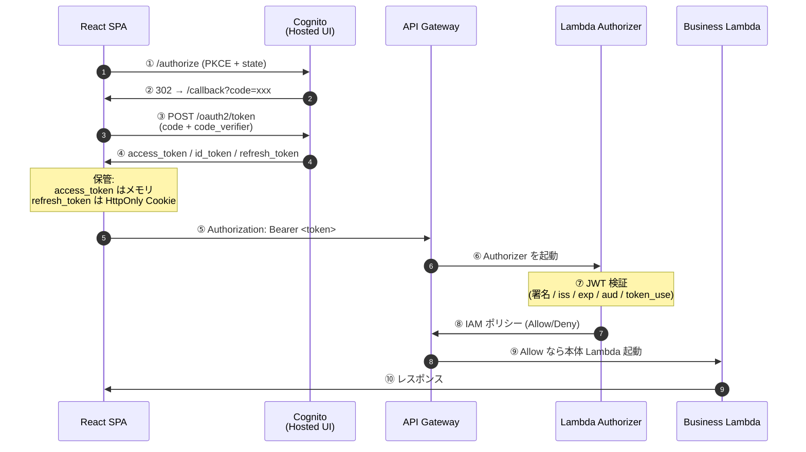

# Cognito OAuth 実装と JWT 検証リファレンス

> [!summary]
> [[Authorization Code Flow]] を [[Cognito]] + [[API Gateway]] + [[Lambda]] + SPA で組むときの実装リファレンス。**ベアラートークンが必要なタイミング**、**access_token と id_token の役割の違い**、**Cognito が両方を JWT 発行する特徴**、**[[Lambda Authorizer]] / API Gateway 標準 Authorizer での検証ポイント**、**SPA トークン保管のセキュリティ**まで実装目線で整理。コンセプト整理は [[OAuth 認証フローと Cognito クロスアプリ連携]] にあるので、ここは Cognito 実装の細部を扱う。

関連トピック: [[OAuth 2.0]] / [[OIDC]] / [[Cognito]] / [[JWT]] / [[API Gateway]] / [[Lambda Authorizer]] / [[PKCE]] / [[BFF パターン]]

---

## TL;DR

- **Authorization Code Flow** ではベアラートークンは **API 呼び出し時のみ必要**（`/authorize` や `/token` には不要）
- **アクセストークン**は「API への入場券」、**IDトークン**は「ユーザーの身分証」 — 役割が違う
- [[Cognito]] は **access_token / id_token のどちらも RS256 署名の JWT で発行**するため、**両方とも JWT 検証可能**（これは Cognito の特徴、OAuth 仕様としては access_token のフォーマットは未規定）
- API 認可には本来 **access_token** を使うのが OAuth 的に正しい
- SPA でトークンを保持するなら **XSS 対策**を意識。本番は **[[BFF パターン]]** が推奨方向

---

## 1. Authorization Code Flow の全体像

```
[1] /authorize     ← ユーザーがログインして code を取得 (ベアラー不要)
        ↓
[2] /token         ← code をトークンと交換 (ベアラー不要、client 認証)
        ↓
[3] /api/...       ← 保護リソースへアクセス (ベアラー必須)
```

### ベアラートークンが必要なタイミング

| ステップ | エンドポイント | ベアラートークン |
|---|---|---|
| 認可 | `/authorize` | 不要 (ユーザーが自分でログイン) |
| トークン交換 | `/token` | 不要 (client_secret or [[PKCE]] で認証) |
| API 呼び出し | `/api/*` | **必須** (`Authorization: Bearer <token>`) |

### `/token` への交換リクエスト例

```http
POST /oauth2/token HTTP/1.1
Host: <user-pool-domain>.auth.<region>.amazoncognito.com
Content-Type: application/x-www-form-urlencoded

grant_type=authorization_code
&code=<受け取ったcode>
&redirect_uri=<登録済みURI>
&client_id=<client_id>
&code_verifier=<PKCE使用時>
```

レスポンス例（scope に `openid` を含めた場合）:

```json
{
  "access_token": "eyJ...",
  "id_token": "eyJ...",
  "refresh_token": "eyJ...",
  "token_type": "Bearer",
  "expires_in": 3600
}
```

---

## 2. アクセストークン vs IDトークン

### 役割の違い

- **アクセストークン**: 「このAPIを叩いていいよ」という **入場券** ([[認可]])
- **IDトークン**: 「このユーザーは確かに本人ですよ」という **身分証** ([[認証]])

### 比較表

| 項目 | アクセストークン | IDトークン |
|---|---|---|
| 規格 | [[OAuth 2.0]] | [[OIDC]] (OpenID Connect) |
| 目的 | リソースへのアクセス許可 | ユーザーの身元証明 |
| 宛先 (`aud`) | リソースサーバー | クライアントアプリ |
| 形式 | 不透明文字列 or JWT (実装次第) | **必ず [[JWT]]** |
| 読む人 | リソースサーバー | クライアント |
| 使い方 | `Authorization: Bearer` で API へ | クライアント内で検証してユーザー情報取得 |

### よくある間違い

- ❌ **IDトークンを `Authorization: Bearer` で API に送る** → 仕様違反（`aud` が違う）
- ❌ **アクセストークンを decode してユーザー情報取得** → 仕様上 JWT である保証も中身の保証もない
  - ユーザー情報が欲しいなら IDトークンか `/userinfo` を使う（[[OAuth 認証フローと Cognito クロスアプリ連携]] §7 参照）

---

## 3. SPA + API Gateway + Lambda + Cognito 構成

### 全体フロー



### 「認証」がどこで起きているか

「認証自体はフロントで実施」と言いがちだが、**厳密には認証は [[Cognito]] (IdP) が実行している**。SPA は OAuth フローを **オーケストレーションしているだけ** という整理が正確。これを混同するとセキュリティ設計の議論が噛み合わない。

---

## 4. Cognito では access_token / id_token どちらでも JWT 検証可能 ★重要

[[Cognito]] User Pool は **access_token と id_token を両方 RS256 署名付き JWT として発行**する。これは Cognito の特徴で、**純粋な OAuth 仕様では access_token のフォーマットは規定されていない**ことに注意。

### 検証に使うリソースは共通

両トークンとも同じ JWKS エンドポイントで署名検証できる:

```
https://cognito-idp.{region}.amazonaws.com/{userPoolId}/.well-known/jwks.json
```

### クレームの違い

| クレーム | `access_token` | `id_token` |
|---|---|---|
| `token_use` | `"access"` | `"id"` |
| `client_id` | あり | なし |
| `aud` | なし | client_id |
| `scope` | あり | なし |
| `email` / `cognito:groups` / カスタム属性 | なし | あり |

### API Gateway 標準 Cognito Authorizer

- access_token / id_token **両方を受け付ける**
- 内部で `token_use` クレームを見て自動でバリデーションを切り替える
- カスタム Authorizer を書かなくて済むので運用は楽
- `$context.authorizer.claims.<claim>` でメソッド側からクレーム参照可能

### カスタム Lambda Authorizer

自前で実装する場合のチェック項目:

1. **署名検証**: JWKS から公開鍵を取得して RS256 検証（`aws-jwt-verify` ライブラリが楽）
2. **`iss` の検証**: `https://cognito-idp.{region}.amazonaws.com/{userPoolId}` と一致するか
3. **`exp` の検証**: 有効期限切れでないか
4. **`token_use` の検証**: 想定するトークン種別と一致するか（これを忘れると **id 想定の API に access が通る等の事故** が起きる）
5. **`aud` または `client_id` の検証**: 自社の Cognito クライアント ID と一致するか
6. **`scope` / `cognito:groups` の検証**: 必要に応じて認可ロジックに利用

```typescript
import { CognitoJwtVerifier } from "aws-jwt-verify";

const verifier = CognitoJwtVerifier.create({
  userPoolId: "ap-northeast-1_xxxxx",
  tokenUse: "access",                 // ← ここで access/id を強制できる
  clientId: "xxxxxxxxxxxxxxxxx",
});

const payload = await verifier.verify(token);
```

### どちらを使うべきか

| ケース | 推奨 |
|---|---|
| 純粋な API 認可 | **access_token**（OAuth 的に正しい） |
| グループでのアクセス制御をしたい | access_token + Cognito API で別途取得、または id_token（運用次第） |
| メール等のユーザー属性が必要 | id_token または `/oauth2/userInfo` |

AWS の公式チュートリアルでは id_token を例示するものも多いため、**実装者で揃っていないことが多い**。**チームで「access_token を送る」「id_token を送る」のどちらかにルール化**しておくのが事故防止に効く。

---

## 5. セキュリティ考慮事項

### SPA でのトークン保管

| 保管場所 | 評価 | 理由 |
|---|---|---|
| `localStorage` / `sessionStorage` | ❌ | [[XSS]] でゴッソリ盗まれる |
| メモリ (React state) | ⚠️ | リロードで消える、UX 課題あり |
| HttpOnly Cookie (refresh_token) + メモリ (access_token) | ✅ | 現実解 |
| **[[BFF パターン]]** (バックエンドがトークン保持、SPA はセッション Cookie のみ) | ✅✅ | OAuth WG の推奨方向、本番運用向け |

### Authorizer 側で漏らさず確認したいクレーム

- `token_use` — **別種のトークン誤投入を防ぐ**（これを忘れると事故が起きる）
- `iss` / `aud` (or `client_id`) — 他テナント・他クライアントの混入を防ぐ
- `exp` — 期限切れトークンの拒否
- `scope` / `cognito:groups` — 過剰権限の防止

### キャッシュ戦略

- [[API Gateway]] の Authorizer 結果キャッシュ (TTL) を有効にすると [[Lambda]] 起動コスト削減
- ただし **TTL 中はトークン失効が反映されない** 点に注意 — 失効伝播時間と TTL は揃える（短時間設定 + 失効許容、または長時間 + 強制 logout で対応）

---

## 6. 関連ノートとの位置づけ

- **コンセプト全般** ([[OAuth 認証フローと Cognito クロスアプリ連携]]): Authorization Code Flow の流れ、PKCE、トークンの検証一般論、Cognito × IAM Identity Center での多重 federation シナリオ
- **本ノート**: Cognito 固有の実装メモ — JWT 検証、API Gateway / Lambda Authorizer、SPA トークン保管
- **[[Cognito外部認証 OIDC連携]]**: Cognito を OIDC IdP として「上位 Cognito」に federate するときのコールバック URL の罠
- **[[A07 Identification and Authentication Failures]]**: OWASP の認証カテゴリ全般

「**コンセプト → Cognito 実装 → ハマりどころ**」の順で読むと頭に入りやすい。

---

## 残課題（議論の元になった問い）

1. ベアラートークンは `/authorize` や `/token` にも必要か → §1、API 呼び出し時のみ必要
2. アクセストークンと IDトークンの違いは何か → §2、宛先と用途が違う
3. ID トークンを API に送ってもいいか → §2、`aud` 違いで NG
4. アクセストークンを decode してユーザー属性を取れるか → §2、Cognito は JWT だが本来非保証
5. Cognito で API Gateway Authorizer を使うと両トークン受け付ける？ → §4、自動振り分けされる
6. `token_use` チェック忘れの事故とはどんなものか → §4-5、id 用 API に access が通る等
7. SPA で refresh_token をどこに置くべきか → §5、HttpOnly Cookie + access_token はメモリ、本番は BFF

---

## 参考リンク

- OAuth 2.0 Authorization Code: RFC 6749
- [[PKCE]]: RFC 7636
- OpenID Connect Core 1.0
- AWS Cognito User Pool: トークン使い分けの公式ドキュメント
- OAuth Browser-Based Apps BCP (draft-ietf-oauth-browser-based-apps)

---

## 関連MOC

- [[MOC AWS]]
- [[MOC Security]]
- [[MOC Learning]]

## 関連ノート

- [[OAuth 認証フローと Cognito クロスアプリ連携]] — 認証フロー全般のコンセプト整理（こちらは Cognito 実装の細部）
- [[Cognito外部認証 OIDC連携]] — Cognito to Cognito OIDC のコールバック URL の罠
- [[認証と認可]]
- [[A07 Identification and Authentication Failures]] — OWASP 認証カテゴリ
- [[AWSセキュリティ実装]]
- [[暗号の基礎]]
- [[ゼロトラストとネットワーク基礎]] — [[IAM Identity Center]] / VPC Lattice
