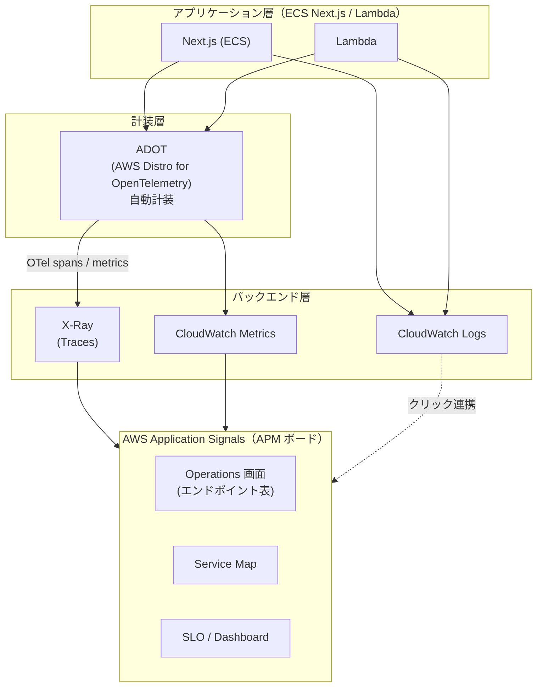

# ECS + Lambda 観測性設計 — パターン比較と C 案採択

> [!summary]
> ECS（Next.js）＋ Lambda 構成の観測性をどう実現するか、3 パターンを比較して **C 案（[[AWS Application Signals]]）** を採択した意思決定メモ。主目的は **API エンドポイント別の遅延を定常的にボードで把握**＋エラー集約。A 案＝最小構成（不適）、B 案＝[[X-Ray]] 中心（分析寄りで主目的不一致）、C 案＝[[OpenTelemetry]] 自動計装＋Application Signals（採択）。トラフィック 50 req/min、月額 $10-20、AWS 内完結、OTel も自然に学べる。本ノートには採択理由・実装手順（ECS / Lambda）・コスト試算・**OTel 基礎概念（Span / Trace / Attribute）**・**New Relic フルプラとのコスト比較**・次のステップを含む。

関連トピック: [[AWS Application Signals]] / [[OpenTelemetry]] / [[X-Ray]] / [[CloudWatch]] / [[ADOT]] / [[Next.js]] / [[ECS]] / [[Lambda]] / [[ALB]]

## 1. 目的とスコープ

- **各 API エンドポイントの遅延を定常的に監視**（リアルタイムで現状把握）
- **エラーログをまとめて把握・集約**
- AWS に閉じた構成（外部 SaaS 不使用）
- [[OpenTelemetry]] は勉強になれば良い（強い拘りなし）

**トラフィック規模**: 50 req/分（全エンドポイント合計）

## 2. パターン比較サマリ

| 観点 | A: 最小構成 | B: [[X-Ray]] 中心 | **C: [[AWS Application Signals]]** |
|---|---|---|---|
| エンドポイント別 p99 ボード | ❌ URL パース＋Athena 自作 | △ ボード化困難 | ✅ Operations 画面に標準搭載 |
| トレース・内訳 | ❌ | ✅ ウォーターフォール | ✅（X-Ray が下支え） |
| Lambda 対応 | ❌ | △ | ✅ |
| OTel 学習 | ❌ | ✅ 素の SDK | ✅ ラップ済みでも触れる |
| 実装コスト | ゼロ | 半日〜1日 | 半日〜1日（ECS）／ 数十分（Lambda） |
| 月額（50 req/min） | ほぼ無料 | $0-10 | $10-20（初月は無料トライアル） |
| 選定 | ❌ 除外 | △ 不採択 | ✅ **採択** |

## 3. パターン A: 最小構成（推奨されず）

**概要**: [[ALB]] ネイティブメトリクス ＋ [[CloudWatch Logs]] のみ。アプリ無改修。

**レイテンシ監視**
- ALB `TargetResponseTime` の p50 / p90 / p99 を [[CloudWatch]] メトリクスで自動取得
- ALB アクセスログ → S3 / Athena で URL パス別に分析可能
- **制限**: ルート粒度の取得は URL パース頼り、1 リクエスト内部の内訳は見えない

**エラー把握**
- CloudWatch Logs（awslogs）にアプリログ集約
- Logs Insights で ERROR パターン集計
- メトリクスフィルタで ERROR 件数をアラーム化

**実装コスト**: ゼロ（設定のみ）

**月額コスト（50 req/分）**
- ALB メトリクス: 無料
- Logs 保存・Logs Insights: 〜¥30-50/月（低量）
- **合計**: ほぼ無料

**長所**: 即日導入可能 / アプリ無改修 / コスト最小

**短所**
- ルート別レイテンシ一覧がない（URL パース ＋ Athena クエリが必要）
- 「ボードで各エンドポイント並べて見る」が難しい
- OTel 学習にならない
- Lambda はカバーできない

**選定**: ❌ 除外。主目的「エンドポイント別の定常監視ボード」に不適。

## 4. パターン B: X-Ray 中心（調査寄り）

**概要**: [[OpenTelemetry]] SDK 導入 → [[X-Ray]] で per-request trace ＋ 内訳。軽量計装。

**レイテンシ監視**
- X-Ray で各リクエストのトレース・ウォーターフォール取得
- DB / 外部 API 呼び出しの内訳が時系列で見える
- **課題**: 「エンドポイント A の p99」を一覧で常設表示するボードが標準にない
  - X-Ray Analytics で URL フィルタすれば分布は見えるが、複数エンドポイント横並び比較は手動作業

**エラー把握**
- CloudWatch Logs に `trace_id` 埋め込み → トレースと突合

**実装コスト**
- ECS: Next.js `instrumentation.ts` or autoinstrumentation パッケージ ＋ task def 修正（サイドカー、IAM）で半日〜1 日
- Lambda: [[ADOT]] レイヤー ＋ env ＋ IAM で数十分

**月額コスト（50 req/min）**
- X-Ray traces recorded: 100 万トレース/月無料 ＋ 超過分 $5 / 100 万
  - 50 req/min × 43,800 min/月 = 219 万トレース → 100 万超過 × $5/M = 約 $6/月
  - サンプリング 10% なら 219 万 × 10% = 21.9 万 → 無料枠内で無料
- **合計**: $0-10/月（サンプリング戦略次第）

**長所**: 内訳がウォーターフォールで見える（調査しやすい）／ OTel の学習になる ／ AWS 内完結 ／ 低コスト

**短所**: 全エンドポイントの p99 を 1 つのボードで並べて見るには向かない（主目的に不適）／ 常設の「ボード監視」より「分析・調査」寄り ／ Lambda とのサービスマップ統合が弱い

**選定**: △ 検討対象だが、「ボードで現状把握がメイン」という目的には X-Ray 単体は不十分。

## 5. パターン C: Application Signals（推奨・採択）

**概要**: [[OpenTelemetry]] 自動計装 ＋ AWS [[Application Signals]]（APM）。ボード機能・SLO・サービスマップ完備。

### 5.1 レイテンシ監視

- Application Signals の **Operations 画面**: **各エンドポイントが行単位で表示**
  - 列: Latency（avg, p99）/ Error Rate / Request Volume / Error Count
  - 動的に更新される（定常監視に最適）
- サービスマップ: 依存関係（[[Aurora]]、Lambda、外部 API）が可視化、リンク先のレイテンシ追跡可能
- 各エンドポイントをクリック → X-Ray トレース詳細へドリルダウン

### 5.2 エラー把握

- CloudWatch Logs（awslogs）＋ Logs Insights ＋ メトリクスフィルタ（パターン A と同じ）
- Application Signals の Faults / Errors も集計表示

### 5.3 実装コスト

**ECS（Next.js）**: CloudWatch agent サイドカー化 ＋ ADOT init コンテナ（or autoinstrumentation パッケージ直入れ for ESM）＋ IAM タスクロール権限 ＋ サービス名手動指定 → **半日〜1 日**（初回）、テンプレ化すれば横展開は高速

**Lambda（Node.js）**: ADOT Lambda レイヤー追加（マネージド提供、最新 ARN は AWS docs から取得）＋ 環境変数 `AWS_LAMBDA_EXEC_WRAPPER=/opt/otel-instrument` ＋ App Signals 自動有効化 ＋ IAM 実行ロール権限 → **数十分**

**統合**: ECS と Lambda が同じ Application Signals にログイン → 1 つのサービスマップで繋がる。Next.js → Lambda → DB の flow が end-to-end で可視。

### 5.4 月額コスト（50 req/min）

**Application Signals**
- シグナル ＝ リクエスト単位（inbound ≈ 1 req = 1 signal）
- 50 req/min × 43,800 min/月 = 219 万シグナル/月
- $1.50 / 100 万シグナル（最初の 1 億）→ 約 **$3.3/月**（inbound のみ）
- outbound（dependency）も乗れば概ね倍増 → **$6-7/月** が現実的
- **3 ヶ月無料トライアル**あり（アカウント単位）

**X-Ray（下支え）**
- 記録トレース: 219 万 × $0.000005/trace = 約 $11/月（100% sampling）
- サンプリング 10% なら無料枠内で $0
- **$0-10/月**（サンプリング戦略次第）

**CloudWatch Logs（エラー）**: 〜¥30/月

**全体月額: $10-20/月**（初月は無料トライアル）、実質的に低コスト

**Lambda 固有の注意**
- ADOT レイヤーはコールドスタート＋実行時間にオーバーヘッド（数百 ms）
  - Lambda は実行時間課金だが、50 req/min 規模では月額への影響は誤差（数百円程度）
- 要トレース感度制御: 低頻度 Lambda はサンプリング低めに

### 5.5 長所・短所

**長所**
- ✅ **ボードで各エンドポイントの p99 / エラー率を並べて見渡せる**（主目的達成）
- ✅ 定常監視に最適（continuous board）
- ✅ SLO（Service Level Objective）貼れる → バーンレートアラーム
- ✅ ECS ＋ Lambda が同じマップで繋がる（end-to-end visibility）
- ✅ X-Ray トレースは下支え（調査・ドリルダウンは X-Ray）
- ✅ 低コスト（この規模では月 $10-20）
- ✅ OTel の学習にもなる
- ✅ AWS 内完結

**短所**
- ECS は sidecar ＋ init container の配線が要る（初回は手間）
- Lambda レイヤーのコールドスタート影響（低頻度なら無視可）
- 手動でサービス名指定する必要あり（ECS は auto-discover なし）

**選定**: ✅ **採択**。主目的「ボードで現状把握」に最適、コストは許容範囲、実装は一度テンプレ化すれば横展開も容易。

## 6. C 案と OpenTelemetry の関係

**結論**: C 案は「**OTel を下地に使う Application Signals**」。OTel そのものではなく、OTel をラップした AWS の APM 製品。

### 6.1 レイヤー構造



- **[[OpenTelemetry]] 本体**: オープンスタンダードの観測フレームワーク（どのバックエンドにも使える）
- **[[Application Signals]]**: その OTel を AWS がラップして APM として提供したもの

### 6.2 意思決定への影響

| 観点 | 内容 |
|---|---|
| OTel 概念（traces, spans, attributes） | 避けられない（理解は必要） |
| OTel SDK のコード実装 | 自動計装が担当 → 直接書かない |
| 学習バランス | 「OTel を学べるが強く縛られない」丁度いい塩梅 |

→ 「OTel は勉強になれば良い」という当初の希望に対し、C 案はむしろ好都合（一石二鳥）。意思決定を変える要素にはならない。

### 6.3 OTel 学習を主目的にする場合の別解

- OTel の素の感覚を得たいなら **B 案（X-Ray ＋ 手動 OTel SDK）** の方が学べる
- ただしその場合ボード機能は自前で作る必要がある
- C 案は「完成したボード（App Signals）」＋「下地で OTel を学べる」の両取り

## 7. OTel 基礎概念: Span / Trace / Attribute

ボードで「エンドポイント別レイテンシ」が見える仕組みの土台になる 3 つの概念。Application Signals の Operations 画面が裏で何をしているか、ここを押さえると一気に腹落ちする。

### 7.1 Span（スパン）= 1 つの作業の記録

「ある処理の始まりと終わりを記録した 1 区間」。ストップウォッチ付きの作業ログ。1 つのスパンが持つもの:

- **名前**（例: `POST /api/orders`）
- **開始時刻・終了時刻** → **所要時間（duration）** ＝ 知りたいレイテンシ
- **親子関係**（どのスパンの中で起きたか）
- **ステータス**（成功 / エラー）
- **属性**（attribute、§7.3）

### 7.2 Trace（トレース）= スパンの木

1 リクエスト内で複数処理が起き、スパンが**親子の木構造**になる。これ全体が 1 トレース（＝ 1 リクエストの全行程）。X-Ray のウォーターフォールはこの木をそのまま描いている。

```
[POST /api/orders]              duration: 320 ms  ← 親スパン
 ├─ [SELECT orders (Aurora)]     duration: 60 ms   ← 子スパン
 ├─ [lambda-process-payment]     duration: 200 ms  ← 子スパン
 └─ [PUT cache (Redis)]           duration: 20 ms   ← 子スパン
```

「合計 320 ms のうち payment Lambda が 200 ms」が一目でわかる ＝ **内訳の正体**。

### 7.3 Attribute（属性）= スパンに貼るラベル

スパンに付ける **key-value のメタデータ**。付箋・タグのイメージ。

```
http.method      = "POST"
http.route       = "/api/orders"
http.status_code = 201
user.id          = "u_123"
```

役割は「**後で絞り込み・グループ化するため**」。

### 7.4 核心 — ボードと繋がる仕組み

Application Signals が「エンドポイント別レイテンシ表」を作れるのは、**`http.route` 属性でスパンをグループ化して duration を集計している**から。

```
http.route = "/api/orders" のスパン群 → 平均 / p99 を計算 → 表の 1 行
http.route = "/api/users"  のスパン群 → 平均 / p99 を計算 → 表の 1 行
```

**カーディナリティ注意**: `http.route` が `/api/users/[id]`（テンプレート）ではなく `/api/users/123`（実値）になると、属性の種類が無限増殖し、グループが爆発して表が使い物にならない。**必ずテンプレート形で出すこと**（フレームワークの自動計装が普通やってくれるが、独自実装時は要確認）。

### 7.5 まとめ

- **Span**: 1 処理の時間記録（ストップウォッチ）
- **Trace**: スパンの木（1 リクエストの全行程）
- **Attribute**: スパンに貼るラベル（絞り込み・集計の軸）

この 3 つが「ボードで各エンドポイントの遅延が見える」仕組みの土台。

## 8. 補足: New Relic（フルプラ）とのコスト比較

NR を使えるなら？という検討。**結論: やりたいことが限定的なので NR フルプラは過剰投資（もったいない）**。ただし今回は NR アカウントが使えない制約があるため、いずれにせよ C 案が妥当。

### 8.1 NR フルプラットフォームユーザーの価格（per user / 月）

- **Standard**: 最初の 1 人 $10 ＋ 追加 1 人ごとに $99（最大 5 人）
- **Pro**: 年契約で $349/user/月（月契約だと $418.80/月）、人数無制限
- **Enterprise**: カスタム（$549/user/月 という list もあり）
- ざっくり **$99〜$549/user/月**（エディション次第）
- 別途: データ取り込み 月 100 GB 無料、超過 $0.40〜0.60/GB

→ NR は「**ユーザー数（席）× エディション単価 ＋ データ量**」課金。

### 8.2 C 案との比較

| | NR フルプラ | C 案（App Signals） |
|---|---|---|
| 課金軸 | ユーザー数（席）＋ データ | リクエスト量のみ |
| 単価 | $99〜349/user/月 | 席課金なし |
| この規模の月額 | 1 人でも $99〜349〜 | **$10〜20 フラット** |
| 閲覧人数増 | 人数分かさむ | 何人見ても追加 $0 |

**C 案の方が明確に安い**。特に SRE として複数人で見たい場合、NR は人数分かかるが、C 案は CloudWatch コンソールを見られる人なら **何人でも追加コストゼロ**。

### 8.3 「もったいない」が当たっている理由

NR フルプラは APM・インフラ・シンセティック・AIOps など 50 以上の機能フルアクセスへの席課金。今回やりたいのは「エンドポイント別レイテンシのボード ＋ エラーログ集約」という限定スコープ。**機能の 9 割を使わないのに席代を払う**構図なので過剰。

### 8.4 正直な 1 点

NR には 100 GB ＋ フルプラ 1 人を含む **期限なしの無料エディション**があり、50 req/分ならデータも 100 GB 以内に収まる公算大。もし NR が使えて 1 人運用なら無料 ＋ セットアップも楽で、実は C 案より手軽だった。ただし「NR アカウントが使えない（AWS 完結が前提）」制約下では選べない。

→ その制約下では **C 案（App Signals）＝ 限定スコープ・複数人閲覧・AWS 完結・月 $10-20 を全部満たすベスト**。

## 9. C 案 実装詳細

### 9.1 ECS（Next.js）側

**必須手順**

1. **CloudWatch agent をサイドカーコンテナ化**
   - Image: `amazon/cloudwatch-agent:latest`
   - Config: Application Signals 用の JSON config

2. **ADOT 計装方式を選択**（どちらか）
   - **方式 A: Init Container** → Next.js が CommonJS の場合
     - Init container で `/opt/aws-otel-nodejs/` マウント
     - Task def に依存
   - **方式 B: SDK 直入れ** → Next.js が ESM の場合（推奨）
     - `npm install @aws/aws-distro-opentelemetry-node-autoinstrumentation`
     - `instrumentation.ts` で `register()` 呼び出し（Next.js standard）
     - `NODE_OPTIONS="--require @aws/aws-distro-opentelemetry-node-autoinstrumentation"` または `register()` via Next.js hook

3. **IAM task role に権限追加**
   - `CloudWatchAgentServerPolicy`
   - `AmazonSSMManagedInstanceCore`（Systems Manager 経由での agent 制御、optional）
   - X-Ray write: `AWSXRayDaemonWriteAccess`

4. **環境変数**
   - `OTEL_SERVICE_NAME=my-nextjs-app`（サービス名、App Signals に表示される）
   - `OTEL_EXPORTER_OTLP_ENDPOINT=http://localhost:4317`（CloudWatch agent への localhost 接続）
   - `OTEL_AWS_APPLICATION_SIGNALS_ENABLED=true`（デフォルト）

**成果**
- Next.js 各ルート（API endpoint）が Application Signals に自動登録
- route 名（`/api/users`、`/api/orders` など）がそのまま Operation 名に

### 9.2 Lambda（Node.js）側

**必須手順**

1. **ADOT Lambda Layer を追加**
   - ランタイム・アーキ・リージョン別に ARN が異なるため、AWS docs から最新取得
   - Layer 例: `arn:aws:lambda:REGION:901920570399:layer:aws-otel-nodejs-...`

2. **環境変数**
   - `AWS_LAMBDA_EXEC_WRAPPER=/opt/otel-instrument`（layer がこのパスで計装ラッパーを提供）
   - `OTEL_SERVICE_NAME=my-lambda-service`
   - `OTEL_AWS_APPLICATION_SIGNALS_ENABLED=true`（デフォルトで有効）

3. **IAM 実行ロール**
   - `CloudWatchLambdaApplicationSignalsExecutionRolePolicy` もしくは明示的に
   - `logs:CreateLogGroup`、`logs:CreateLogStream`、`logs:PutLogEvents`（CloudWatch Logs）
   - `xray:PutTraceSegments`、`xray:PutTelemetryRecords`（X-Ray）
   - `cloudwatch:PutMetricData`（App Signals metrics）

4. **コード修正**: ほぼ不要（Layer が自動計装）
   - 任意: 特定ロジックを手動スパンで囲みたいなら OTel SDK 呼び出し

**成果**
- 各 Lambda invocation が Application Signals に記録
- function 名がそのまま Operation 名に

### 9.3 ECS ＋ Lambda の統合

Application Signals が自動的に Next.js → Lambda の依存を検出し、サービスマップに線で繋ぐ。**end-to-end latency visibility** が得られる。

## 10. ボード（Application Signals Operations 画面）の見え方

**画面**: Service → Operations tab

| Operation | Latency (avg) | Latency (p99) | Error Rate | Volume | Status |
|---|---|---|---|---|---|
| `GET /api/users` | 45 ms | 320 ms | 0.2% | 1,240 | ✓ |
| `POST /api/orders` | 320 ms | 540 ms | 1.1% | 340 | ⚠ |
| `GET /api/inventory` | 12 ms | 50 ms | 0% | 2,100 | ✓ |
| `lambda-process-payment` | 850 ms | 2,100 ms | 0.5% | 85 | ⚠ |

このテーブルが定常的に更新される。「A は今どのくらい？ B は？」という問いに即座に答える。

## 11. 次のステップ

1. **ECS タスク定義テンプレート化**（CloudFormation / Terraform / CDK）
2. **Lambda 関数の layer 統合テンプレート化**
3. **デプロイ、無料トライアル期間中に動作確認**
4. **SLO 設定**（オプション）: 例「`GET /api/orders` の p99 < 1000 ms、99% availability」

## 12. メタ情報

- 作成日時: 2026-06-06
- 選定パターン: **C**（Application Signals／OTel ベース）
- 対象システム: ECS（Next.js）＋ Lambda
- トラフィック: 50 req/min

## 参考リンク

- [AWS Application Signals - CloudWatch](https://docs.aws.amazon.com/AmazonCloudWatch/latest/monitoring/CloudWatch-Application-Signals-Enable-ECSMain.html)
- [ADOT Lambda Layer](https://docs.aws.amazon.com/xray/latest/devguide/xray-sdk-nodejs-lambda.html)
- [X-Ray Pricing](https://aws.amazon.com/xray/pricing/)
- [CloudWatch Application Signals Pricing](https://aws.amazon.com/cloudwatch/pricing/)
- [New Relic Pricing](https://newrelic.com/pricing)

## 関連MOC

- [[MOC Observability]]
- [[MOC AWS]]
- [[MOC Learning]]

## 関連ノート

- [[システム監視と可観測性]] — Monitoring と Observability の違い、4 本柱（Metrics / Logs / Traces / Profiles）
- [[セキュリティロギング設計]] — 何をどこにどれだけ残すか、PII の扱い
- [[インシデントレスポンス]] — Runbook / Game Day
