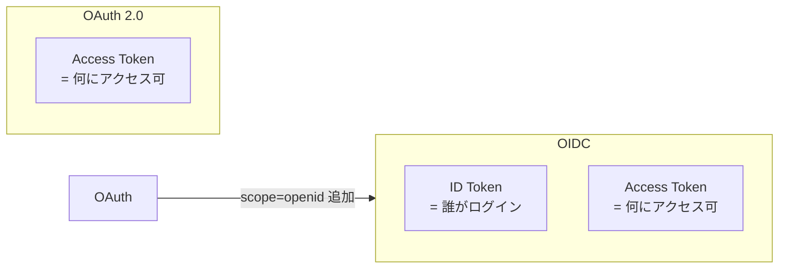
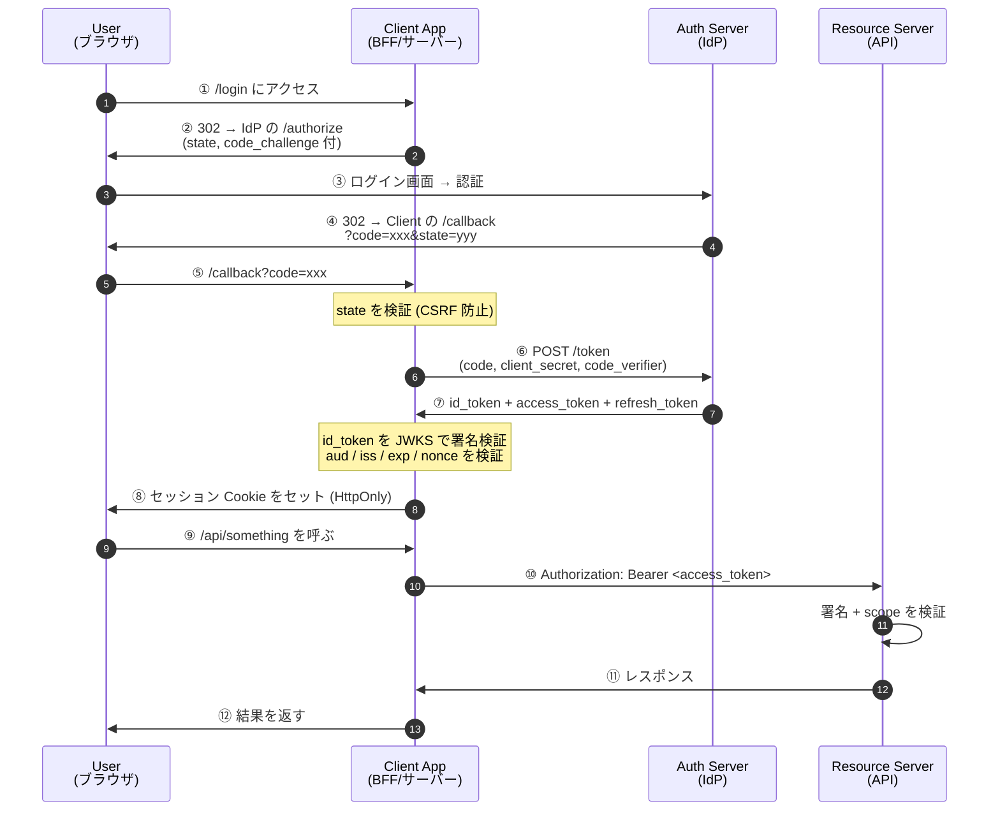
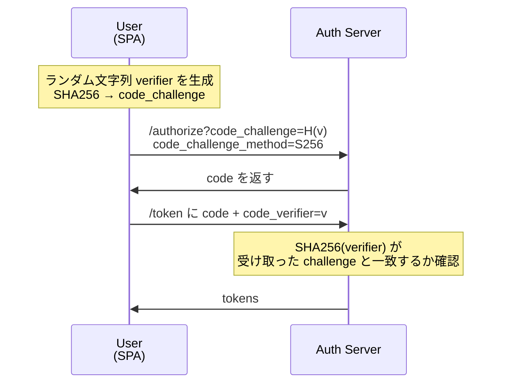
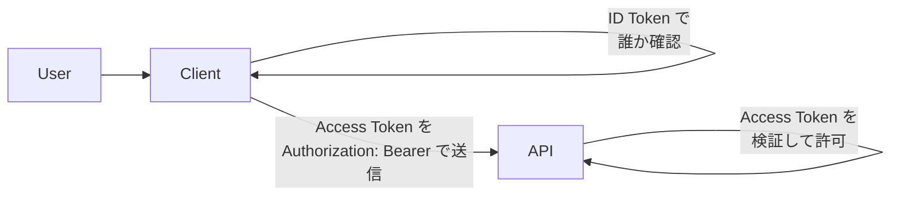
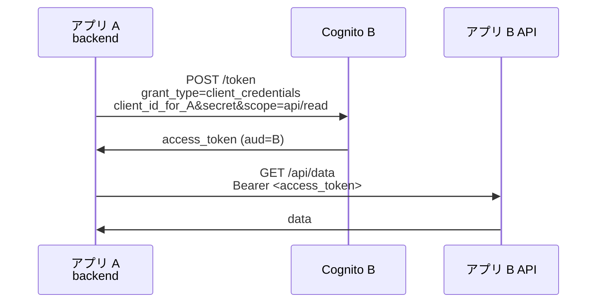
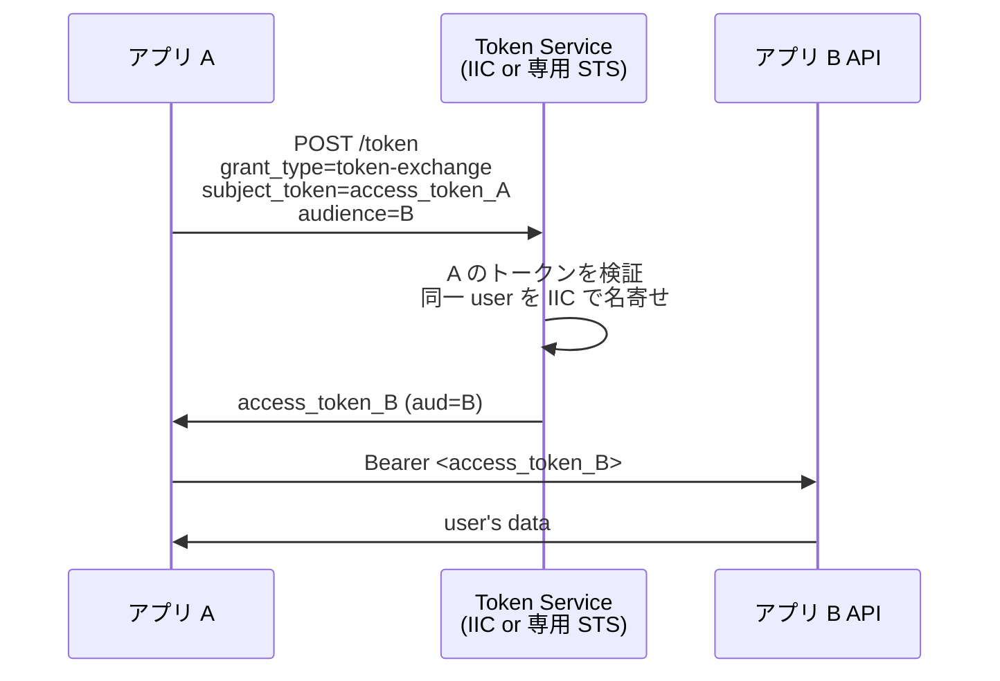
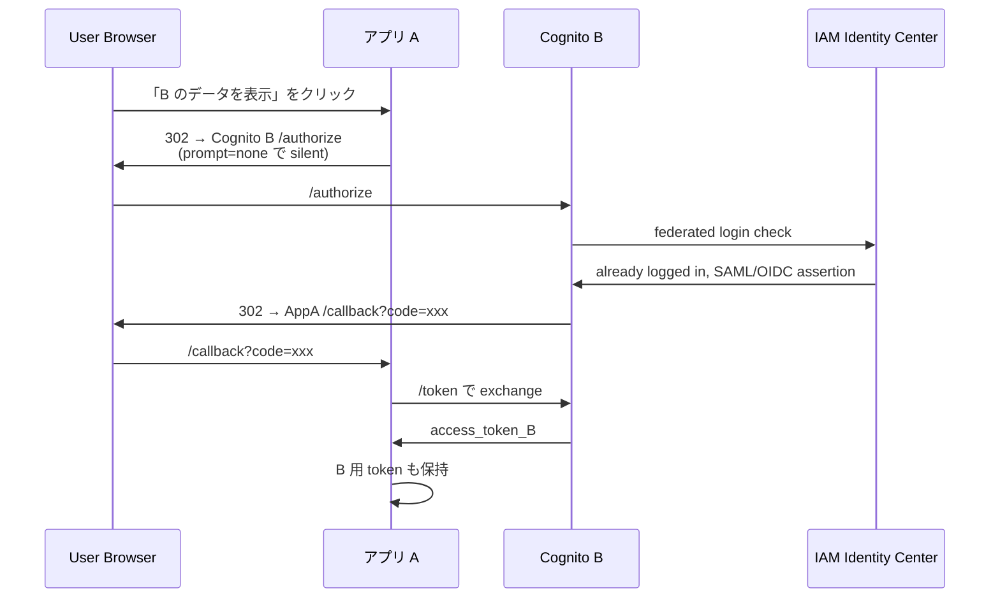
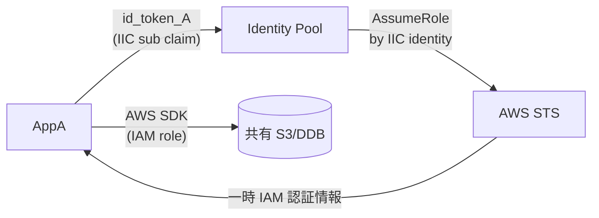
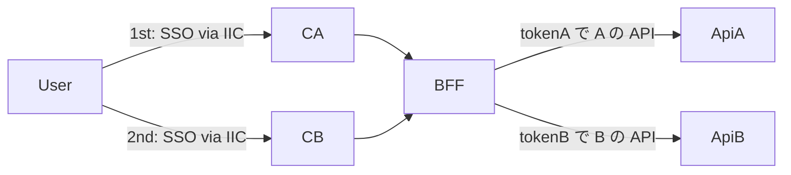

# OAuth 認証フローと Cognito クロスアプリ連携

> [!summary]
> [[Authorization Code Flow]] の流れと検証ポイント、[[ID Token]] と [[Access Token]] の役割の違い、`/userinfo` で自分の情報を取り直す方法、そして「**Cognito A と Cognito B が同じ [[IAM Identity Center]] に federate している環境で、アプリ A からアプリ B のデータを取得する**」現実シナリオの解法を整理。図示多めで実装の足がかりにする。

関連トピック: [[OAuth 2.0]] / [[OIDC]] / [[Cognito]] / [[IAM Identity Center]] / [[JWT]] / [[PKCE]] / [[Token Exchange]] / [[OWASP Top 10]]

---

## 1. 全体マップ — OAuth と OIDC の役割分担

- **[[OAuth 2.0]]** は**認可**（このクライアントは API を呼んでいいか？）のための仕様
- **[[OIDC]]** は OAuth 2.0 の上に**認証**（誰がログインしたか？）を載せた拡張
- 両者は同じエンドポイント（`/authorize`、`/token`、`/userinfo`）を共有し、`scope` に `openid` を含めるかどうかで切り替わる
- 出力されるトークンが違う:
  - OAuth → [[Access Token]]
  - OIDC → [[ID Token]] + [[Access Token]]（+ Refresh Token）



---

## 2. Authorization Code Flow とは

「**認可コード**」を一度だけ受け取り、それをサーバー側で**トークン**と交換するフロー。OAuth 2.0 / OIDC で最も広く使われる、最も安全なフロー。

### 登場人物

| 役 | 例 | 持つもの |
|---|---|---|
| **User** | ブラウザの中の人 | パスワード（IdP に預けてある） |
| **Client** | Web アプリ ([[Next.js]] / [[Lambda]] backend 等) | client_id、client_secret（バックエンド側のみ） |
| **Authorization Server (IdP)** | [[Cognito]] / [[Auth0]] / [[Keycloak]] / [[IAM Identity Center]] | ユーザー DB、署名鍵 |
| **Resource Server** | アプリの REST API | Access Token を検証するロジック |

### 流れ（シーケンス図）



### 各ステップの要点

| Step | 要点 |
|---|---|
| ② | `response_type=code`、`scope=openid profile email`、`state`、`code_challenge` を含める |
| ③ | パスワードは IdP にだけ流れる。Client App は絶対に受け取らない |
| ④ | リダイレクト URL は Client の callback。`code` は短命 (Cognito で約 60 秒) |
| ⑥ | バックエンドからのみ叩く（client_secret が必要）。これが「コード→トークン」の関門 |
| ⑦ | レスポンスは JSON。`id_token` は JWT、`access_token` は JWT or opaque（IdP 次第） |

---

## 3. なぜ「コード」を介すのか

直接 Access Token を ④ で返す方式は **Implicit Flow** として OAuth 2.0 初期にあったが、**現在は非推奨**。理由:

- URL fragment に Access Token が出る → ブラウザ履歴・Referer に残る、リバースプロキシのアクセスログに出る
- リフレッシュトークンが取れない（長期セッションが組めない）
- client_secret 検証の機会がない（confidential client の証明ができない）

Authorization Code Flow ではこれらを解決:

- **`code` は短命・1 回限り**: 漏れても 60 秒以内に使われないと無効
- **`code → token` 交換はバックエンド**: client_secret はサーバーから出さない
- **Refresh Token も同じ交換で受け取れる**: セッション延長が可能

---

## 4. PKCE — クライアントが client_secret を持てない場合

SPA、ネイティブモバイルアプリのように client_secret を秘匿できないクライアントは、**[[PKCE]] (Proof Key for Code Exchange)** を追加で使う。



要点: client_secret の代わりに「**自分が認可リクエストを出した張本人である**」ことを毎回証明する仕組み。code が漏れても verifier がないと交換できない。

---

## 5. 検証ポイント — 何を verify すべきか

[[OIDC]] / OAuth の実装で**手抜きで穴を空ける**箇所のチェックリスト。

### Client App 側

| 検証項目 | 何のため | 検証しないと… |
|---|---|---|
| `state` | CSRF 防止 | 攻撃者の認可コードを犠牲者に飲ませる攻撃が成立 |
| `nonce` | replay 防止 (id_token に含まれる) | 過去の id_token を流用される |
| 署名検証 (JWKS) | id_token の改竄検知 | 偽の `sub` で別人になりすませる |
| `iss` | 発行者確認 | 別 IdP のトークンを受け入れてしまう |
| `aud` | 受信者確認 | 別 Client 向け id_token を流用される |
| `exp` | 期限切れ拒否 | 古いトークンが永久に通る |

### Resource Server 側 (API)

| 検証項目 | 何のため |
|---|---|
| Bearer の署名 (JWKS) | access_token の改竄検知 |
| `aud` | この API 向けのトークンか確認 |
| `scope` | この API/操作に必要な権限を持つか確認 |
| `exp` | 期限切れ拒否 |

### JWKS の正しい扱い

- IdP の `/.well-known/openid-configuration` の `jwks_uri` から公開鍵を取得
- 鍵は**キャッシュ**してよい（毎回 fetch しない）。ただし **kid (key id) 別** に管理
- IdP は鍵をローテーションするので、未知の kid が来たら JWKS を refetch
- 鍵ローテーション期間は Cognito で 1 年程度

---

## 6. ID Token vs Access Token — 用途の違い

| 観点 | ID Token | Access Token |
|---|---|---|
| **規格** | [[OIDC]] (Core 1.0) | [[OAuth 2.0]] |
| **目的** | **認証** 「誰がログインしたか」 | **認可** 「何にアクセスできるか」 |
| **形式** | 必ず JWT (RFC 7519) | JWT or opaque（IdP 次第） |
| **主要 claim** | `sub`, `name`, `email`, `picture`, `nonce` | `scope`, `client_id` (発行先 Client) |
| **受信者 (`aud`)** | **Client App** | **Resource Server** |
| **使われ方** | Client がユーザー情報を取り出して session を組む | Resource API を呼ぶ Bearer token として |
| **検証する人** | **Client App** | **Resource Server** |
| **寿命** | 通常 1 時間程度 | 通常 1 時間（Refresh で更新） |
| **API に投げていいか** | **NG**（用途違い） | **OK**（むしろこれを投げる） |



### 典型的なミス

- **API リクエストに id_token を渡す**: API は通常 access_token しか期待していない、`aud` 不一致で 401
- **Client App の session を access_token の中身で組む**: access_token は opaque な場合があり、user info が入っていない可能性。**user info は id_token か `/userinfo` から取る**
- **id_token を URL クエリで投げる**: SSO 終了時のリダイレクト等で URL に乗せると Referer に漏れる。POST body か HttpOnly Cookie で

---

## 7. /userinfo エンドポイントで「自分の情報」を取り直す

> 質問: アクセストークンあれば、IdP に問い合わせて自分の情報取れるの？

**Yes。OIDC 標準で `/userinfo` エンドポイントが用意されている**。

```
GET /oauth2/userInfo
Host: <idp-domain>
Authorization: Bearer <access_token>

→ 200 OK
{
  "sub": "abc-123",
  "email": "user@example.com",
  "email_verified": true,
  "name": "Taro Yamada",
  ...
}
```

[[Cognito]] の場合:

```bash
curl -H "Authorization: Bearer $ACCESS_TOKEN" \
  https://{domain}.auth.{region}.amazoncognito.com/oauth2/userInfo
```

### id_token があるのになぜ /userinfo か

- **id_token は初回ログイン時にしか発行されない**（refresh しても出ない IdP がある）
- 長期セッション中にユーザー情報を最新化したい → `/userinfo` で取り直す
- `/userinfo` が返す claim は scope に依存（`openid profile email` を要求していれば profile / email claim が来る）
- 戻ってくる JSON は **JWT ではなくただの JSON**。署名検証は不要だが、HTTPS は必須

### 落とし穴

- access_token が opaque な場合でも `/userinfo` は動く（IdP 側が opaque token と user を紐づけているため）
- scope を絞っていると claim が来ない（`scope=openid` だけだと email すら取れないことがある）
- Cognito の `/userinfo` は **email_verified** などの custom attributes も返す。SAML federation 経由の attribute mapping が正しく組まれているかは `/userinfo` で確認できる

---

## 8. Cognito A / Cognito B が同じ IAM Identity Center に federate しているシナリオ

> 質問: Cognito A が IAM Identity Center に fed してる。同様に Cognito B も同じ IAM Identity Center に fed してる。それぞれ別のアプリとしてログインしているが、アプリ A からアプリ B の情報を取得するにはどんな手段がある？

### 構成図

```mermaid
flowchart TB
    subgraph IIC["IAM Identity Center<br/>(共通 IdP)"]
      U[User<br/>(認証主体)]
    end

    subgraph A["App A 環境"]
      CA[Cognito User Pool A]
      AppA[アプリ A<br/>(BFF + API)]
    end

    subgraph B["App B 環境"]
      CB[Cognito User Pool B]
      AppB[アプリ B<br/>(BFF + API)]
    end

    U -- OIDC fed --> CA
    U -- OIDC fed --> CB
    CA --> AppA
    CB --> AppB

    AppA -. "ここを通して<br/>App B のデータを<br/>取りたい" .-> AppB
```

User は同じ人。IIC で 1 回認証すれば A も B も SSO で入れる。問題は「**アプリ A の中で、アプリ B が持っているデータを取得する**」こと。

### なぜそのままだと取れないか

- アプリ A が持っている `access_token_A` は `iss=Cognito A`、`aud=Cognito A 配下の Resource Server`
- アプリ B の API は `iss=Cognito B` のトークンしか検証しない
- そのまま `access_token_A` を B に投げても **401 Unauthorized**（issuer/audience 不一致）

つまり「同じ User なのにトークンドメインが分かれている」のがブロッカー。

---

## 9. クロスアプリ情報取得の 5 パターン

実用解を整理。状況に応じて選ぶ。

### パターン①: M2M (Client Credentials Flow)

アプリ A のバックエンドが、Cognito B に対して **machine-to-machine** で認証する。



- **メリット**: シンプル、user context を介さない
- **デメリット**: **User がどのデータの主か** が伝わらない → アプリ B 側で「誰の情報？」をパラメータで受ける必要、権限分離が雑になりがち
- **使い所**: A→B が「アプリ全体の集計データを取りたい」「特定 user のデータをパラメータで指定して取りたい」など、user identity が二次的なケース

### パターン②: Token Exchange ([[RFC 8693]])

User の access_token_A を IdP に提示して、access_token_B に **交換** する。



- **メリット**: user context 維持、最も「教科書通り」
- **デメリット**: [[Cognito]] が standard token exchange を full support していない (2026年5月時点では限定的)。[[Auth0]] / [[Keycloak]] / [[Okta]] / [[Curity]] はサポート
- **使い所**: IIC や中央 STS が token exchange を提供しているとき。商用 IdP では多くがサポート

### パターン③: User の同意で B 側にも認可コードを取りに行く (Federated Login Chain)

ブラウザ経由でアプリ A から Cognito B の `/authorize` に飛ばし、SSO で透過的にログインさせて access_token_B を取得する。



- **メリット**: 通常の OIDC フローだけで実現、ユーザー体験は SSO なので無感
- **デメリット**: ブラウザ介在が必要 (バックエンドジョブには使えない)、`prompt=none` で「ログイン状態」が切れていると失敗する
- **使い所**: ユーザー操作起点で B のデータを表示するケース、BFF が両方のトークンを保持する MFE / 統合ポータル

### パターン④: Cognito Identity Pool で AWS リソース経由

アプリ A の id_token を [[Cognito Identity Pool]] に渡し、IIC user identity に紐づいた一時 AWS 認証情報 (IAM role の AssumeRole) を取得。S3 / DynamoDB / Lambda 経由でデータを取る。



- **メリット**: AWS リソースを共有 backend にしてしまえば、Cognito A/B のアプリ層を貫通せず直接データアクセスできる
- **デメリット**: B の業務ロジックを通らない (API 越しの validation を bypass する)、IAM role 設計が複雑化
- **使い所**: A と B が「同じ user identity」を共有しており、ストレージレイヤーで自然に共有できる場合 (e.g. user-uploaded file の共有閲覧)

### パターン⑤: BFF 集約 (両 Cognito で別々に session を持つ)

アプリ A の BFF が User に対して Cognito A だけでなく Cognito B でも別途ログインしてもらい、両方の access_token を BFF が保持する。



- **メリット**: 標準フローだけで成立、IdP 側に拡張機能を要求しない
- **デメリット**: BFF が両方のセッションを管理する複雑性、token refresh も両方走らせる必要
- **使い所**: 統合ダッシュボード、社内ポータル、PoC

---

## 10. パターン選定の判断軸

| 軸 | パターン① M2M | ② Token Exchange | ③ Federated Chain | ④ Identity Pool | ⑤ BFF 集約 |
|---|---|---|---|---|---|
| user context 維持 | × | ◎ | ◎ | ○ | ◎ |
| 実装の単純さ | ◎ | △ (IdP 依存) | ○ | △ | △ |
| Cognito のみで可能か | ◎ | △ | ○ | ◎ | ○ |
| バックエンドジョブで使えるか | ◎ | ○ | × | ○ | × |
| 業務ロジックを通る | ○ | ○ | ○ | × | ○ |
| 監査ログの追跡 | △ (M2M は user 分離が雑) | ◎ | ◎ | △ | ◎ |

**実務ファーストチョイス**: [[Cognito]] のみで完結させたい場合は **③ Federated Chain** か **⑤ BFF 集約**。Token Exchange を待たずに今すぐ実装できる。AWS リソース層で共有してよいなら **④ Identity Pool** が最も低 friction。

---

## 11. 実装の落とし穴

- **id_token を API に投げてしまう**: 6 章の通り `aud` 違いで 401。アプリの内部でロール構築のために使うだけ
- **state を検証していない**: OIDC ライブラリの defaults を信用していないか確認 (Express + passport-openidconnect の古いバージョンは state を verify しないオプションがあった)
- **JWKS をキャッシュしない**: 毎リクエスト fetch するとパフォーマンス劣化、IdP のレート制限に当たる
- **rotation した kid を refetch しない**: いきなり全 user が 401 になる、本番障害の典型
- **refresh_token を localStorage に置く**: XSS 一撃で奪われる。HttpOnly Cookie or サーバー側 session 推奨
- **Cognito Hosted UI の callback URL に hash fragment を残す**: SPA で `#access_token=...` の Implicit が混ざってないか確認
- **prompt=none を抑制せずに polling**: silent token renew が User の操作中に裏で走るとブラウザの popup ブロックや race condition の原因
- **scope の管理が雑**: API ごとに必要な scope を server 側でホワイトリスト化、Client がリクエストできる scope は IdP 側でも限定 (`AllowedOAuthScopes`)

---

## 12. 残課題（議論の元になった問い）

1. Authorization Code Flow って何？図示化して。検証は？ → §2-5
2. ID トークンと Access トークンの違いは？ → §6
3. Access Token があれば IdP に問い合わせて自分の情報取れるか？ → §7
4. Cognito A / B が同じ IIC に fed していて、A から B のデータ取得手段は？ → §8-9, 5 パターン
5. Token Exchange (RFC 8693) を Cognito で実装するベストプラクティスは？ → 現状 Cognito は限定対応、回避策として §9 の③/⑤
6. /userinfo は毎回叩くべきか、id_token を信用してキャッシュすべきか → 寿命と最新性のトレードオフ、通常は session 構築時 1 回 + 必要時のみ refetch
7. PKCE は SPA だけでなく confidential client でも使うべきか → セキュリティ的にプラス、現代の OIDC 仕様では推奨

---

## 関連MOC

- [[MOC AWS]]
- [[MOC Security]]
- [[MOC Learning]]

## 関連ノート

- [[Cognito外部認証 OIDC連携]] — Cognito を OIDC IdP として連携するときのコールバックURL設定
- [[A07 Identification and Authentication Failures]] — OWASP の認証カテゴリ
- [[認証と認可]]
- [[AWSセキュリティ実装]]
- [[セキュリティ識別子の体系]]
- [[セキュリティ標準とフレームワーク]]
- [[暗号の基礎]]
- [[ゼロトラストとネットワーク基礎]] — IAM Identity Center / VPC Lattice
