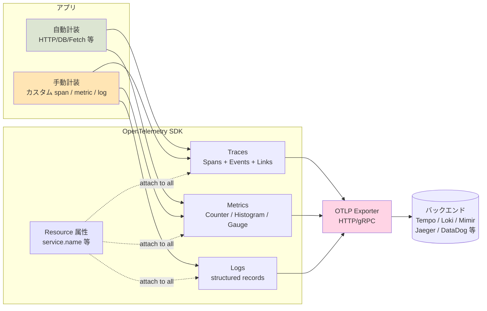

# OpenTelemetry で送れる情報の全体像

> [!summary]
> OpenTelemetry は **Traces / Metrics / Logs** の3シグナル＋共通の **Resource 属性** を送る。何を送るかは「**自動計装**で勝手に拾う部分」と「**手動計装**で自分でコードを埋めて足す部分」の組合せで決まる。属性命名は **Semantic Conventions** で世界標準化されていて、それに従うほどバックエンド側のダッシュボード・検索・他ツール移行が効きやすい。

## 全体像



**「設定次第」 + 「一般的に決まってる」両方が正解：**
- **送るデータの種類・属性名は標準化** されてる（Semantic Conventions）
- **何を送るか／どう拾うか** は SDK 初期化時の設定 + 手動計装で自分で決める

---

## 3 つのシグナル

### 1. Traces（リクエストの流れ）

「**1リクエストが何を経由して、各処理がどれくらいかかったか**」を**木構造**で記録する。

**1つの Span（処理単位）が持つ情報：**

| 項目 | 内容 | 例 |
|---|---|---|
| **name** | 操作名 | `GET /api/users/:id` |
| **trace_id / span_id** | 識別子 | `4bf92f3577b34da6a3ce929d0e0e4736` |
| **parent_span_id** | 親 span（木構造の根を辿る） | `00f067aa0ba902b7` |
| **start_time / end_time** | 開始/終了タイムスタンプ | RFC3339（ナノ秒精度） |
| **duration** | 処理時間 | `42ms` |
| **status** | OK / ERROR / UNSET | `OK` |
| **attributes** | key-value のメタ情報 | `http.status_code=200` |
| **events** | span 内の時刻つきメモ | `cache.miss` at t+12ms |
| **links** | 別 trace への関連 | 非同期処理連携用 |
| **kind** | サーバー/クライアント/プロデューサ等 | `SERVER`, `CLIENT`, `INTERNAL` |

例：`/api/orders` に来たリクエストの span 木：

```
Span: POST /api/orders (root, 200ms, kind=SERVER)
├─ Span: middleware.auth (5ms)
├─ Span: validate.input (3ms)
├─ Span: db.query "INSERT INTO orders ..." (50ms, kind=CLIENT)
├─ Span: external.call stripe.charge (120ms, kind=CLIENT)
│   └─ Event: rate_limit_warning at t+115ms
└─ Span: serialize.response (4ms)
```

### 2. Metrics（数値の集計）

「**何回起きた / 平均何 ms / 最大何バイト**」みたいな**集計可能な数値**を記録。

| 種類 | 性質 | 例 |
|---|---|---|
| **Counter** | 単調増加（リセットあり） | リクエスト総数、エラー総数 |
| **UpDownCounter** | 増減両方 | アクティブ接続数、キュー長 |
| **Histogram** | 分布を集計 | レイテンシ p50/p95/p99 |
| **Gauge** | 瞬時値（同期） | 設定値、設定上限 |
| **ObservableGauge** | 瞬時値（非同期） | メモリ使用量、CPU 使用率 |
| **ObservableCounter** | カウンタの非同期版 | システムから抜き取る値 |

各 metric は **属性（次元）** でラベル付けされる：

```
http.server.request.duration {
  http.method = "GET",
  http.route = "/api/health",
  http.response.status_code = "200"
}
= histogram of [12, 15, 8, 22, ...] ms
```

属性の組合せで分析できる例：「`/api/orders` の `POST` で `5xx` が出てる時間帯の p99」など。

### 3. Logs（構造化ログ）

普通のログ（INFO/ERROR 等）に **trace context** を紐付けたもの。

| 項目 | 内容 |
|---|---|
| **timestamp** | 発生時刻 |
| **severity_number / text** | TRACE(1) / DEBUG(5) / INFO(9) / WARN(13) / ERROR(17) / FATAL(21) |
| **body** | 本文 |
| **attributes** | key-value |
| **trace_id / span_id** | 関連する trace（あれば自動付与） |

**Logs の特徴**：trace と紐付くので、Grafana などで「**このリクエスト中に出た全ログ**」が trace 詳細から1クリックで見える。

---

## Resource 属性（全シグナル共通）

シグナルとは別に、**サービス自体の識別**を表す共通属性。SDK 起動時に1回設定すれば**全シグナル**に自動付与される。

| 属性 | 意味 | 例 |
|---|---|---|
| `service.name` | サービス名（**最重要**、ほぼ必須） | `obsidian-replica` |
| `service.version` | バージョン | `1.2.3` |
| `service.instance.id` | インスタンス識別 | UUID |
| `deployment.environment` | 環境 | `production` / `staging` |
| `host.name` | ホスト | `vercel-iad1-xyz` |
| `process.pid` | プロセス ID | `12345` |
| `cloud.provider` / `cloud.region` | クラウド | `aws` / `us-east-1` |
| `k8s.pod.name` / `k8s.namespace.name` | K8s 内部情報 | （K8s 環境のみ） |
| `telemetry.sdk.name/version/language` | SDK 情報（自動） | `opentelemetry`/`1.x`/`nodejs` |

`service.name` だけ最低限決めれば、他は SDK が自動収集してくれることが多い。

---

## Semantic Conventions（命名標準）

OpenTelemetry は属性名を**世界標準で決めている**。`http.method` `db.statement` `messaging.system` 等。

**従うメリット：**
- バックエンド（Grafana, Jaeger 等）の**標準ダッシュボードがそのまま使える**
- 別のツールに切り替えても**ダッシュボード再利用可能**
- 業界の人が見てすぐ理解できる

**主要カテゴリと例：**

| カテゴリ | 代表属性 |
|---|---|
| HTTP | `http.request.method`, `http.route`, `http.response.status_code`, `url.path`, `url.full` |
| DB | `db.system`, `db.statement`, `db.operation`, `db.collection.name` |
| Messaging | `messaging.system`, `messaging.destination.name`, `messaging.operation` |
| FaaS | `faas.invocation_id`, `faas.trigger`, `faas.coldstart` |
| Cloud | `cloud.provider`, `cloud.region`, `cloud.account.id` |
| RPC | `rpc.system`, `rpc.service`, `rpc.method` |
| GenAI（最近追加）| `gen_ai.system`, `gen_ai.request.model`, `gen_ai.usage.total_tokens` |
| Browser | `browser.brands`, `user_agent.original` |
| Network | `network.protocol.name`, `network.peer.address` |

**自分のドメイン用の属性**は `app.*` や `myapp.*` 等の独自プレフィックスを推奨（標準名と衝突しないため）。

---

## 自動計装 vs 手動計装

### 自動計装（auto-instrumentation）

ライブラリにフック注入して **コード変更なし** で span / metric を自動生成。

| 環境 | 自動計装の対象 |
|---|---|
| **Node.js** | `http`, `https`, `fetch`, `pg`, `mysql`, `redis`, `aws-sdk`, `express`, `fastify`, `koa`, `nestjs`, `mongodb`, `prisma` 等 100+ ライブラリ |
| **ブラウザ** | `DocumentLoad`, `Fetch`, `XmlHttpRequest`, `UserInteraction` |
| **Java** | 200+ ライブラリ（業界最多） |
| **Python** | Django, Flask, FastAPI, requests, psycopg, sqlalchemy 等 |
| **Go** | `net/http`, `database/sql`, `aws-sdk-go` 等（一部、コード明示が多め） |

**入れるだけで以下が見える：**
- 入ってきた HTTP リクエストの開始/終了/ステータス
- 出ていった fetch / HTTP 呼び出し（外部 API、DB）
- DB クエリ（SQL文も attributes に入る、PII 注意）
- メッセージキュー操作

> [!tip] auto-instrumentation で 80% カバーできる
> 大半のアプリは **SDK + auto-instrumentations を入れるだけで実用レベルの可観測性が手に入る**。手動計装が必要なのは「ビジネス特有の重要処理」や「カスタム指標」だけ。

### 手動計装（manual-instrumentation）

ビジネスロジック特有の処理に **自分で span / metric / log を埋め込む**。

**ここに埋めるのが定石：**

| 場所 | 何をやる | 例 |
|---|---|---|
| 重い処理の前後 | カスタム span | レポート生成、PDF 変換、ML 推論 |
| 重要な意思決定点 | event 追加 | 「キャッシュヒット」「制限超過」 |
| ビジネス指標 | カスタム metric | 「注文成立数」「課金額」「アクティブユーザー数」 |
| 既存ログ | OTel logger に置換 | trace context が自動付与される |

---

## どこに、どうコードを埋めるか（Node.js / Next.js 例）

### 1. SDK 初期化（1回だけ、起動時）

サーバー側 (`instrumentation.ts`):

```ts
import { NodeSDK } from '@opentelemetry/sdk-node';
import { getNodeAutoInstrumentations } from '@opentelemetry/auto-instrumentations-node';
import { Resource } from '@opentelemetry/resources';
import { ATTR_SERVICE_NAME, ATTR_SERVICE_VERSION } from '@opentelemetry/semantic-conventions';

const sdk = new NodeSDK({
  resource: new Resource({
    [ATTR_SERVICE_NAME]: 'my-app',
    [ATTR_SERVICE_VERSION]: process.env.APP_VERSION ?? '0.0.0',
    'deployment.environment': process.env.NODE_ENV ?? 'development',
  }),
  instrumentations: [getNodeAutoInstrumentations()],
});
sdk.start();
```

これだけで **HTTP / fetch / DB アクセスが全部自動 span 化** される。

### 2. カスタム span を足す（ビジネス処理）

```ts
import { trace, SpanStatusCode } from '@opentelemetry/api';

const tracer = trace.getTracer('my-app');

async function generateReport(userId: string) {
  return tracer.startActiveSpan('generate-report', async (span) => {
    // 属性で「誰の・どんな・どこから」を残す
    span.setAttribute('app.user_id', userId);
    span.setAttribute('app.report.type', 'monthly');

    try {
      // 中間イベント
      span.addEvent('fetch.start');
      const data = await fetchUserData(userId);
      span.addEvent('fetch.done', { 'data.size': data.length });

      const pdf = await renderPdf(data);
      span.setStatus({ code: SpanStatusCode.OK });
      return pdf;
    } catch (e) {
      span.recordException(e as Error);  // exception を span に紐付け
      span.setStatus({ code: SpanStatusCode.ERROR, message: String(e) });
      throw e;
    } finally {
      span.end();  // 必ず end する
    }
  });
}
```

### 3. カスタム metric を足す

```ts
import { metrics } from '@opentelemetry/api';

const meter = metrics.getMeter('my-app');

// Counter（数えるだけ）
const orderCounter = meter.createCounter('app.orders.created', {
  description: 'Number of orders created',
  unit: '{order}',
});

// Histogram（分布）
const checkoutDuration = meter.createHistogram('app.checkout.duration', {
  description: 'Checkout flow duration',
  unit: 'ms',
});

async function createOrder(order) {
  const start = Date.now();
  // ... order logic
  orderCounter.add(1, {
    'order.type': order.type,
    'customer.tier': order.customerTier,
  });
  checkoutDuration.record(Date.now() - start, {
    'order.type': order.type,
  });
}
```

### 4. ログに trace context を紐付ける

OpenTelemetry Logs API、または既存 logger（pino, winston 等）の OTel bridge を使うと **自動的に trace_id / span_id が log record に入る**：

```ts
import { logs, SeverityNumber } from '@opentelemetry/api-logs';
const logger = logs.getLogger('my-app');

logger.emit({
  severityNumber: SeverityNumber.INFO,
  severityText: 'INFO',
  body: 'order processed',
  attributes: { 'order.id': order.id, 'order.amount': order.amount },
});
```

または pino を使ってる場合：

```ts
import pino from 'pino';
import { pinoLogger } from '@opentelemetry/instrumentation-pino';
// auto-instrumentation 効かせれば、pino で出したログに trace_id が自動で入る
```

### 5. ブラウザ側（Web SDK）

ブラウザでは初期化を `<head>` に近い位置の早いタイミングで：

```ts
// instrumentation-client.ts
import { WebTracerProvider } from '@opentelemetry/sdk-trace-web';
import { OTLPTraceExporter } from '@opentelemetry/exporter-trace-otlp-http';
import { BatchSpanProcessor } from '@opentelemetry/sdk-trace-base';
import { registerInstrumentations } from '@opentelemetry/instrumentation';
import { DocumentLoadInstrumentation } from '@opentelemetry/instrumentation-document-load';
import { FetchInstrumentation } from '@opentelemetry/instrumentation-fetch';
import { UserInteractionInstrumentation } from '@opentelemetry/instrumentation-user-interaction';

const provider = new WebTracerProvider({
  resource: new Resource({ 'service.name': 'my-app-web' }),
});
provider.addSpanProcessor(new BatchSpanProcessor(new OTLPTraceExporter({
  url: process.env.NEXT_PUBLIC_OTEL_EXPORTER_OTLP_TRACES_ENDPOINT,
})));
provider.register();

registerInstrumentations({
  instrumentations: [
    new DocumentLoadInstrumentation(),
    new FetchInstrumentation(),
    new UserInteractionInstrumentation(),
  ],
});

// Web Vitals → Span にも飛ばす
import { onCLS, onLCP, onINP } from 'web-vitals';
const tracer = provider.getTracer('web-vitals');
[onCLS, onLCP, onINP].forEach(fn => fn(metric => {
  const span = tracer.startSpan(`web-vital.${metric.name}`);
  span.setAttribute('web_vital.value', metric.value);
  span.end();
}));
```

---

## 「設定次第」 vs 「決まってる」整理

| 項目 | 決まってる側 | 自分で決める側 |
|---|---|---|
| シグナルの種類 | Traces / Metrics / Logs の3種 | どれを使うか（全部 or 一部） |
| Span/Metric/Log のフィールド | OpenTelemetry 仕様で固定 | 値の中身（attributes 等） |
| 属性名（標準カテゴリ） | Semantic Conventions | 独自属性は `app.*` 等で自由 |
| プロトコル | OTLP（HTTP/gRPC）が標準 | バックエンド独自プロトコル選ぶことも可 |
| 自動計装の対象 | ライブラリ別に決まってる | どの auto-instrumentation を有効化するか |
| サンプリング | 標準アルゴリズムあり（probability, parent-based） | 確率や条件は自由 |

---

## バックエンド（受け側）が決めること

OTel SDK が送る → **OTLP プロトコル**（HTTP/gRPC）でバックエンドが受信 → 保存・可視化。

| バックエンド | 強み |
|---|---|
| **Grafana Tempo + Loki + Mimir** | OSS、無料枠あり、汎用 |
| Jaeger | OSS、トレース特化 |
| Honeycomb | 高速クエリ、商用 |
| DataDog | 統合可観測性、商用 |
| New Relic | 商用、AI 機能 |
| Vercel Observability | Vercel 統合 |

**SDK の標準が同じ（OTLP）** なので、バックエンドは差し替え可能。これが OTel の最大の価値（**vendor lock-in を避けられる**）。

---

## 実例：obsidian-replica の場合

現状の構成（参考：[[OTEL_GRAFANA_DEPLOYMENT]]）：

| シグナル | 自動計装 | 手動計装 |
|---|---|---|
| Traces (browser) | DocumentLoad, Fetch, UserInteraction | Web Vitals → Span, error capture |
| Traces (server) | HTTP via @vercel/otel | `/api/health` の明示的 span |
| Metrics | （未設定） | （未設定） |
| Logs | （未設定） | （未設定） |

**追加の余地（手動計装の例）：**

- `app.note.viewed` Counter で**ノート閲覧数**集計（属性: `note.slug`）
- `app.search.duration` Histogram で**検索時間分布**
- `app.wikilink.followed` Counter で**内部リンク遷移率**
- `app.error.boundary` Counter で**エラー境界発火数**

これらを足すと「どのノートが人気か」「検索は遅くないか」が自動でダッシュボード化できる。

---

## サンプリング（コスト管理）

トラフィックが増えると全 trace 送ると高い。**サンプリング** で間引く：

| 戦略 | 性質 | 用途 |
|---|---|---|
| **AlwaysOn** | 全部送る | 開発、低トラフィック |
| **AlwaysOff** | 何も送らない | 一時停止 |
| **TraceIdRatioBased** | 一定確率（例: 10%） | 高トラフィック |
| **ParentBased** | 親 span に従う | マイクロサービス間 |
| **Tail-based**（Collector 側） | 失敗 trace は全部、成功は10%等 | 高度な運用 |

SDK 初期化時に指定：

```ts
import { TraceIdRatioBasedSampler } from '@opentelemetry/sdk-trace-base';
const sdk = new NodeSDK({
  sampler: new TraceIdRatioBasedSampler(0.1),  // 10%
  // ...
});
```

---

## 学習リソース

- [OpenTelemetry Specification](https://opentelemetry.io/docs/specs/otel/) — 仕様の決定版
- [Semantic Conventions](https://opentelemetry.io/docs/specs/semconv/) — 属性名カタログ
- [OpenTelemetry JavaScript SDK](https://opentelemetry.io/docs/languages/js/) — Node/Browser 実装
- 「Learning OpenTelemetry」by Ted Young, Austin Parker（O'Reilly, 2024）— 体系本

## 関連MOC

- [[MOC Observability]]
- [[MOC Learning]]
- [[MOC DevSecOps]]

## 関連ノート

- [[OpenTelemetry]]
- [[システム監視と可観測性]]
- [[セキュリティロギング設計]]
- [[インシデントレスポンス]]
