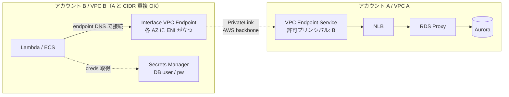
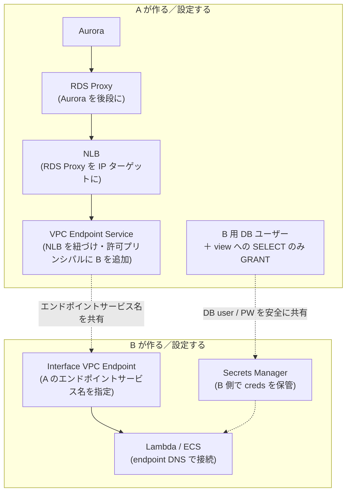

# PrivateLink で別アカウントの Aurora に接続する — TGW との比較と各アカウント実施事項

> [!summary]
> 前回 [[Transit Gateway で複数 AWS アカウントを接続する]] / [[TGW クロスアカウント接続 まとめ]] で扱った「B の Lambda/ECS から A の Aurora にクエリする」と同じ用件を、今度は **PrivateLink** で実装する場合の設計メモ。**Aurora は PrivateLink で直接公開できず NLB＋[[RDS Proxy]] 経由が定石**であること、CIDR 重複が許容される代わりに公開範囲が NLB:port に絞られること、ハブアカウント C が不要なこと、を中心に整理。アーキテクチャ図・責務マップ・TGW との比較表・A/B の実施事項リスト・判断軸を含む。

関連トピック: [[AWS PrivateLink]] / [[VPC Endpoint Service]] / [[NLB]] / [[RDS Proxy]] / [[Aurora]] / [[Transit Gateway]] / [[SQL ビューの基礎と使いどころ]]

## 1. 前提と目的

- ユースケースは前回と同じ: **B の Lambda/ECS から A の Aurora にクエリ**
- 今回は [[Transit Gateway]] ではなく **[[AWS PrivateLink]]** で実装する場合の整理
- PrivateLink の構成・各アカウントの作業・TGW との違いと判断軸を一通り押さえる

## 2. ★ 重要前提 — Aurora を直接 PrivateLink で公開はできない

PrivateLink で外部に公開できるのは **NLB（Network Load Balancer）の背後にあるサービス**だけ。Aurora エンドポイントは DNS で複数 IP に解決され、failover で IP が変わる仕様のため、NLB のターゲットに**直接置くと運用が破綻しやすい**。実用的な定石は:

**NLB → [[RDS Proxy]] → Aurora**

- RDS Proxy が Aurora の前段に立ち、**安定した接続先**になる（RDS Proxy のエンドポイント IP は安定）
- NLB のターゲットは RDS Proxy。`IP ターゲット`タイプを使う
- ボーナス: RDS Proxy は**コネクションプーリング**も担うので、Lambda の大量起動による接続枯渇を緩和できる

代替案として「NLB の IP ターゲット＋Lambda で Aurora の IP 変化を追従更新」もあるが運用負荷が高い。本ノートは **NLB → RDS Proxy → Aurora** を前提とする。

## 3. アーキテクチャ図

**流れ**: B の Lambda → B の Interface VPC Endpoint → AWS バックボーン → A の VPC Endpoint Service → NLB → RDS Proxy → Aurora。応答は逆経路。**A の VPC 内部は B には見えない**（NLB ポートだけが窓口）。

## 4. TGW との比較

### 4.1 メリット・デメリット比較表

| 観点 | [[Transit Gateway]]（前回） | [[AWS PrivateLink]]（今回） |
|---|---|---|
| ハブアカウント | 必要（C を立てる前提） | **不要**（A・B で完結） |
| Aurora の見え方 | A の VPC 内 Aurora そのもの | A の NLB＋RDS Proxy 経由で間接 |
| CIDR 重複 | **不可**（重複は致命的） | **OK**（A と B の VPC CIDR が被ってよい） |
| 公開範囲 | VPC 全体（ルートと SG しだいで広い） | **NLB:port のみ**（最小公開） |
| 通信方向 | 双方向可（A 側からも B に向けられる） | **B → A の片方向のみ**（A からは開始不可） |
| 取り消し | アタッチメント／経路を削除（複数操作） | **プリンシパル除外で即時** |
| 必要な前段リソース | TGW 専用サブネット／VPC アタッチメント | NLB ＋ RDS Proxy（A 側）／Interface Endpoint（B 側） |
| 主要コスト | TGW attachment 時間料金＋通信量 | Endpoint 時間料金（AZ ごと）＋通信量 |
| GB あたり通信料 | 一般に**安い**（大量トラフィック有利） | 一般に高め |
| 適する規模 | 多数 VPC・多サービス相互接続 | 特定サービスを少数の相手に公開 |
| 監査・統制 | 経路管理を C に集約 | エンドポイントサービスのアクセス制御で個別管理 |

### 4.2 性質の違い（要点）

- **粒度**: TGW = VPC まるごと到達可（その後 SG で絞る）。PrivateLink = **サービス単位（NLB:port）でしか到達できない**
- **方向**: TGW は双方向設計可。PrivateLink は **コンシューマ（B）が起点でしか繋がらない** — 構造的に B→A 限定。A から B に「漏れる」リスクが構造上ない
- **CIDR**: TGW は重複不可、PrivateLink は重複可（Interface Endpoint は B のローカル ENI として動き、A 側へのトンネルは AWS バックボーン経由のため）
- **コスト感**: 大量トラフィックなら TGW が GB 単価で有利。少量・限定公開なら PrivateLink が現実的

## 5. PrivateLink での各アカウント実施事項

### 5.1 責務マップ（誰が何を作り、何を渡すか）

人が手で渡す情報は **2 つだけ**: エンドポイントサービス名（`com.amazonaws.vpce.<region>.vpce-svc-xxxx`）と、DB ユーザー名／PW。

### 5.2 アカウント A（DB 提供側）の実施事項

- [ ] **RDS Proxy** を A の VPC に作成（Aurora を後段に、認証情報は Secrets Manager 参照）
- [ ] **NLB** を A の VPC に作成、ターゲットグループに RDS Proxy のエンドポイント IP を指定
  - ターゲットタイプ = `IP`、プロトコル = `TCP`、ポート = DB ポート（3306 / 5432）
  - **preserve-client-IP は無効**を推奨（Aurora SG の許可設定が NLB IP ベースで楽になる／CIDR 重複時の衝突も回避）
- [ ] **VPC Endpoint Service** を作成し、上記 NLB を紐づける
  - 受諾モード（auto / manual acceptance）を選択
- [ ] **許可プリンシパル**に B のアカウント ID または ARN を追加
- [ ] B に **エンドポイントサービス名** `com.amazonaws.vpce.<region>.vpce-svc-xxxxxxxx` を共有
- [ ] Aurora の SG: **NLB の IP（または NLB のサブネット）** からの DB ポートを許可
- [ ] DB レイヤ: **B 専用 DB ユーザー** を作成し、**view への SELECT のみ GRANT**（元テーブルには何も GRANT しない／[[SQL ビューの基礎と使いどころ]] の権限制御）
- [ ] B にユーザー名／PW を安全に共有（チャット直貼り NG／パスワードマネージャ等）

### 5.3 アカウント B（アプリ／コンシューマ側）の実施事項

- [ ] **Interface VPC Endpoint** を B の VPC に作成し、A から共有された**エンドポイントサービス名**を指定
  - **Lambda/ECS のある AZ ぶん各サブネット**を選択（ENI がその AZ に作られる）
  - エンドポイント用 SG: Lambda/ECS から DB ポートへの通信を許可
- [ ] Lambda/ECS の接続先を **Interface Endpoint の DNS 名**に向ける（または Private DNS を有効化して Aurora 名のままで動かす）
- [ ] 受け取った DB ユーザー名／PW を **B 側の Secrets Manager** に保管。Lambda 実行ロールに Secret 読み取り権限
- [ ] Lambda は接続をハンドラ外で定義しウォームスタート再利用（前回 TGW 編と同じ）
- [ ] Aurora に対する **AWS IAM 権限は不要**（パスワード認証なので）

### 5.4 アカウント C は不要

- PrivateLink にハブアカウントは不在。**A と B が直接ペアリング**する形
- TGW のような「RAM 共有」「TGW ルートテーブル」「アタッチメント受諾」のレイヤがそもそも無い
- 取り消しもシンプル: A が許可プリンシパルから B を外せば即時に遮断できる

## 6. 認証・認可は別レイヤ（PrivateLink は関与しない）

PrivateLink は **ネットワーク経路の話だけ**。TGW のときと同じく:

- **接続認証** = DB ユーザー名／PW（または IAM DB 認証）
- **何ができるか** = DB の GRANT（view への SELECT だけ等）

PrivateLink を使っても DB レイヤの認可は強化されない。**B 専用 DB ユーザー＋view に SELECT のみ**という設計は TGW のときと完全に同じ。詳細は [[Transit Gateway で複数 AWS アカウントを接続する]] §10 と本ノート §5.2 末尾を参照。

## 7. どちらを選ぶか — 判断軸

| 状況 | 推奨 |
|---|---|
| 「B から A の DB だけ」を最小公開でやりたい | **PrivateLink** |
| A・B の VPC CIDR が重複している（変更不可） | **PrivateLink**（TGW は不可） |
| 取り消し・監査・契約単位の制御を簡潔にしたい | **PrivateLink** |
| 多数の VPC が相互に繋がる／複数サービスを互いに呼ぶ | **TGW** |
| 高トラフィックでコスト最適化したい | **TGW**（GB 単価が一般に安い） |
| 全社のネットワーク統制を 1 か所（C）で握りたい | **TGW** |
| 単一サービス公開＋外部組織（別社）にも提供したい | **PrivateLink**（Endpoint Service として一般公開／Marketplace まで視野） |

「DB 1 つを別アカウントに見せたい」というピンポイント用件なら **PrivateLink**、「ネットワーク全体を統合したい」なら **TGW**、と覚えると判断しやすい。

## 8. ハマりやすい点

- **Aurora 直 NLB はしない** — failover で IP が変わるので、必ず RDS Proxy を間に挟む（または IP 更新の自動化を組む）
- **AZ ごとに ENI** — Interface Endpoint は AZ ごとに ENI が立つ。Lambda/ECS のある AZ ぶんサブネットを指定しないと、別 AZ 経由になりコストとレイテンシが乗る（TGW の「各 AZ に TGW サブネット」と同じ発想）
- **DNS** — Interface Endpoint には独自 DNS 名がある（`vpce-xxx.vpce-svc-xxx...`）。アプリ側のエンドポイント設定をその名前に変えるか、Private DNS を有効化して Aurora 名のままで解決させるか、いずれかを決めておく
- **preserve-client-IP** — NLB の IP ターゲットモードで有効にすると、A の Aurora 側 SG が B のクライアント IP を見るが、CIDR 重複時に衝突する。**無効推奨**
- **NLB のヘルスチェック** — RDS Proxy へのヘルスチェックを通すよう、SG／ポートを揃える
- **TLS** — エンドツーエンド TLS が必要なら各層で有効化。NLB は L4 パススルーなので透過的
- **コスト** — Endpoint は AZ ごとに時間料金がかかる。少量で多 AZ にすると意外と効く
- **PrivateLink で繋がっても DB の認可は別** — view への SELECT のみ GRANT する設計を必ず入れる

## 9. まとめ

- **PrivateLink は Aurora を「サービス公開」する形に変える**: A は Aurora を直接見せず、**NLB＋RDS Proxy 経由のサービス**として公開、B はそのサービスへのエンドポイントを自 VPC に作る
- **TGW は VPC をネットワーク的に繋ぐ**: 双方向・広い・CIDR 重複不可・ハブが要る
- **1 DB を 1 アカウントに見せるだけなら PrivateLink がシンプル**。多 VPC・多サービスなら TGW
- どちらを選んでも、**DB 認証（ユーザー／PW or IAM DB 認証）と GRANT 設計（B 専用ユーザー＋view への SELECT のみ）は変わらず必要**

## 関連MOC

- [[MOC AWS]]
- [[MOC Learning]]

## 関連ノート

- [[Transit Gateway で複数 AWS アカウントを接続する]] — 同じ用件を TGW で実装する詳細版
- [[TGW クロスアカウント接続 まとめ]] — TGW 版の早見版（誰が何を設定するか／C が制御する図解）
- [[SQL ビューの基礎と使いどころ]] — view による権限制御の用途
- [[トンネルの分類と定義]] — VPN / Direct Connect / TGW / PrivateLink の位置づけ
- [[ファイアウォールとネットワークACL]] — SG / NACL 設計
