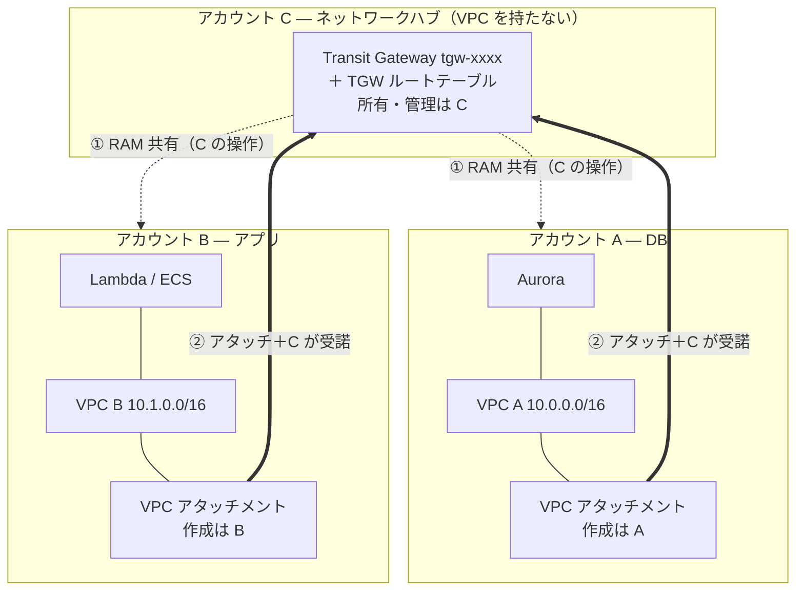
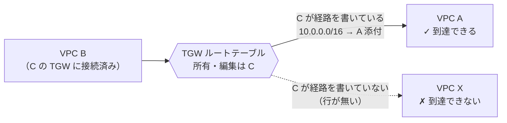
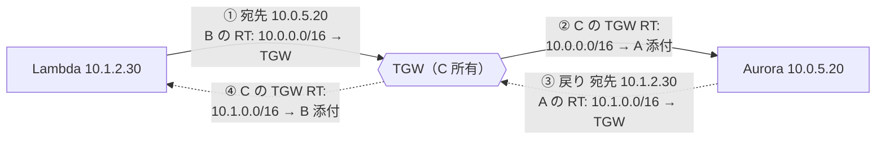

# TGW クロスアカウント接続 まとめ — 誰が何を設定し、C が何を制御するか

> [!summary]
> [[Transit Gateway で複数 AWS アカウントを接続する]]（全 17 章 + 補足）の要点を 1 ページに凝縮した早見版。3 アカウント構成（**A = Aurora / B = アプリ / C = TGW ハブ**）で「**誰がどのリソースを設定するか**」を図と表で示す。最大の論点は「**TGW に繋いだだけでは全 VPC が透過的に相互接続されるわけではなく、アカウント C がすべての接続性を握っている**」こと。詳細・背景・なぜそうなるかは元ノート参照。

関連トピック: [[Transit Gateway]] / [[AWS RAM]] / [[ルートテーブル]] / [[VPC]] / [[TGW セグメンテーション]] / [[CIDR]]

## 1. 全体像 — 3 アカウントの役割

- **C** は TGW という「箱」と TGW ルートテーブルだけを持つ。VPC もサブネットも持たない
- **A / B** は自分の VPC・ワークロード（Aurora / Lambda・ECS）と、TGW への **アタッチメント**を持つ
- TGW は [[AWS RAM]] で C から A・B へ共有される。共有はアカウント単位なので、一度共有すれば VPC が増えても再共有は不要

## 2. 最重要 — 「TGW に繋ぐ = 全員と繋がる」ではない

TGW は L3 のルーターであって、**自動メッシュではない**。アタッチしただけの VPC 同士は繋がらない。接続性は **アカウント C が握る「3 つの関所」**をすべて通って初めて成立する。

| 関所 | 誰が握るか | これが無いと |
|---|---|---|
| ① RAM 共有 | **C** | A・B はそもそも TGW を選べず、アタッチメントを作れない |
| ② アタッチメントの受諾 | **C** | A・B が作ったアタッチメントが有効化されない（`Auto accept` 無効時） |
| ③ TGW ルートテーブルの association / 経路 | **C** | アタッチ済みでも、C の RT に宛先 CIDR が無ければそのトラフィックは届かない |

→ **C は TGW ルートテーブルを複数枚に分け、各アタッチメントをどの 1 枚に association するかを決めることで、「B は Z だけに繋ぐ、A とは繋がない」といったセグメンテーションを自在に設計できる**（仕組みは §4 で詳述）。VPC 側がいくらルートを書いても、C の TGW ルートテーブルに経路が無ければ到達不能。「透過的に勝手に繋がる」のではなく、**C が許可した経路だけが通る**。

## 3. 誰が何を設定するか（一覧）

| 設定対象 | アカウント A（DB） | アカウント B（アプリ） | アカウント C（ハブ） |
|---|---|---|---|
| Transit Gateway 本体 | — | — | **作成・所有** |
| TGW の RAM 共有 | 受諾するだけ | 受諾するだけ | **A・B へ共有する** |
| VPC | VPC A を作成（CIDR 非重複） | VPC B を作成（CIDR 非重複） | 持たない |
| TGW 専用サブネット（`/28`／AZ ごと） | **作成** | **作成** | — |
| VPC アタッチメント | **作成**（C の共有 TGW へ） | **作成**（C の共有 TGW へ） | **受諾** |
| TGW ルートテーブル | — | — | **編集**（association ＋ propagation／静的ルート） |
| VPC サブネットのルートテーブル | **編集**（相手 CIDR → TGW） | **編集**（相手 CIDR → TGW） | — |
| Security Group | **編集**（Aurora に B の CIDR を許可） | アウトバウンドを絞るなら編集 | — |

ポイント: **A・B は「自分の VPC とアタッチメントとルート」を設定する。C は「TGW と TGW ルートテーブル」を設定する。** どちらか一方が欠けても通信は成立しない（両側＋C の三者協調）。

## 4. ルートテーブルの中身 — 誰が何を書くか

ルーティングは **VPC CIDR 単位**（サブネット単位ではない）。例: VPC A `10.0.0.0/16` / VPC B `10.1.0.0/16`（**非重複が絶対条件**）。

**VPC A ワークロード用 RT（編集 = A）**

| 送信先 | ターゲット |
|---|---|
| `10.0.0.0/16` | local |
| `10.1.0.0/16` | TGW（B 宛ては C 所有の TGW へ） |

**VPC B ワークロード用 RT（編集 = B）**

| 送信先 | ターゲット |
|---|---|
| `10.1.0.0/16` | local |
| `10.0.0.0/16` | TGW（A 宛ては C 所有の TGW へ） |

**TGW ルートテーブル（編集 = C）**

| 送信先 | ターゲット |
|---|---|
| `10.0.0.0/16` | VPC A アタッチメント |
| `10.1.0.0/16` | VPC B アタッチメント |

**TGW ルートテーブルは「アタッチメント単位」ではない。** TGW ルートテーブルは C が必要な数だけ作る（1 枚でも複数でも C の設計判断）。各アタッチメントは「ちょうど 1 つ」の TGW ルートテーブルに **association** される — アタッチメント → ルートテーブルは **多対一**で、1 枚を複数アタッチメントで共有できる。この例では TGW ルートテーブルは `tgw-rtb-main` の **1 枚だけ**で、A・B 両方のアタッチメントがそれに association され、両方の経路が同じ 1 枚に入っている。「アタッチメントごとに専用 RT がある」わけではない。複数枚に分けるのは §2 のセグメンテーションをしたいときだけで、その場合も「アタッチメント単位」ではなく「prod 用 / dev 用 / 共有サービス用」のような**ゾーン（セグメント）単位**で分けるのが普通。**どのアタッチメントをどの 1 枚に association するか**は C だけが持つ管理権限であり、これが §2 の「C が接続性を制御する」の実装そのもの。

- TGW 専用サブネットの RT は `local` のみ（TGW ENI を収容するだけで、能動的に通信を出さない）
- C の TGW RT は `propagation` を有効にすればアタッチ時に自動で埋まる。静的運用なら C が CIDR を 2 本書く
- **C の RT に書く識別子は「CIDR → アタッチメント」**。VPC ID は登場しない

**アタッチメントは VPC ごとに 1 つ — AZ をいくつ選んでも ID は 1 個。** TGW の VPC アタッチメントは VPC ごとに 1 個。作成時に AZ を複数選び、各 AZ の TGW 専用サブネットを指定しても、出来上がるアタッチメントは `tgw-attach-xxxx` **1 個**で、AZ ごとに別 ID にはならない。AWS は裏で各 AZ の TGW 専用サブネットに TGW ENI を 1 個ずつ置くが、それらは 1 つのアタッチメントの内部構成要素にすぎない（ENI 自体に `eni-xxxx` という ID はあるが、ルーティングには一切使わない）。

したがって C の TGW ルートテーブルのターゲットは常に **アタッチメント単位**（`tgw-attach-xxxx`）であり、ENI 単位でも AZ 単位でもない。C は `10.1.0.0/16 → tgw-attach-B` の **1 行を書くだけ**で、その 1 行が両 AZ の TGW ENI を内部的にカバーする。「2 つの ENI にそれぞれ向ける設定」というもの自体が存在しない。

- **どの AZ の ENI に届くか**は TGW 内部（Mapping Service）が自動判定する。利用者が AZ を指定する場面は無い
- デフォルトは **AZ affinity** — 送信元 VPC の AZ-a から出たパケットは、宛先 VPC の AZ-a 側の TGW ENI に届くよう、できるだけ同一 AZ 内で完結させる
- だから**ワークロードのある AZ のぶん、TGW 専用サブネットも各 AZ に用意する**。サブネットが無い AZ があると AZ affinity が効かず別 AZ の ENI に回され、クロス AZ 通信になる（動くが課金とレイテンシが乗る）

## 5. パケットの流れ（B の Lambda → A の Aurora）

実線 = 往路、破線 = 復路。往復とも **B の RT・C の TGW RT・A の RT** の 3 つすべてに経路が揃って初めて通る。1 つでも欠ければそこで行き止まり。これが「三者協調」かつ「**C が中央で経路を制御している**」ことの実体。

## 6. アカウント間で渡す情報

「人が手で伝える情報」と「自動で見える情報」は分かれる。

| 情報 | 方向 | 手渡し要否 |
|---|---|---|
| TGW（共有） | C → A・B | 不要（RAM 共有操作で自動表示） |
| VPC アタッチメント | A・B → C | 不要（C の TGW に自動表示／受諾するだけ） |
| 互いの VPC CIDR | A ⇄ B | **要**（相手の RT 記載に使う） |
| B のワークロードサブネット CIDR | B → A | **要**（A が Aurora の SG に許可を書く） |
| Aurora エンドポイント名 | A → B | **要**（B アプリの接続先） |
| VPC ID / アタッチメント ID | — | 不要（クロスアカウントで使わない／自動可視） |

→ **手で伝える必要があるのは実質 A ⇄ B 間だけ**（互いの CIDR、B のワークロード CIDR、Aurora エンドポイント名）。C との間は RAM 共有とアタッチメント受諾でほぼ自動。

## 7. まとめ — C が握る「3 つの関所」

1. **RAM 共有** — C が共有しない限り、誰も TGW を使えない
2. **アタッチメント受諾** — C が受諾しない限り、アタッチメントは有効にならない
3. **TGW ルートテーブルの経路** — C の RT に宛先 CIDR が無ければ、アタッチ済みでも到達不能。C は RT を複数に分けて「誰と誰を繋ぐ／繋がない」を完全に設計できる

**結論**: TGW に繋いだだけでは VPC は透過的に相互接続されない。A・B は自分の VPC・アタッチメント・ルートを設定し、**最終的な接続性（どの VPC がどの VPC に到達できるか）はアカウント C の TGW ルートテーブル設計が決める**。C はネットワークの中央管制塔であり、セグメンテーションの主体である。

## 関連MOC

- [[MOC AWS]]
- [[MOC Learning]]

## 関連ノート

- [[Transit Gateway で複数 AWS アカウントを接続する]] — 全 17 章 + 補足の詳細版。背景・なぜそうなるか・CIDR 重複の罠・DNS・SG/NACL・コストまで網羅
- [[トンネルの分類と定義]] — VPN / Direct Connect / TGW の位置づけ
- [[IPアドレスとサブネット]] — CIDR 設計の前提
- [[ファイアウォールとネットワークACL]] — SG / NACL の設計
