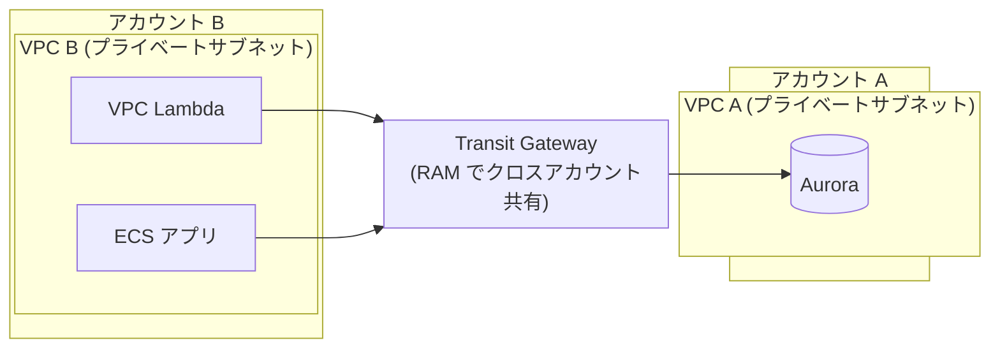

# Transit Gateway で複数 AWS アカウントを接続する

> [!summary]
> アカウント B の [[VPC]] にある VPC Lambda / ECS アプリから、アカウント A のプライベートサブネットの [[Aurora]] にアクセスする構成を [[Transit Gateway]] (TGW) で実現する手順と落とし穴。**結論: 技術的に成立する**。ただし ① VPC の CIDR が重複していると不成立、② クロスアカウントでは Security Group の SG-ID 参照が効かず CIDR ベースで許可する、の 2 点が要注意。ユーザーの想定（B のプライベートサブネット IP レンジを A 側で許可）は **②の観点で正しい**。

関連トピック: [[Transit Gateway]] / [[VPC]] / [[Aurora]] / [[AWS RAM]] / [[VPC Peering]] / [[PrivateLink]] / [[セキュリティグループ]]

## 1. やりたいこと



- **アカウント A**: プライベートサブネットに [[Aurora]] クラスター
- **アカウント B**: プライベートサブネットに VPC アタッチの [[Lambda]] と [[ECS]] アプリ
- B のアプリから A の Aurora にデータ取得したい
- A 側は B のプライベートサブネットの IP レンジを許可する想定

## 2. 結論 — 技術的に成立する（訂正・補足つき）

この構成は **そのまま実現可能**。ただし計画段階で押さえるべき点を訂正・補足する。

| ユーザーの想定 | 判定 | 補足 |
|---|---|---|
| TGW で複数アカウントの VPC を接続 | ✅ 成立 | TGW を [[AWS RAM]] で共有してアタッチ |
| B の Lambda(VPC) / ECS から A の Aurora にアクセス | ✅ 成立 | ルーティング + SG + NACL が揃えば疎通する |
| A 側で B のプライベートサブネット IP レンジを許可 | ✅ 正しい | **クロスアカウントでは SG-ID 参照は不可。CIDR ベースで許可するのが正解** |
| （暗黙の前提）VPC A と VPC B の CIDR | ⚠️ 要確認 | **CIDR が重複していると TGW ルーティングが成立しない**（最重要） |

→ **不成立になる唯一の地雷は「CIDR 重複」**。それ以外はユーザーの設計どおりで動く。

## 3. Transit Gateway とは / なぜ使うか

[[Transit Gateway]] は複数の VPC・オンプレ接続を**ハブ&スポーク型**で束ねるルーター。

- VPC Peering が「VPC 同士の 1:1 メッシュ」なのに対し、TGW は中央ハブ。VPC が増えても接続が爆発しない
- **クロスアカウント対応**: TGW を 1 アカウントで作り、[[AWS RAM]] (Resource Access Manager) で他アカウントに共有 → 各アカウントが自分の VPC をアタッチできる
- 今回は VPC 2 つだけなので [[VPC Peering]] でも足りる（§10 参照）が、将来 VPC が増える・オンプレ接続も束ねるなら TGW が素直

## 4. 構成手順

### Step 1. TGW を作成（アカウント A 推奨）

Aurora を持つ A 側に TGW を作るのが管理上素直（どちらでも可）。

- `Default route table association` / `Default route table propagation` は、ルーティングを明示制御したいなら **disable** にして手動管理する手もある（小規模なら enable のままで可）

### Step 2. TGW を RAM でアカウント B に共有

- アカウント A の [[AWS RAM]] で「Resource share」を作成し、TGW を共有リソースに、アカウント B をプリンシパルに指定
- 同一 AWS Organizations 内なら共有受諾は自動化できる。組織外なら B 側で招待を受諾

### Step 3. 各 VPC を TGW にアタッチ

- **アカウント A**: VPC A を TGW にアタッチ（A 自身の TGW なのでそのまま）
- **アカウント B**: 共有された TGW に対し、VPC B の TGW アタッチメントを作成
- アタッチメントは各 VPC の**サブネットを指定**して作る。AZ ごとに 1 サブネット選ぶ（TGW ENI がそこに置かれる）

### Step 4. ルートテーブルを設定（§5 で詳述）

## 5. ルーティング設計

3 種類のルートテーブルを揃える必要がある。

### 5.1 VPC A のサブネットルートテーブル

Aurora のあるサブネットのルートテーブルに、**B の CIDR 宛て → TGW** を追加。

```
送信先          ターゲット
10.1.0.0/16     tgw-xxxxxxxx     ← VPC B の CIDR
```

### 5.2 VPC B のサブネットルートテーブル

Lambda / ECS のあるサブネットのルートテーブルに、**A の CIDR 宛て → TGW** を追加。

```
送信先          ターゲット
10.0.0.0/16     tgw-xxxxxxxx     ← VPC A の CIDR
```

### 5.3 TGW ルートテーブル

TGW 自身のルートテーブルで、各 VPC の CIDR をそのアタッチメントに向ける。`propagation` を有効にすればアタッチ時に自動で入る。手動なら静的ルートを 2 本。

```
10.0.0.0/16  → VPC A アタッチメント
10.1.0.0/16  → VPC B アタッチメント
```

## 6. ★ CIDR 重複の罠（最重要）

**TGW は CIDR が重複した VPC 同士をルーティングできない**。ルーターである以上、「10.0.x.x はどっちの VPC か」を一意に決められないため。

- VPC A も VPC B も `10.0.0.0/16` のようなデフォルト的レンジだと **この構成は不成立**
- 対策:
  - 構築前に両 VPC の CIDR を確認し、重複していたら**どちらかを作り直す**（VPC の CIDR は後から縮小・変更できない。セカンダリ CIDR 追加は可能だが根本解決にならない）
  - 新規なら最初から分離した設計に（例: A = `10.0.0.0/16`、B = `10.1.0.0/16`）
- どうしても重複 VPC を繋ぐ必要がある場合は [[PrivateLink]]（重複 CIDR でも動く）を検討（§10）

## 7. セキュリティグループ — クロスアカウントは CIDR ベース

ユーザーの「B のプライベートサブネット IP レンジを A 側で許可」は **この観点で正しい**。理由を明確化する。

- Security Group のルールは「**SG-ID 参照**」と「**CIDR 指定**」の 2 通り
- **SG-ID 参照はクロスアカウント TGW 接続では使えない**。SG 参照が効くのは同一 VPC 内、または VPC Peering したピア間（同一/別アカ, 同一リージョン）に限られる。**TGW 越しでは SG 参照は不可**
- したがって A の Aurora のセキュリティグループは、**B のサブネット CIDR を送信元に指定**したインバウンドルールにする

```
A の Aurora SG インバウンド:
  Type: MySQL/Aurora (3306)  ※PostgreSQL なら 5432
  Source: 10.1.0.0/16        ← B のプライベートサブネット CIDR
```

- B 側 Lambda / ECS のアウトバウンド SG は、デフォルトの「全許可」のままなら Aurora の 3306/5432 へ出られる。絞っているなら A の CIDR + DB ポートを許可

## 8. NACL（ネットワーク ACL）

NACL を変更している場合は両サブシステムで見直す。NACL は**ステートレス**なので、戻りトラフィック用にエフェメラルポートのルールが要る。

- A 側 Aurora サブネットの NACL: インバウンド `B CIDR → 3306/5432` 許可、アウトバウンド `B CIDR → 1024-65535` 許可
- B 側 Lambda/ECS サブネットの NACL: アウトバウンド `A CIDR → 3306/5432`、インバウンド `A CIDR → 1024-65535`
- NACL をデフォルト（全許可）のまま使っているなら設定不要

## 9. DNS — Aurora エンドポイントの名前解決

- [[Aurora]] のクラスターエンドポイント（`xxx.cluster-yyy.region.rds.amazonaws.com`）は**パブリック DNS 名だが、プライベート IP に解決される**（インスタンスが publicly accessible でない場合）
- この DNS 名はどこから引いても A のプライベート IP を返す。B の VPC からそのまま名前解決でき、**Route 53 プライベートホストゾーンの共有は不要**
- 解決された A のプライベート IP に対し、TGW 経由のルートと SG/NACL が通っていれば疎通する
- B の VPC で「DNS 解決」「DNS ホスト名」が有効になっていることは前提（通常デフォルト有効）

## 10. Lambda(VPC) / ECS 側の留意点

- **VPC Lambda**: VPC にアタッチした Lambda は B のサブネットに ENI を持つ。そこから TGW 経由で A へ出る。Lambda のサブネットルートテーブルに §5.2 のルートが必要
- **ECS**: Fargate / EC2 いずれもタスクは B のプライベートサブネットの ENI を使う。同じくルート + SG が要る
- **IAM 認証 / TLS**: Aurora への接続は TLS を有効化推奨。IAM データベース認証を使えばパスワードレスにもできる（任意）

### 10.1 RDS Proxy はどちらのアカウントに置くか

**アカウント A（Aurora と同じ VPC・同じアカウント）**。[[RDS Proxy]] は特定の RDS / Aurora を**ターゲットにするマネージドリソース**で、その DB と同一 VPC のサブネットにデプロイされる。RAM 共有のような仕組みは無く、A の VPC A 内に置く。

- B の Lambda / ECS は、Aurora エンドポイントの代わりに **RDS Proxy のエンドポイント**（これも VPC A のプライベート IP）に接続する
- 経路は Aurora 直結と同じ — TGW 経由。**RDS Proxy の SG に B の CIDR : 3306/5432 を許可**する必要がある
- Proxy → Aurora 間は VPC A 内で完結

### 10.2 15 分に 1 回のクエリなら RDS Proxy は不要

**結論: 低頻度・低並列なら直結で問題ない。RDS Proxy はオーバースペック。**

コネクションプール枯渇が起きるのは「**多数の Lambda が同時に実行され、それぞれ別の DB 接続を張る**」とき。Lambda は実行環境ごとに接続を持ち、横断共有しないため、同時実行数が跳ねると接続数も跳ねて Aurora の `max_connections` を食いつぶす。

15 分に 1 回の定期クエリで、同時実行数が 1〜数本に収まるワークロードなら：

- 接続数は常時ごく少数 → 枯渇しない
- 接続確立のレイテンシ（TLS ハンドシェイク等）も 15 分に 1 度なら無視できる
- → **RDS Proxy を入れる理由がない**

RDS Proxy が効くのはむしろ逆のケース：高並列 Lambda、スパイクするトラフィック、短命接続の大量発生、フェイルオーバーの透過性が要る場合。

**注意点（直結でも守ること）**:

- 「15 分に 1 回」でも、その 1 回の中で**大量の並列 Lambda を fan-out する**、ECS アプリが**多数の常時接続を保持する**設計なら話は別 — その場合は接続数を見積もる
- プロキシ無しでも、Lambda は **接続をハンドラ関数の外で定義**してウォームスタート時に再利用し、不要になったら閉じる、という基本は守る

## 11. 代替案

| 方式 | 向き / 不向き |
|---|---|
| **Transit Gateway**（本命） | VPC が今後増える・ハブ集約したい。今回の要件に素直 |
| [[VPC Peering]] | VPC 2 つだけなら最小構成。安い（データ処理課金なし）。ただし将来メッシュが増えると破綻、推移的ルーティング不可 |
| [[PrivateLink]] (+ NLB) | **Aurora だけを「サービス」として B に公開**。CIDR 重複でも動く・最小権限。ただし NLB 前段が要る・構成が増える |

「VPC 2 つきりで当面増えない」なら VPC Peering が一番安くて速い。「CIDR が重複している」「DB だけピンポイント公開で他は見せたくない」なら PrivateLink。「ハブにして増やす」なら TGW。

## 12. コスト感

- **TGW アタッチメント**: アタッチメント 1 つあたり時間課金（リージョン・時期で変動）。VPC 2 つで 2 アタッチメント分
- **TGW データ処理**: TGW を通過するデータ量に対し GB 課金
- VPC Peering は**データ処理課金がない**（同一 AZ 内なら転送無料、跨ぐと AZ 間転送課金）。コストだけなら Peering が有利
- 最新の料金は AWS 公式の料金ページで確認すること

## 13. 構成チェックリスト

- [ ] VPC A / VPC B の CIDR が**重複していない**（最重要）
- [ ] TGW を作成し、[[AWS RAM]] でアカウント B に共有・受諾済み
- [ ] VPC A・VPC B をそれぞれ TGW にアタッチ（AZ ごとにサブネット指定）
- [ ] VPC A サブネットRT: B CIDR → TGW
- [ ] VPC B サブネットRT: A CIDR → TGW
- [ ] TGW ルートテーブル: 両 VPC CIDR → 各アタッチメント（propagation or 静的）
- [ ] A の Aurora SG: インバウンド `B CIDR : 3306/5432` 許可（**SG-ID 参照ではなく CIDR**）
- [ ] NACL を変更している場合、両方向 + エフェメラルポートを許可
- [ ] B の VPC で DNS 解決・DNS ホスト名が有効
- [ ] （任意）RDS Proxy / TLS / IAM 認証

## 関連MOC

- [[MOC AWS]]
- [[MOC Learning]]

## 関連ノート

- [[トンネルの分類と定義]] — VPN / Direct Connect / Transit Gateway の位置づけ
- [[IPアドレスとサブネット]] — CIDR 設計、重複回避の前提知識
- [[ファイアウォールとネットワークACL]] — Security Group / NACL の設計
- [[ゼロトラストとネットワーク基礎]] — IAM Identity Center / VPC Lattice
- [[AWSセキュリティ実装]]
