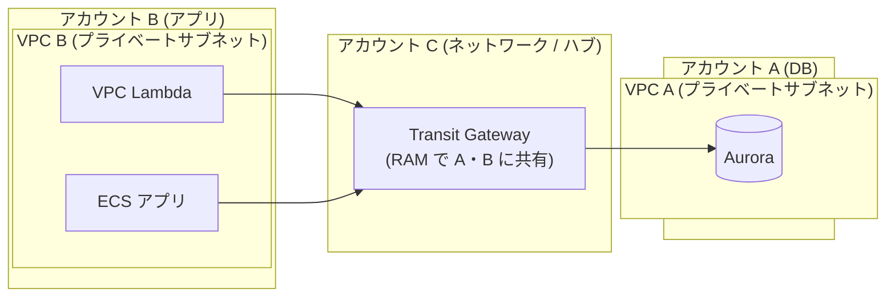
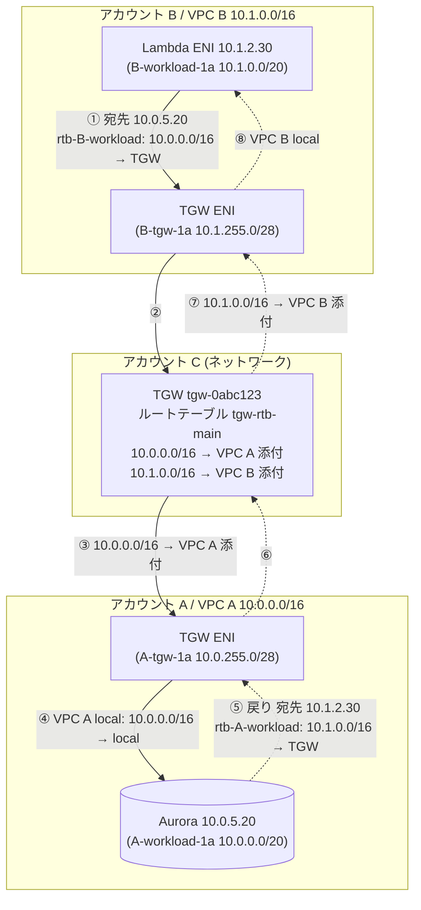
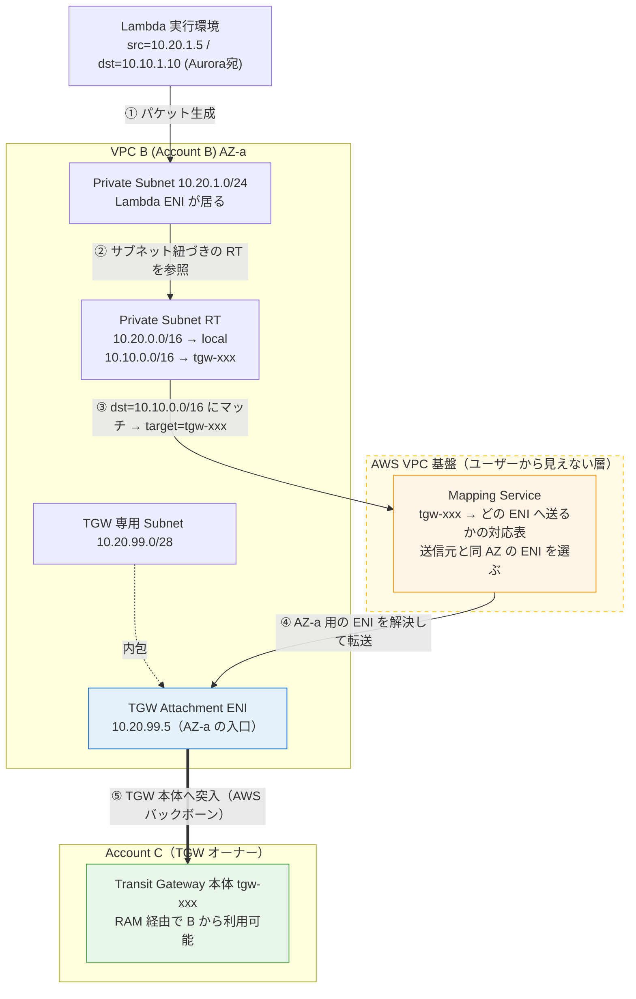

# Transit Gateway で複数 AWS アカウントを接続する

> [!summary]
> アカウント B の [[VPC]] にある VPC Lambda / ECS アプリから、アカウント A のプライベートサブネットの [[Aurora]] にアクセスする構成を [[Transit Gateway]] (TGW) で実現する手順と落とし穴。**前提: TGW は A でも B でもない第三の「ネットワークアカウント C」が所有**し、[[AWS RAM]] で A・B 両方に共有する 3 アカウント構成。**結論: 技術的に成立する**。要注意は ① VPC A / VPC B の CIDR が重複していると不成立、② クロスアカウントでは Security Group の SG-ID 参照が効かず CIDR ベースで許可、③ クロスアカウント TGW では「アタッチメント作成は VPC 所有者(A/B)」「TGW ルートテーブルの関連付けは TGW 所有者(C)」と**操作主体が分かれる**、の 3 点。

関連トピック: [[Transit Gateway]] / [[VPC]] / [[Aurora]] / [[AWS RAM]] / [[AWS Organizations]] / [[VPC Peering]] / [[PrivateLink]] / [[セキュリティグループ]]

## 1. やりたいこと（3 アカウント構成）



- **アカウント A**: プライベートサブネットに [[Aurora]] クラスター
- **アカウント B**: プライベートサブネットに VPC アタッチの [[Lambda]] と [[ECS]] アプリ
- **アカウント C**: [[Transit Gateway]] を所有する「ネットワークアカウント / ハブアカウント」。**VPC は持たず、TGW とその設定だけを管理する**
- B のアプリから A の Aurora にデータ取得したい
- A 側は B のプライベートサブネットの IP レンジを許可する想定

> [!info] なぜ TGW を別アカウント C に置くのか
> AWS のマルチアカウント設計（Landing Zone / Control Tower）では、ネットワークの中核（TGW・Direct Connect・インスペクション VPC 等）を **専用のネットワークアカウントに集約**するのが定番。理由は ① 課金とネットワーク責任の一元化、② A も B も「対等なスポーク」になり一方が他方のネットワークを握らない、③ 将来アカウントが増えても C にアタッチするだけで拡張できる、から。本ノートはこの定番構成を前提にする。

## 2. 結論 — 技術的に成立する（訂正・補足つき）

この構成は **そのまま実現可能**。ただし計画段階で押さえるべき点を訂正・補足する。

| 想定 | 判定 | 補足 |
|---|---|---|
| TGW で複数アカウントの VPC を接続 | ✅ 成立 | C 所有の TGW を [[AWS RAM]] で A・B に共有してアタッチ |
| B の Lambda(VPC) / ECS から A の Aurora にアクセス | ✅ 成立 | ルーティング + SG + NACL が揃えば疎通する |
| A 側で B のプライベートサブネット IP レンジを許可 | ✅ 正しい | **クロスアカウントでは SG-ID 参照は不可。CIDR ベースで許可するのが正解** |
| TGW を A/B とは別のアカウント C が所有 | ✅ 成立・推奨 | **操作主体が分かれる**点に注意（§4）。アタッチメント作成=VPC 所有者、TGW RT 関連付け=C |
| （暗黙の前提）VPC A と VPC B の CIDR | ⚠️ 要確認 | **CIDR が重複していると TGW ルーティングが成立しない**（最重要） |

→ **不成立になる唯一の地雷は「CIDR 重複」**。それ以外は設計どおりで動く。3 アカウント構成で増える論点は「誰がどの操作をするか」の役割分担（§4）。

## 3. Transit Gateway とは / なぜ使うか

[[Transit Gateway]] は複数の VPC・オンプレ接続を**ハブ&スポーク型**で束ねるルーター。

- VPC Peering が「VPC 同士の 1:1 メッシュ」なのに対し、TGW は中央ハブ。VPC が増えても接続が爆発しない
- **クロスアカウント対応**: TGW を 1 アカウントで作り、[[AWS RAM]] (Resource Access Manager) で他アカウントに共有 → 各アカウントが自分の VPC をアタッチできる
- **TGW を専用アカウント C に置ける**: TGW はリージョンの構造物で「特定の VPC の中」には存在しない。よって C は VPC を 1 つも持たなくても TGW を所有・管理できる。A・B は対等なスポークとして C の TGW にぶら下がる
- 今回は VPC 2 つだけなので [[VPC Peering]] でも足りる（§11 参照）が、**ネットワークを専用アカウントに集約したい / 将来 VPC やアカウントが増える / オンプレ接続も束ねる**なら TGW（ハブアカウント方式）が素直

## 4. 構成手順（3 アカウントでの役割分担）

クロスアカウント TGW でいちばん重要なのが「**どの操作を誰のアカウントでやるか**」。ここを取り違えると詰まる。

| 操作 | 実行アカウント |
|---|---|
| TGW の作成 | **C** |
| TGW を RAM で共有 | **C** |
| RAM 共有の受諾 | A と B（同一 Organizations なら自動化可） |
| VPC アタッチメントの作成 | **A**（VPC A 用）/ **B**（VPC B 用）— 各 VPC 所有者 |
| クロスアカウントアタッチメントの受諾 | **C**（TGW 所有者、auto-accept 無効時） |
| TGW ルートテーブルへの関連付け・伝播設定 | **C**（TGW 所有者） |
| VPC サブネットのルートテーブル編集 | **A**（VPC A）/ **B**（VPC B）— 各 VPC 所有者 |
| Security Group / NACL の設定 | **A**（Aurora 側）/ **B**（アプリ側） |

### Step 1. アカウント C で TGW を作成

- C で [[Transit Gateway]] を 1 つ作成
- `Auto accept shared attachments`（共有アタッチメントの自動受諾）を **無効のまま**にしておくと、A/B が作ったアタッチメントを C が明示的に受諾する運用になる（誰が何を繋いだか C が管理できる）。台数が多く運用を簡略化したいなら有効化も可
- `Default route table association` / `Default route table propagation` は、ルーティングを明示制御したいなら **disable** にして手動管理する手もある（小規模なら enable のままで可）

### Step 2. アカウント C で TGW を RAM 共有

- C の [[AWS RAM]] で「Resource share」を作成し、TGW を共有リソースに、**プリンシパルにアカウント A とアカウント B の両方**を指定
- 同一 [[AWS Organizations]] 内なら、OU 単位で共有でき受諾も自動化できる。組織外なら A・B 側でそれぞれ招待を受諾

### Step 3. アカウント A・B でそれぞれ VPC アタッチメントを作成

- **アカウント A**: 共有された C の TGW に対し、VPC A の TGW アタッチメントを作成
- **アカウント B**: 同じく VPC B の TGW アタッチメントを作成
- アタッチメントは各 VPC の**サブネットを指定**して作る。AZ ごとに 1 サブネット選ぶ（指定したサブネットに TGW の ENI が 1 個置かれる）
- ※ アタッチメントは「VPC 所有者のアカウント」で作る。A が作るアタッチメントは A の持ち物、B のは B の持ち物。ただし接続先 TGW は C の所有

### Step 3.5. ★ TGW アタッチメント専用サブネットを用意する（推奨）

> 「プライベートサブネット以外に TGW 用のサブネットが要るのか？」 → **YES、専用サブネットを用意するのが AWS 推奨**。

- **厳密には必須ではない**。既存のプライベートサブネット（Aurora や Lambda のいるサブネット）を TGW アタッチメントに指定しても動く
- **しかし AWS のベストプラクティスは「TGW アタッチメント専用の小さなサブネットを AZ ごとに用意する」**。理由:
  - **ルーティングの分離**: アタッチメント用サブネットのルートテーブルを独立管理でき、ワークロード用サブネットのルートテーブルを汚さない・取り違えない
  - **アドレスの節約**: TGW ENI は AZ あたり 1 個しか使わない。**`/28`（16 アドレス）で十分**。AWS も「小さい CIDR を使え」と明記している
  - **将来の拡張・appliance mode 等での挙動を素直に保てる**
- 構成: VPC A・VPC B の**それぞれ**に、AZ ごとの小さな TGW 専用サブネット（例 `/28`）を作り、そこを TGW アタッチメントに指定する
  - 2 AZ 冗長なら VPC ごとに TGW 専用サブネット × 2
  - これらのサブネットには TGW ENI 以外を置かない
- ワークロード（Aurora / Lambda / ECS）は従来どおりプライベートサブネットに置いたまま。TGW 専用サブネットと役割を分ける
- **アカウント C には VPC もサブネットも不要**。TGW の ENI は A・B 側の TGW 専用サブネットに置かれる。C は TGW という箱とそのルートテーブルを持つだけ

### Step 3.6. ★ アカウント C でアタッチメントを受諾・ルートテーブルに関連付け

ここが 3 アカウント構成で増える工程。

- Step 1 で `Auto accept` を無効にしている場合、A・B が作ったアタッチメントは **C 側で「保留中」になる → C が受諾**する
- 受諾後、**C が各アタッチメントを TGW ルートテーブルに association（関連付け）**し、ルート伝播（propagation）を有効化する（または静的ルートを追加）
- **TGW ルートテーブルの管理権限は TGW 所有者 C にある**。A や B は自分の VPC ルートテーブルは触れるが、TGW ルートテーブルは触れない。ここが「VPC RT は A/B、TGW RT は C」という分担になる理由

### Step 4. ルートテーブルを設定（§5 で詳述）

### 4.1 RAM 共有の粒度 — アカウント単位。VPC が増えても再共有は不要

> 「RAM 共有は C が A・B それぞれにやる？ つなげたい VPC が増えるたびに共有し直す？ 一度共有すれば A・B は C の TGW を選べる？」

**(1) 共有の主体は C。ただし A 用・B 用と別々に作る必要はない**

- RAM のリソースシェアを作るのは **TGW 所有者 C**
- 1 つのリソースシェアに **A・B 両方（さらに増やすなら複数アカウント）をプリンシパルとして登録できる**。「A 用」「B 用」と分けて作る必要はない
- [[AWS Organizations]] を使っているなら **OU 単位 / 組織単位で一括共有**でき、アカウントを個別指定する手間すら不要。OU に後からアカウントが入れば自動で共有が効く

**(2) RAM 共有は「アカウント単位」。VPC ごとではない**

ここが核心。RAM が共有しているのは **TGW というリソースを「アカウント A が使ってよい」という許可**。VPC 単位でも アタッチメント単位でもない。

- **一度 C が TGW を A に共有すれば、A はその TGW に VPC を何個でもアタッチできる**。VPC A2、VPC A3 が増えても **RAM 共有はやり直し不要**。A は単にアタッチメントを追加で作るだけ（共有済みの TGW は A の画面にずっと選択肢として出ている）
- B も同様。一度共有を受けていれば、B 配下の VPC をいくつでもアタッチできる
- RAM 共有を追加で必要とするのは「**新しいアカウント D を参加させる**」とき。D を既存リソースシェアのプリンシパルに足す（OU 共有ならそれも自動）。**再共有が要るのはアカウントが増えたときだけ、VPC が増えたときではない**

**(2.5) 新アカウント D を足すとき — 「別のリソースシェア」は不要。既存シェアにプリンシパル追加**

- A・B が登録済みのリソースシェアに、後から **D をプリンシパルとして追加**するだけ。**新規の別シェアを作る必要はない**（リソースシェアは複数プリンシパルを持て、後からいつでも足せる）
- 新規シェアを別に作ることも技術的には可能だが、不要。普通は既存シェアに D を足す。OU 共有なら D を OU に入れた時点で自動
- **RAM 共有は「A と D をペアで繋ぐ」ものではない**点に注意。RAM = 「D がこの TGW を**使ってよい**」というアカウント単位の許可にすぎない。D が VPC をアタッチした後、**D の VPC が A に届くか B に届くか**を決めるのは **TGW ルートテーブル**であって RAM ではない
  - 「D は A とだけ繋ぎ、B とは繋ぎたくない」のような**到達範囲の分離（セグメンテーション）**をしたい場合 → それは **TGW ルートテーブルを複数に分けて association を設計する**話。RAM の仕事ではない
- まとめ: **同じアカウントである限り（VPC が増えても）共有は使い放題・再共有不要。RAM 操作が要るのは新しいアカウントを足すときだけ、しかも「別シェア作成」ではなく「既存シェアにプリンシパル追加」**

**(3) VPC を増やすときに毎回要る工程（RAM 以外）**

VPC を 1 つ足すたびに発生するのは:

- A（または B）: その VPC の TGW アタッチメントを作成
- C: そのアタッチメントを受諾（`Auto accept` 無効時）+ TGW ルートテーブルに association + propagation
- A: その VPC のサブネット RT に他 VPC 向けルート

→ **RAM 共有は最初の 1 回だけ**。以降の VPC 追加では「アタッチメント作成 + C の受諾 / 関連付け + ルートテーブル」だけが繰り返される。RAM は登場しない。

## 5. ルーティング設計

3 種類のルートテーブルを揃える必要がある。**所有・編集するアカウントが異なる**点に注意。

### 5.1 VPC A のサブネットルートテーブル（A が編集）

Aurora のあるサブネットのルートテーブルに、**B の CIDR 宛て → TGW** を追加。

```
送信先          ターゲット
10.1.0.0/16     tgw-xxxxxxxx     ← VPC B の CIDR / C 所有の TGW
```

### 5.2 VPC B のサブネットルートテーブル（B が編集）

Lambda / ECS のあるサブネットのルートテーブルに、**A の CIDR 宛て → TGW** を追加。

```
送信先          ターゲット
10.0.0.0/16     tgw-xxxxxxxx     ← VPC A の CIDR / C 所有の TGW
```

### 5.3 TGW ルートテーブル（C が編集）

C が所有する TGW のルートテーブルで、各 VPC の CIDR をそのアタッチメントに向ける。`propagation` を有効にすればアタッチ時に自動で入る。手動なら静的ルートを 2 本。**この操作は TGW 所有者 C のアカウントで行う**。

```
10.0.0.0/16  → VPC A アタッチメント
10.1.0.0/16  → VPC B アタッチメント
```

#### 5.3.1 ★ A・B が C に伝えるのは「VPC ID」か「CIDR」か

> 「C に伝えるのは各 VPC の ID？ それとも CIDR そのもの？」 → **CIDR そのもの**。VPC ID ではない。

- **TGW ルートテーブルの中身は「宛先 = CIDR」「ターゲット = アタッチメント」**。VPC ID はどこにも出てこない
- **VPC ID はアカウント内ローカルの識別子**。A の `vpc-xxxx` は C から見て意味を持たず、C の TGW ルーティングでは一切使わない。C が扱う識別子は「**アタッチメント ID**（`tgw-attach-xxxx`）」と「アタッチメント所有者のアカウント ID」
- したがって C が routing のために必要とするのは **各 VPC の CIDR**：
  - **propagation（ルート伝播）を有効にする場合** → C は CIDR すら明示的に受け取らなくてよい。アタッチメントを TGW ルートテーブルに association すれば、**そのアタッチメント経由で VPC の CIDR が自動で TGW RT に入る**。A・B は「アタッチメントを作る」だけでよい
  - **静的ルートで書く場合** → C は各 VPC の **CIDR** を知る必要がある。A・B が C に「うちの VPC CIDR は `10.0.0.0/16` です」と **CIDR を伝える**
- まとめ: C への共有情報は **CIDR**（静的ルート時）または **何も不要**（propagation 時）。**VPC ID を C に渡す場面は無い**
- 補足: C がネットワークアカウントとして全社の **CIDR 重複を管理**する場合も、台帳に載せるのは各 VPC の **CIDR**。この観点でも C が集めるのは CIDR

#### 5.3.2 ★ アタッチメント ID も C に伝える必要はない

> 「アタッチメント ID は C に伝えなくて OK？」 → **OK。伝える必要はない。C 側に自動で見える。**

- A・B が **C の共有 TGW に対して**アタッチメントを作成すると、そのアタッチメントは **C が所有する TGW にぶら下がる**。結果、**C 側のコンソール / API に自動で出現する**（C の TGW のアタッチメント一覧に表示される）
  - `Auto accept` 無効 → C 側に「**保留中（pending acceptance）**」で出現 → C が承認
  - `Auto accept` 有効 → C 側に「**available**」で出現
- C はその一覧で、**アタッチメント ID・要求元アカウント ID・紐づく VPC 情報**をすべて自分で見られる。誰かに教えてもらう必要はない
- 必要な「人的連絡」は、`Auto accept` 無効時に「アタッチメント作ったので承認して」と一声かける程度。これは**技術的なデータ受け渡しではなく運用上の合図**

**クロスアカウントで実際に手渡しが要る情報はほぼゼロ**:

| 情報 | 伝達方法 |
|---|---|
| TGW（の ID） C → A・B | [[AWS RAM]] 共有で A・B に自動で見える。手渡し不要 |
| アタッチメント A・B → C | C の TGW に作るので C に自動で見える。手渡し不要 |
| VPC CIDR A・B → C | propagation なら自動。静的ルート時のみ CIDR を口頭/チケットで伝える |
| VPC ID | そもそも誰にも渡さない（クロスアカウントで使わない識別子） |

→ 手作業として残るのは「**RAM 共有の受諾**」「**アタッチメントの受諾**」という承認操作だけ。識別子の手渡しはほぼ発生しない。

### 5.4 ★ ルーティングは「VPC CIDR 単位」— サブネット単位ではない

> 「TGW のルートテーブルに設定するのは、お互いのプライベートサブネットのレンジ？」 → **いいえ。お互いの VPC CIDR（VPC 全体のレンジ）を設定する。**

§5.1〜5.3 の 3 つのルートテーブルすべて、宛先に書くのは **VPC CIDR**（例 `10.0.0.0/16` / `10.1.0.0/16`）であって、個々のプライベートサブネットの `/20` などではない。

- **TGW アタッチメントは VPC 単位**。VPC を 1 つアタッチすると、その VPC CIDR 全体がそのアタッチメント経由で到達可能になる。`propagation` 有効なら TGW ルートテーブルに**自動で入るのも VPC CIDR**
- パケットが対象 VPC に届けば、あとは **VPC 内部のルーター（local ルート）が正しいサブネットへ配送**する。ルーティング層は「どの VPC か」までの粒度でよい
- サブネット単位の静的ルートを書くことも技術的には可能だが、不要かつ保守が増えるだけ。標準は VPC CIDR

**粒度の整理（重要な使い分け）**:

| レイヤー | 粒度 | 何を書く / 設定する |
|---|---|---|
| ルーティング（VPC RT / TGW RT） | **VPC CIDR 単位** | 相手の VPC CIDR → TGW |
| フィルタリング（Security Group / NACL） | **サブネット / IP 単位** | 相手のワークロードサブネット CIDR（§7） |

→ 「どの VPC へ運ぶか」はルーティングが VPC CIDR で決め、「どの送信元を通すか」は SG/NACL がサブネット粒度で絞る。**ルーティングは VPC 単位・セキュリティは サブネット単位**、と覚えると混乱しない。

### 5.5 パケットの流れ（エンドツーエンドで追う）

B の Lambda が A の Aurora に接続するとき、パケットは複数のルーターを順にホップする。**ルーティングは 1 箇所で決まるのではなく、各ホップで都度ルートテーブルが引かれる**。経路上に C の TGW が中継点として入る。

**往路（B Lambda → A Aurora）**:

1. Lambda が Aurora エンドポイントを DNS 解決 → A の Aurora のプライベート IP を得る（例 `10.0.5.20`）
2. Lambda の ENI からパケット送出。**送信元 = Lambda ENI の具体的な 1 IP**（例 `10.1.2.30`）、送信先 = `10.0.5.20`
3. **B のサブネットルートテーブル**を引く → `10.0.0.0/16 → TGW` がヒット → パケットを TGW へ。★このルートが無いと TGW にすら届かず終わり
4. **C 所有の TGW のルートテーブル**を引く → `10.0.0.0/16 → VPC A アタッチメント` → VPC A へ転送
5. VPC A 内の **local ルート**が `10.0.5.20` を Aurora のサブネットへ配送
6. A の Aurora の SG が**送信元 `10.1.2.30` を許可しているか**判定（§7）→ OK なら着信

**復路（A Aurora → B Lambda）**:

7. Aurora が応答パケットを返す。送信元 = `10.0.5.20`、送信先 = `10.1.2.30`
8. **A のサブネットルートテーブル**を引く → `10.1.0.0/16 → TGW` がヒット → TGW へ。★復路用のこのルートも必須
9. **C の TGW ルートテーブル** → `10.1.0.0/16 → VPC B アタッチメント` → VPC B へ
10. VPC B の local ルート → Lambda の ENI へ配送

**ポイント**:

- ルーティングは TGW だけで決まるのではなく、**往復・各ホップで都度発生**する。VPC 両側のサブネットルートテーブル（A/B が管理）と TGW ルートテーブル（C が管理）が全部揃って初めて疎通する
- 「送信元」はサブネットの**レンジ**ではなく、その中の **ENI の具体的な 1 IP**。レンジ（CIDR）が意味を持つのはルートテーブルの宛先と SG ルールの話
- TCP は往復が成立して初めて接続確立。**復路のルート（A 側に `B CIDR → TGW`）を忘れると、行きは届くのに接続できない**——非常によくあるハマり

### 5.6 propagation（ルート伝播）と association とは

TGW ルートテーブルには、アタッチメントごとに 2 つの設定がある。用語を整理する。

| 用語 | 意味 |
|---|---|
| **association（関連付け）** | 「このアタッチメントから入ってきたトラフィックは、どの TGW ルートテーブルを見て転送先を決めるか」を指定する。アタッチメント 1 つにつき association できる TGW ルートテーブルは 1 つ |
| **propagation（伝播）** | 「このアタッチメントが繋いでいる VPC の CIDR を、TGW ルートテーブルに**自動でルートとして登録する**」設定。VPC アタッチメントなら登録されるのは VPC CIDR |

**propagation = 動的なルート学習**。propagation を有効にすると、`VPC CIDR → そのアタッチメント` というルートが TGW ルートテーブルに**自動で入る**。C が手でルートを書かなくてよい。

対比すると:

- **propagation 有効** → TGW ルートテーブルに `10.0.0.0/16 → VPC A 添付` が自動登録。C は何もタイプしない
- **propagation 無効（静的ルート運用）** → C が TGW ルートテーブルに `10.0.0.0/16 → VPC A 添付` を**手で 1 行ずつ書く**

イメージ: propagation は「ルーターが経路を自動学習する（ダイナミックルーティング）」、静的ルートは「経路を手で書く（スタティックルーティング）」。小規模なら propagation 有効が楽。経路を厳密に手で制御したいなら静的。

※ VPN / Direct Connect アタッチメントの場合、propagation は BGP で学習した経路を取り込む。VPC アタッチメントでは「その VPC の CIDR」が伝播対象。

### 5.7 ★ なぜ「C の TGW ルートテーブルだけ」では足りないのか

> 「ルーティングは中間の C アカウントの TGW ルートテーブルだけが知っていればよいのでは？ なぜ A・B も相互に相手の VPC CIDR を必要とする？」

**理由: ルーティングは経路上の各ホップで独立に起きる。C の TGW ルートテーブルは「中間ホップ」しか制御しない。** 入口と出口の判断は VPC 側のルートテーブルが担い、そこは C から触れない。

VPC は本来**閉じたネットワーク**で、デフォルトでは自分の CIDR（`local` ルート）しか知らない。自分の CIDR 以外の宛先は、ルートテーブルに**明示的なルートが無ければ「行き先不明」で破棄**される。TGW はあくまで「行き先の選択肢の 1 つ」で、VPC が勝手にそこへ送ってはくれない。

具体的に往路で起きること:

1. B の Lambda が宛先 `10.0.5.20`（A の Aurora）にパケットを出す
2. 最初に引かれるのは **VPC B のサブネットルートテーブル**。ここに `10.0.0.0/16 → TGW` が無いと、`10.0.5.20` は VPC B の `local`（`10.1.0.0/16`）にも一致せず **行き先不明 → 破棄**。**TGW にすら到達しない**
3. → だから **VPC B のルートテーブルに「A の VPC CIDR → TGW」が要る**。そのためには **B が A の CIDR を知っている必要がある**
4. C の TGW ルートテーブルが活躍するのは、パケットが TGW に**届いた後**の中間ホップだけ。届く前の判断はできない

復路も同じ。A の Aurora が `10.1.2.30`（B）に返すとき、**VPC A のルートテーブル**に `10.1.0.0/16 → TGW` が無ければ TGW に戻せない。→ **A が B の CIDR を知っている必要がある**。

つまりルーティングは **3 層の独立した判断**:

| 層 | ルートテーブル | 管理者 | 必要な知識 |
|---|---|---|---|
| 入口 | VPC B サブネット RT | **B** | A の VPC CIDR |
| 中間 | TGW ルートテーブル | **C** | 両 VPC CIDR（propagation なら自動） |
| 出口（復路の入口） | VPC A サブネット RT | **A** | B の VPC CIDR |

**C が管理できるのは中間層だけ**。入口・出口の VPC ルートテーブルは A・B それぞれの持ち物で、C は touch できない。だから A・B が各自「相手 VPC へは TGW 経由」というルートを自分のルートテーブルに書く必要があり、そのために**相手の VPC CIDR を知る必要がある**。

> [!example] 郵便の比喩
> C の TGW = 街の中央郵便局。建物 A・建物 B の間の仕分けは郵便局がやる。だが建物 B の中の人が「A 宛ての手紙は、郵便局行きの便に渡す」という仕分けルールを**建物 B の内部に**持っていなければ、手紙はそもそも郵便局に届かない。郵便局がいくら賢くても、手紙が郵便局に来なければ意味がない。各建物が独立に「この宛先 → 郵便局便へ」を知っている必要がある。

### 5.8 アタッチメントが C の TGW に紐づく仕組み — 誰がどこで設定するか

> 「propagation なら C に CIDR を渡さないのに、なぜ B → C の TGW → A と通る？ A・B のアタッチメントはなぜ C と紐づく？ その設定は誰がどこでやる？」

ポイント: **アタッチメントというオブジェクトそのものが「リンク」**。A・B が「C の TGW に対して」アタッチメントを作った瞬間に、C の TGW に紐づく。人が CIDR や ID を手渡しする工程は無い。

**(1) アタッチメント = リンクの実体**

TGW アタッチメントは独立した浮いた存在ではなく、作成時に必ず「**接続先 TGW**」「**VPC**」「**サブネット**」を指定する。A が作るアタッチメントは「ターゲット = C の TGW」を指定して作られる。→ 作った瞬間に C の TGW にぶら下がる。これが「紐づく」の正体。アタッチメントは「A の VPC」と「C の TGW」の間に張られたコネクタ。

**(2) A はどうやって「C の TGW」を選べるのか → RAM 共有**

A の画面に C の TGW が選択肢として出てくるのは、C が **[[AWS RAM]] で共有**したから。RAM 共有 = 「この TGW をあなたのアカウントから使ってよい」という**許可の付与**。共有を受けると、C の TGW（その ID）が A・B の VPC コンソールに見えるようになり、A はそれを選んでアタッチメントを作れる。
→ C → A・B に「渡る」のは **TGW を使う許可**。CIDR でも VPC ID でもない。

**(3) propagation が CIDR を必要としない理由**

CIDR は **VPC のプロパティ**。アタッチメントは VPC を参照している。AWS は「どの VPC か」「その VPC の CIDR は何か」を**自分のメタデータとして全部持っている**。

propagation 有効 = 「TGW よ、このアタッチメントが繋ぐ VPC の CIDR を見て、ルートテーブルに登録しろ」という内部処理の指示。TGW は AWS 内部で アタッチメント → VPC → CIDR とたどって自動登録する。**人もアカウントも CIDR を手渡ししない**。「C に CIDR を渡していない」のにルーティングできるのはこのため。

**(4) 誰が・どこで設定するか**

| 工程 | 実行者 | 場所 |
|---|---|---|
| TGW 作成 | C | C のコンソール（VPC → Transit Gateways） |
| TGW を RAM 共有 | C | C のコンソール（RAM） |
| アタッチメント作成（C の TGW を選ぶ） | A / B | 各自のコンソール（VPC → Transit Gateway Attachments） |
| アタッチメント受諾 | C | C のコンソール（Transit Gateway Attachments） |
| アタッチメントを TGW RT に association + propagation | C | C のコンソール（Transit Gateway Route Tables） |

→ 「紐づける設定」は **2 段階の握手**:
- **A・B 側**: 「C の TGW を指定してアタッチメントを作る」（各自のコンソール）
- **C 側**: 「上がってきたアタッチメントを受諾し、ルートテーブルに association + propagation」（C のコンソール）

**(5) 「C に情報を渡さない」の正体**

実は A・B は C に「**アタッチメント**」というオブジェクトを渡している。ただしメール / チャットで渡すのではなく、**AWS のコントロールプレーン経由**で渡る。A が「C の TGW に対して」アタッチメントを作れば、それは AWS の仕組みで自動的に C の TGW に出現する。だから「人的な手渡しはゼロ」に見える。

実際にアカウント間を流れているのは「**RAM の利用許可**（C→A・B）」と「**アタッチメントというオブジェクト**（A・B→C）」だけ。CIDR・VPC ID といった生の識別子を人が手渡しする工程は無い。propagation は、その渡ってきたアタッチメントを足がかりに AWS が CIDR を内部で解決してくれる仕組み。

## 6. ★ CIDR 重複の罠（最重要）

**TGW は CIDR が重複した VPC 同士をルーティングできない**。ルーターである以上、「10.0.x.x はどっちの VPC か」を一意に決められないため。TGW がアカウント C にあっても話は同じ — 重複判定は VPC A と VPC B の CIDR で起きる。

- VPC A も VPC B も `10.0.0.0/16` のようなデフォルト的レンジだと **この構成は不成立**
- 対策:
  - 構築前に両 VPC の CIDR を確認し、重複していたら**どちらかを作り直す**（VPC の CIDR は後から縮小・変更できない。セカンダリ CIDR 追加は可能だが根本解決にならない）
  - 新規なら最初から分離した設計に（例: A = `10.0.0.0/16`、B = `10.1.0.0/16`）
  - 3 アカウント以上に拡張していくなら、**C（ネットワークアカウント）が全社の VPC CIDR を台帳管理**し、新規 VPC に重複しないレンジを払い出す運用にすると破綻しにくい
- どうしても重複 VPC を繋ぐ必要がある場合は [[PrivateLink]]（重複 CIDR でも動く）を検討（§11）

## 7. セキュリティグループ — クロスアカウントは CIDR ベース

「B のプライベートサブネット IP レンジを A 側で許可」は **この観点で正しい**。理由を明確化する。

- Security Group のルールは「**SG-ID 参照**」と「**CIDR 指定**」の 2 通り
- **SG-ID 参照はクロスアカウント TGW 接続では使えない**。SG 参照が効くのは同一 VPC 内、または VPC Peering したピア間（同一/別アカ, 同一リージョン）に限られる。**TGW 越しでは SG 参照は不可**（TGW がアカウント C にあっても同じ）
- したがって A の Aurora のセキュリティグループは、**B のサブネット CIDR を送信元に指定**したインバウンドルールにする

```
A の Aurora SG インバウンド:
  Type: MySQL/Aurora (3306)  ※PostgreSQL なら 5432
  Source: 10.1.0.0/16        ← B の「ワークロード」プライベートサブネット CIDR
```

### 7.1 ★ 許可するのは「ワークロードのサブネット」— TGW サブネットではない

> 「A 側で許可する B の IP レンジは、プライベートサブネット？ それとも TGW アタッチメント専用サブネット？」 → **ワークロード（Lambda / ECS）が実際にいるプライベートサブネットの CIDR**。TGW 専用サブネットではない。

理由:

- **TGW は NAT しない**。TGW は L3 ルーターで、パケットを転送する際に**送信元 IP を書き換えない**（C 所有でも同じ）
- B の Lambda / ECS は B のプライベートサブネットの ENI を使う。そこから出るパケットの**送信元 IP は、その ENI のプライベート IP**（= B のワークロード用プライベートサブネットのレンジ）
- パケットは「Lambda の ENI → TGW → A」と流れるが、TGW を通過しても送信元 IP は Lambda の IP のまま。A の Aurora に届いた時点でも送信元は Lambda の IP
- したがって A の Aurora SG が許可すべきは **B のワークロードがいるプライベートサブネットの CIDR**
- **TGW アタッチメント専用サブネット（§3.5 の `/28`）の CIDR を許可しても無意味**。そこには TGW の ENI があるだけで、トラフィックの送信元にはならない
- Lambda / ECS が複数のサブネット・AZ にまたがるなら、その**全ワークロードサブネットの CIDR**を許可する。簡略化したいなら VPC B の CIDR 全体を許可してもよい（広めだが運用は楽）

### 7.2 サブネットと AZ と CIDR の関係（前提知識）

> 「プライベートサブネットのレンジは AZ ごとに別々？ それとも 1 つのレンジを分け合う？」 → **1 つの VPC CIDR を、AZ ごとのサブネットに重複しないよう分割する**。各サブネットは固有の CIDR を持ち、サブネットは 1 つの AZ にしか属せない（AZ をまたげない）。

- VPC は大きい CIDR を 1 つ持つ（例: VPC B = `10.1.0.0/16`）
- その中を、AZ ごとのサブネットに**重複しない小ブロック**として切り出す
- 例（VPC B = `10.1.0.0/16` を 3 AZ 構成にする場合）:

| サブネット | AZ | CIDR |
|---|---|---|
| ワークロード private (AZ-1a) | ap-northeast-1a | `10.1.0.0/20` |
| ワークロード private (AZ-1c) | ap-northeast-1c | `10.1.16.0/20` |
| ワークロード private (AZ-1d) | ap-northeast-1d | `10.1.32.0/20` |
| TGW 専用 (AZ-1a) | ap-northeast-1a | `10.1.255.0/28` |
| TGW 専用 (AZ-1c) | ap-northeast-1c | `10.1.255.16/28` |
| TGW 専用 (AZ-1d) | ap-northeast-1d | `10.1.255.32/28` |

### 7.3 ★ VPC CIDR で許可するか、サブセット（サブネット）で許可するか

> 「許可は VPC CIDR にするのか、もう少し狭いプライベートサブネットのレンジか？ サブネットにするなら全 AZ 分？」

3 つの選択肢と推奨：

| 方式 | ルール数 | 評価 |
|---|---|---|
| **A. VPC CIDR 全体**（`10.1.0.0/16`） | 1 行 | 楽だが広い。VPC B の将来の全サブネット（public 含む）を許可してしまう。クロスアカウント境界では緩すぎ |
| **B. ワークロード private サブネットを個別に**（`/20` × 3） | AZ 数だけ（例 3 行） | 最小権限。ただし AZ を増やすたびに SG ルール追加が要る |
| **C. ワークロード用の連続ブロックを 1 つ**（推奨） | 1 行 | 設計時に「ワークロード private 専用の連続レンジ」を確保し、その 1 プレフィックスで許可 |

**推奨は C 方式**。VPC の CIDR 設計の段階で、ワークロード private 用に**連続した 1 ブロック**を取っておく。例:

```
VPC B 10.1.0.0/16 の割り当て設計
  10.1.0.0/18    ← ワークロード private 専用ブロック（ここを SG で 1 行許可）
      ├ 10.1.0.0/20    private AZ-1a
      ├ 10.1.16.0/20   private AZ-1c
      └ 10.1.32.0/20   private AZ-1d   （48.0/20 は将来の 4 AZ 目用に予約）
  10.1.255.0/24  ← TGW 専用など管理サブネット
```

→ A の Aurora SG は `10.1.0.0/18` の **1 行**で済む。VPC 全体（/16）より十分狭く最小権限、かつ**この /18 内に AZ を増やしても SG 変更不要**。

判断の早見:

- **最小権限を重視 / クロスアカウントで DB を晒す** → B か C 方式。**C 方式が一番きれい**（狭くて 1 行）
- **VPC B がこの用途専用で中身を全部信頼できる** → A 方式（VPC CIDR）でも可。ただしクロスアカウント境界では一段絞るのが筋
- **サブネット個別（B 方式）にする場合は、Lambda / ECS が動く全 AZ のサブネット CIDR を漏れなく許可**する。SG のインバウンドルール上限はデフォルト 60（緩和可）なので、AZ 3〜4 個分の数行は全く問題にならない — 数ではなく「AZ 追加時の追従漏れ」がリスク

- B 側 Lambda / ECS のアウトバウンド SG は、デフォルトの「全許可」のままなら Aurora の 3306/5432 へ出られる。絞っているなら A の CIDR + DB ポートを許可

## 8. NACL（ネットワーク ACL）

NACL を変更している場合は両アカウントのサブネットで見直す。NACL は**ステートレス**なので、戻りトラフィック用にエフェメラルポートのルールが要る。

- A 側 Aurora サブネットの NACL: インバウンド `B CIDR → 3306/5432` 許可、アウトバウンド `B CIDR → 1024-65535` 許可
- B 側 Lambda/ECS サブネットの NACL: アウトバウンド `A CIDR → 3306/5432`、インバウンド `A CIDR → 1024-65535`
- NACL をデフォルト（全許可）のまま使っているなら設定不要
- TGW 自体には NACL は無い。NACL はあくまで A・B の各サブネットの設定

## 9. DNS — Aurora エンドポイントの名前解決

- [[Aurora]] のクラスターエンドポイント（`xxx.cluster-yyy.region.rds.amazonaws.com`）は**パブリック DNS 名だが、プライベート IP に解決される**（インスタンスが publicly accessible でない場合）
- この DNS 名はどこから引いても A のプライベート IP を返す。B の VPC からそのまま名前解決でき、**Route 53 プライベートホストゾーンの共有は不要**
- 解決された A のプライベート IP に対し、TGW 経由のルートと SG/NACL が通っていれば疎通する
- B の VPC で「DNS 解決」「DNS ホスト名」が有効になっていることは前提（通常デフォルト有効）

### 9.1 ★ クロスアカウントでも DNS は気にしなくてよい

> 「エンドポイント → プライベート IP の DNS 解決は、クロスアカウントでも気にせずできる？」 → **Yes。特別な設定は一切不要。**

- RDS / Aurora のエンドポイントは **AWS 管理のパブリック DNS** に登録された名前。中身（A レコード）がプライベート IP というだけ
- パブリック DNS なので、**アカウント B から引いても、世界中どこから引いても同じプライベート IP** が返る。アカウント境界も VPC 境界も関係ない（TGW が C にあることも無関係）
- よって **Route 53 プライベートホストゾーンの共有 / Route 53 Resolver ルール / DNS まわりのクロスアカウント設定は一切不要**
- 唯一の前提は「B の VPC で DNS 解決・DNS ホスト名が有効」——これは B 自身の VPC 設定で、デフォルト有効。クロスアカウント要素ではない
- **例外**: A が独自ドメイン（例 `db.internal.example.com`）を **Route 53 プライベートホストゾーン**で割り当てて、B にはその独自名で繋がせたい場合 → そのプライベートホストゾーンは別 VPC / 別アカウントからは解決できないので、ホストゾーンの VPC 関連付け（クロスアカウント association）か Route 53 Resolver が要る。**ネイティブの RDS エンドポイントをそのまま使う限り、この問題は発生しない**

## 10. Lambda(VPC) / ECS 側の留意点

- **VPC Lambda**: VPC にアタッチした Lambda は B のサブネットに ENI を持つ。そこから TGW 経由で A へ出る。Lambda のサブネットルートテーブルに §5.2 のルートが必要
- **ECS**: Fargate / EC2 いずれもタスクは B のプライベートサブネットの ENI を使う。同じくルート + SG が要る
- **IAM 認証 / TLS**: Aurora への接続は TLS を有効化推奨。IAM データベース認証を使えばパスワードレスにもできる（任意）

### 10.1 RDS Proxy はどちらのアカウントに置くか

**アカウント A（Aurora と同じ VPC・同じアカウント）**。[[RDS Proxy]] は特定の RDS / Aurora を**ターゲットにするマネージドリソース**で、その DB と同一 VPC のサブネットにデプロイされる。RAM 共有のような仕組みは無く、A の VPC A 内に置く。アカウント C は関係しない。

- B の Lambda / ECS は、Aurora エンドポイントの代わりに **RDS Proxy のエンドポイント**（これも VPC A のプライベート IP）に接続する
- 経路は Aurora 直結と同じ — C の TGW 経由。**RDS Proxy の SG に B の CIDR : 3306/5432 を許可**する必要がある
- Proxy → Aurora 間は VPC A 内で完結

### 10.2 15 分に 1 回のクエリなら RDS Proxy は不要

**結論: 低頻度・低並列なら直結で問題ない。RDS Proxy はオーバースペック。**

コネクションプール枯渇が起きるのは「**多数の Lambda が同時に実行され、それぞれ別の DB 接続を張る**」とき。Lambda は実行環境ごとに接続を持ち、横断共有しないため、同時実行数が跳ねると接続数も跳ねて Aurora の `max_connections` を食いつぶす。

15 分に 1 回の定期クエリで、同時実行数が 1〜数本に収まるワークロードなら：

- 接続数は常時ごく少数 → 枯渇しない
- 接続確立のレイテンシ（TLS ハンドシェイク等）も 15 分に 1 度なら無視できる
- → **RDS Proxy を入れる理由がない**

RDS Proxy が効くのはむしろ逆のケース：高並列 Lambda、スパイクするトラフィック、短命接続の大量発生、フェイルオーバーの透過性が要る場合。

**注意点（直結でも守ること）**:

- 「15 分に 1 回」でも、その 1 回の中で**大量の並列 Lambda を fan-out する**、ECS アプリが**多数の常時接続を保持する**設計なら話は別 — その場合は接続数を見積もる
- プロキシ無しでも、Lambda は **接続をハンドラ関数の外で定義**してウォームスタート時に再利用し、不要になったら閉じる、という基本は守る

## 11. 代替案

| 方式 | 向き / 不向き |
|---|---|
| **Transit Gateway（ハブアカウント C）**（本命） | ネットワークを専用アカウントに集約したい・VPC やアカウントが今後増える。今回の前提に素直 |
| [[VPC Peering]] | VPC 2 つきりで当面増えないなら最小構成。安い（データ処理課金なし）。ただし「ネットワーク専用アカウント」という思想とは噛み合わない（Peering は VPC 所有者同士の直接関係）。将来メッシュが増えると破綻、推移的ルーティング不可 |
| [[PrivateLink]] (+ NLB) | **Aurora だけを「サービス」として B に公開**。CIDR 重複でも動く・最小権限。ただし NLB 前段が要る・構成が増える。所有アカウントは A（サービス提供側） |

「VPC 2 つきりで当面増えない & 専用ネットワークアカウントは要らない」なら VPC Peering が一番安くて速い。「CIDR が重複している」「DB だけピンポイント公開」なら PrivateLink。「ネットワークをアカウント C に集約してハブにする / 今後広げる」なら TGW ハブアカウント方式 = 本ノートの前提。

## 12. コスト感

- **TGW 本体の時間課金**: TGW 所有者 **C** に課金
- **TGW アタッチメントの時間課金 / データ処理課金**: クロスアカウントだと負担先がケースで分かれる（アタッチメント所有者 A/B 側か、TGW 所有者 C 側か）。**正確な負担区分は最新の AWS 料金ドキュメントで必ず確認**すること
- **TGW データ処理**: TGW を通過するデータ量に対し GB 課金
- VPC Peering は**データ処理課金がない**（同一 AZ 内なら転送無料、跨ぐと AZ 間転送課金）。コストだけなら Peering が有利
- ハブアカウント方式は「課金をネットワークアカウント C に寄せられる」のがメリット（各アプリアカウントのコストにネットワーク費が混ざらない）
- 最新の料金は AWS 公式の料金ページで確認すること

## 13. 構成チェックリスト

- [ ] VPC A / VPC B の CIDR が**重複していない**（最重要）
- [ ] **アカウント C** で TGW を作成（`Auto accept shared attachments` の有効/無効を決める）
- [ ] **アカウント C** の [[AWS RAM]] で TGW を **A・B 両方**に共有、A・B が受諾済み
- [ ] VPC A・VPC B それぞれに **TGW アタッチメント専用サブネット**（AZ ごと `/28` 程度、推奨）を用意
- [ ] **アカウント A・B** がそれぞれ自分の VPC を C の TGW にアタッチ（上記専用サブネットを指定）
- [ ] **アカウント C** がクロスアカウントアタッチメントを受諾（auto-accept 無効時）し、TGW ルートテーブルに association + propagation 設定
- [ ] VPC A サブネットRT（A が編集）: B CIDR → TGW
- [ ] VPC B サブネットRT（B が編集）: A CIDR → TGW
- [ ] TGW ルートテーブル（C が編集）: 両 VPC CIDR → 各アタッチメント（propagation or 静的）
- [ ] A の Aurora SG: インバウンド `B のワークロード（Lambda/ECS）プライベートサブネット CIDR : 3306/5432` 許可（**SG-ID 参照ではなく CIDR / TGW 専用サブネットではない**）
- [ ] NACL を変更している場合、両方向 + エフェメラルポートを許可
- [ ] B の VPC で DNS 解決・DNS ホスト名が有効
- [ ] （任意）RDS Proxy / TLS / IAM 認証

## 14. 完全構成例 — 3 アカウント + 非重複 CIDR + 全ルートテーブル + パケットの動き

TGW をアカウント C が所有し、TGW 専用サブネットを使う前提での、具体的な数値入り構成例。

### 14.1 アカウントと CIDR 割り当て（非重複）

**アカウント C（ネットワーク / ハブ）— VPC なし**

- Transit Gateway `tgw-0abc123...` を所有
- TGW ルートテーブル `tgw-rtb-main` を所有・管理
- **VPC もサブネットも持たない**。TGW という箱とそのルートテーブルだけ

**アカウント A（DB）— VPC A `10.0.0.0/16`**

| サブネット | AZ | CIDR | 用途 |
|---|---|---|---|
| A-workload-1a | ap-northeast-1a | `10.0.0.0/20` | Aurora |
| A-workload-1c | ap-northeast-1c | `10.0.16.0/20` | Aurora（マルチ AZ 用） |
| A-tgw-1a | ap-northeast-1a | `10.0.255.0/28` | TGW ENI 専用 |
| A-tgw-1c | ap-northeast-1c | `10.0.255.16/28` | TGW ENI 専用 |

Aurora ライターエンドポイントの解決先 IP（例）: `10.0.5.20`

**アカウント B（アプリ）— VPC B `10.1.0.0/16`**

| サブネット | AZ | CIDR | 用途 |
|---|---|---|---|
| B-workload-1a | ap-northeast-1a | `10.1.0.0/20` | Lambda / ECS |
| B-workload-1c | ap-northeast-1c | `10.1.16.0/20` | Lambda / ECS |
| B-tgw-1a | ap-northeast-1a | `10.1.255.0/28` | TGW ENI 専用 |
| B-tgw-1c | ap-northeast-1c | `10.1.255.16/28` | TGW ENI 専用 |

Lambda ENI の IP（例）: `10.1.2.30`

**非重複の確認**: VPC A `10.0.0.0/16` と VPC B `10.1.0.0/16` は重複なし ✓（第 2 オクテットが `0` と `1` で分離）。C は VPC を持たないので CIDR 判定の対象外。

### 14.2 各ルートテーブルの記載例（編集アカウントつき）

**VPC A — ワークロード用 RT（`rtb-A-workload`、A-workload-1a / 1c に関連付け、編集 = A）**

| 送信先 | ターゲット |
|---|---|
| `10.0.0.0/16` | local |
| `10.1.0.0/16` | `tgw-0abc123...`（B 宛ては C 所有の TGW へ） |

**VPC A — TGW 専用サブネット用 RT（`rtb-A-tgw`、A-tgw-1a / 1c に関連付け、編集 = A）**

| 送信先 | ターゲット |
|---|---|
| `10.0.0.0/16` | local |

→ TGW 専用サブネットは **local だけでよい**。ここから能動的にクロス VPC 通信を出すリソースは無く、TGW ENI が置いてあるだけ。受信トラフィックは VPC A の local ルートで Aurora サブネットへ配送される。

**VPC B — ワークロード用 RT（`rtb-B-workload`、B-workload-1a / 1c に関連付け、編集 = B）**

| 送信先 | ターゲット |
|---|---|
| `10.1.0.0/16` | local |
| `10.0.0.0/16` | `tgw-0abc123...`（A 宛ては C 所有の TGW へ） |

（Lambda が外部 API も叩くなら `0.0.0.0/0 → NAT GW` も別途。本題の対象外）

**VPC B — TGW 専用サブネット用 RT（`rtb-B-tgw`、B-tgw-1a / 1c に関連付け、編集 = B）**

| 送信先 | ターゲット |
|---|---|
| `10.1.0.0/16` | local |

**TGW ルートテーブル（`tgw-rtb-main`、アカウント C が所有・編集。両アタッチメントを association、propagation 有効なら自動）**

| 送信先 | ターゲット |
|---|---|
| `10.0.0.0/16` | VPC A アタッチメント |
| `10.1.0.0/16` | VPC B アタッチメント |

**A の Aurora セキュリティグループ（インバウンド、編集 = A）**

| Type | Port | Source |
|---|---|---|
| MySQL/Aurora | 3306 | `10.1.0.0/18`（B のワークロード連続ブロック、§7.3 推奨） |

### 14.3 パケットの動き（mermaid）



実線 = 往路（B Lambda → A Aurora）、破線 = 復路（A Aurora → B Lambda）。

- 往路: Lambda が宛先 `10.0.5.20` を見て `rtb-B-workload` を引く → `10.0.0.0/16 → TGW` → C の TGW → `10.0.0.0/16 → VPC A 添付` → VPC A の local で Aurora へ
- 復路: Aurora が宛先 `10.1.2.30` を見て `rtb-A-workload` を引く → `10.1.0.0/16 → TGW` → C の TGW → `10.1.0.0/16 → VPC B 添付` → VPC B の local で Lambda へ
- TGW 専用サブネット（`*-tgw-*`）は TGW ENI を収容するだけ。`rtb-*-tgw` は local のみで、往復ルーティングの主役はあくまで `rtb-*-workload`（A/B 管理）と TGW RT（C 管理）
- C の TGW は経路の中継ハブ。ENI 自体は A・B の TGW 専用サブネットに置かれ、C 内には VPC がないことに注目

## 15. アカウント別 実施事項 + 伝える情報（まとめ）

A・B・C それぞれが「何をやるか」「他アカウントへ何を渡すか / から何を受け取るか」の総まとめ。

### 15.1 アカウント A（DB / Aurora 側）の実施事項

- [ ] VPC A を用意（CIDR は VPC B と**非重複**に。例 `10.0.0.0/16`）
- [ ] TGW アタッチメント専用サブネットを AZ ごとに用意（`/28`）
- [ ] C の共有 TGW に **VPC A をアタッチ**（TGW 専用サブネットを指定）
- [ ] VPC A ワークロード用サブネット RT に `B の VPC CIDR → TGW`
- [ ] TGW 専用サブネット RT は `local` のみ
- [ ] Aurora の SG インバウンドに `B のワークロード CIDR : 3306/5432`（SG-ID 参照ではなく CIDR）
- [ ] NACL を変更しているなら両方向 + エフェメラルポート
- [ ]（任意）RDS Proxy（A 内に置く）/ TLS / IAM 認証

### 15.2 アカウント B（アプリ / Lambda・ECS 側）の実施事項

- [ ] VPC B を用意（CIDR は VPC A と**非重複**に。例 `10.1.0.0/16`）
- [ ] TGW アタッチメント専用サブネットを AZ ごとに用意（`/28`）
- [ ] C の共有 TGW に **VPC B をアタッチ**（TGW 専用サブネットを指定）
- [ ] VPC B ワークロード用サブネット RT に `A の VPC CIDR → TGW`
- [ ] TGW 専用サブネット RT は `local` のみ
- [ ] Lambda / ECS のアウトバウンド SG（絞っているなら `A の CIDR : 3306/5432` を許可。デフォルト全許可なら不要）
- [ ] VPC B で DNS 解決・DNS ホスト名が有効（デフォルト有効）
- [ ] Lambda は接続をハンドラ外で定義しウォームスタート再利用

### 15.3 アカウント C（ネットワーク / ハブ）の実施事項

- [ ] TGW を作成（`Auto accept shared attachments` の有効/無効を決める）
- [ ] TGW を [[AWS RAM]] で **A・B 両方**に共有
- [ ] A・B が作ったアタッチメントを**受諾**（`Auto accept` 無効時）
- [ ] 各アタッチメントを TGW ルートテーブルに **association + propagation 有効化**（または静的ルートを記載）
- [ ]（任意）全社の VPC CIDR 台帳を管理し、重複しないレンジを払い出す
- **VPC もサブネットも持たない**

### 15.4 アカウント間で伝える / 受け取る情報

「人が手で伝える必要がある情報」と「自動で見える情報」を分けて整理。

| 情報 | 出す側 → 受ける側 | 伝達方法 | 手渡し要否 |
|---|---|---|---|
| TGW（共有） | C → A・B | [[AWS RAM]] で共有 → A・B に自動表示 | **不要**（共有操作のみ） |
| VPC アタッチメント | A・B → C | C の TGW に作るので C に自動表示 | **不要**（受諾操作のみ） |
| VPC A の CIDR | A → B、A → C | B は RT 記載に使用 / C は静的ルート時のみ | **A→B は要**、A→C は propagation なら不要 |
| VPC B の CIDR | B → A、B → C | A は RT 記載に使用 / C は静的ルート時のみ | **B→A は要**、B→C は propagation なら不要 |
| B のワークロードサブネット CIDR | B → A | A が Aurora SG インバウンドに記載 | **要**（A は B の VPC を見られない） |
| Aurora エンドポイント名 | A → B | B のアプリの接続先 | **要** |
| VPC ID / アタッチメント ID | — | クロスアカウントで使わない / 自動可視 | **不要** |

**要点**:

- **本当に人が手で伝える必要があるのは A ⇄ B の間だけ** — 互いの VPC CIDR、B のワークロード CIDR、Aurora エンドポイント名。A と B は直接フェデレートしていないので、相手の VPC 内部は見えず、CIDR や接続先は口頭 / チケット / IaC のパラメータで共有する
- **C との間はほぼ自動** — RAM 共有でTGW が A・B に見え、アタッチメントが C に見える。C への CIDR 共有も propagation を使えば不要
- **C が静的ルート運用をする場合のみ**、A・B が C に VPC CIDR を伝える
- VPC ID とアタッチメント ID は、どの方向でも「手で伝える」場面が無い（前者は使わない、後者は自動可視）

### 15.5 推奨する進行順序

1. **C**: TGW 作成 → RAM で A・B に共有
2. **A・B**: RAM 共有を受諾
3. **A・B**: 互いに VPC CIDR を非重複で確定（事前調整）。TGW 専用サブネットを用意
4. **A・B**: それぞれ VPC を C の TGW にアタッチ
5. **C**: アタッチメントを受諾 → TGW RT に association + propagation
6. **A・B**: 各 VPC のサブネット RT に相手 VPC CIDR → TGW を記載
7. **B → A**: B のワークロード CIDR と、A → B: Aurora エンドポイントを共有
8. **A**: Aurora SG に B のワークロード CIDR を許可
9. 疎通テスト（往復のルート・SG が揃っているか §5.5 の流れで確認）

## 16. TGW サブネットと ENI の内部動作 — Mapping Service と AZ affinity

§3.5 で「TGW アタッチメント専用サブネットを用意する」と書いたが、では**そのサブネットを通って実際どう通信されるのか**、`target = tgw-xxxx` という 1 行がなぜ機能するのかを掘り下げる。

### 16.1 「TGW サブネットを通る」の正確なメンタルモデル

「TGW 専用サブネットを通って通信される」と捉えがちだが、実態は **「TGW 専用サブネットに置かれた ENI が TGW への入口になる」**。

実際に起きていること:

1. TGW アタッチメント作成時、指定した TGW 専用サブネットに **TGW 用の ENI が AZ ごとに 1 個ずつ**作られる（そのサブネット CIDR から IP を 1 つ消費する）
2. この ENI が **「TGW への入口の実体」**。ルートテーブルの `target = tgw-xxxx` が論理的に指しているのは、この ENI 群
3. ワークロード（Lambda / ECS）の private サブネットから出た相手 VPC 宛のパケットは、VPC の内部ルーティングによって **同じ AZ の TGW ENI** に届けられ、そこから TGW 本体へ抜ける

→ だから private サブネットと TGW 専用サブネットの間に **ピアリングや特別なルート・SG 許可は不要**。**同じ VPC に居れば十分**。private サブネットの RT に `dst = 相手CIDR, target = TGW` と書いた瞬間、VPC 基盤が裏で「同 AZ の TGW ENI に渡す」処理をやる。これが「透過的に通信される」と感じる正体。

整理すると 2 段構え:

- **TGW 専用サブネット** = 「TGW ENI を挿すコンセント口」
- **private サブネット RT の `target=TGW`** = 「そのコンセントを使え」という指示
- 両者の接続自体は VPC 基盤が見えないところで繋いでくれる

### 16.2 なぜ `target = tgw-xxxx` だけで ENI に届くのか — Mapping Service

ルートテーブルの `target = tgw-xxxx` は **IP アドレスではなく「論理 ID」**。AWS の VPC 基盤（SDN / **Mapping Service** と呼ばれる、ユーザーから見えない層）が、その論理 ID と「実際にどの ENI へ届ければよいか」のマッピングを保持している。

- TGW アタッチメントを作った時点で「`tgw-xxxx` の VPC B への入口は、AZ-a の ENI x、AZ-c の ENI y」という対応表が AWS 内部に登録される
- パケットが出ると、VPC 基盤がこの表を引いて **送信元と同じ AZ の ENI** にカプセル化して転送する
- だからユーザーは `target = tgw-xxxx` と書くだけでよく、ENI の IP や AZ 振り分けは意識しなくていい

**ユーザー側の理解レベル**: 「ルートテーブルに `tgw-ID` を書いた = AWS 基盤に『あとはよしなに』と委ねた」で十分。Mapping Service はユーザーが触れる場所ではない。

### 16.3 ★ AZ affinity — 全 AZ に TGW 専用サブネットが要る理由

ただし「よしなに」の中で 1 つだけ効くルールがある: **AZ affinity** — パケットは **送信元と同じ AZ の TGW ENI** に送られる。

- → ワークロード（Lambda / ECS）が AZ-a で動くなら、**AZ-a にも TGW 専用サブネット（= AZ-a の TGW ENI）が必要**
- ある AZ に TGW ENI が無いと、その AZ 発の通信が **クロス AZ 転送になって余計な転送料**が出る、最悪**ルーティング失敗**する
- だから §3.5 の「AZ ごとに TGW 専用サブネットを用意」は、冗長性だけでなく **AZ affinity のために必須**

### 16.4 TGW ENI の細かい性質

- **TGW ENI には SG が付かない**。通常の ENI と違う特殊な扱い。SG でのフィルタは TGW ENI ではなく、ワークロード側 / Aurora 側の SG で行う（§7）
- TGW ENI は **サブネット CIDR から IP を 1 つ消費**する（AZ あたり 1 個）。だから `/28` で十分（§3.5）
- TGW 専用サブネットの RT は **最小限（local のみ）で OK**。相手 VPC 行きのルートを入れるのは、あくまでワークロードが居る private サブネットの RT（§14.2 の `rtb-*-tgw` 参照）

### 16.5 パケットの流れ（Mapping Service まで含めた図）



| # | 何が起きているか | 誰の責任 |
|---|---|---|
| ① | ワークロード（Lambda）が Aurora 宛にパケット送信。送信元 IP は自分の ENI の private IP | ユーザー |
| ② | ワークロードが居る private サブネットに紐づく RT が参照される | ユーザー（サブネット↔RT 紐付け） |
| ③ | RT 内で `相手CIDR → tgw-xxx` にマッチ。target は論理 ID | ユーザー（ルート追加） |
| ④ | AWS 基盤（Mapping Service）が `tgw-xxx` の実体 ENI を解決。**送信元と同じ AZ の ENI** を選ぶ | AWS（透過） |
| ⑤ | パケットが TGW ENI に着き、TGW 本体（C 所有）へ。以降は TGW ルートテーブルが A への転送を決める | AWS（透過）+ C の設定 |

→ ユーザーが正しくやるのは ②③（RT の `target` 記述と、TGW 専用サブネットの存在）だけ。④⑤ は AWS が面倒を見る。

### 16.6 ルートテーブルに書く TGW ID は C のもの — 全アカウント共通

ワークロード側の private サブネット RT に書く `target` の TGW ID は、**C が所有する TGW の ID（`tgw-0123...`）そのまま**。

- TGW を RAM 共有すると、その ID は **全アカウントで共通**に見える。アカウントごとに別 ID になったりエイリアスされたりはしない
- Account B のコンソールには「共有リソース」として C の TGW が表示され、RT には **その ID をそのまま**書く
- RAM 共有された瞬間、B からも `tgw-xxxx` でそのまま参照できる

## 補足. 既存稼働中の C の TGW に、後から自分（B）の VPC を足すケース

> シナリオ: C の TGW は既に存在し、他のアタッチメントも繋がって稼働中。自分は B アカウント所有。B の VPC を足して A の Aurora に繋ぎたい。「RAM はもう共有されてそう？ A に CIDR を聞いてアタッチメントを足せばいい？ A も同様にやれば解決？」

### Q1. RAM はもう共有されている？

- **確実な確認方法**: B アカウントの VPC コンソール → Transit Gateways を開く。**C の TGW が「別アカウント所有の TGW」として一覧に出ていれば、RAM は B に共有済み** → B はアタッチメントを作れる
- 出ていなければ未共有 → C に「B アカウントを RAM リソースシェアのプリンシパルに追加して」と依頼
- ⚠️ 注意: 「**他のアカウントのアタッチメントが既に存在する**」ことは、**B に共有されている保証にはならない**。RAM 共有はアカウント単位。他社のアタッチメントがあっても、それは他社が共有を受けているだけかもしれない。**B 自身の画面で C の TGW が見えるか**が唯一の確実な判定

### Q2. B がやること

1. 上記で RAM 共有を確認（見えなければ C に追加依頼）
2. B が **VPC B の TGW アタッチメントを作成**（C の共有 TGW を選ぶ。TGW 専用サブネット推奨）
   - ※ **アタッチメント作成自体に A の CIDR は不要**。要るのは「C の TGW + B の VPC + サブネット」だけ
3. B の VPC サブネット RT に **`A の VPC CIDR → TGW`** を追加 ← **ここで A の CIDR が要る**。A に聞くのはこのため（アタッチメント作成のためではない）
4. B 側 Lambda / ECS のアウトバウンド SG を絞っているなら `A の CIDR : 3306/5432` を許可

### Q3. A がやること

1. A の VPC が **まだ C の TGW にアタッチされていなければ**、A が VPC A のアタッチメントを作成（既にアタッチ済みなら不要 — 「既存の他アタッチメント」に A の VPC が入っているか A に確認）
2. A の VPC サブネット RT に **`B の VPC CIDR → TGW`** を追加（A は B の CIDR が要る）
3. **A の Aurora SG インバウンドに `B のワークロード CIDR : 3306/5432` を許可** ← これは「B と同様のこと」には含まれない A 固有の作業。見落としやすい
4. 必要なら NACL

### Q4. C がやること（B・A だけでは完結しない）

**重要: B と A がアタッチメントを作っても、C が動かないと疎通しない。**

- C が B（および新規なら A）のアタッチメントを**受諾**（`Auto accept` 無効時）
- C が各アタッチメントを **TGW ルートテーブルに association + propagation**（または静的ルート）
- これらは TGW 所有者 C のみ実行可能。B・A は TGW ルートテーブルを触れない

### 結論

「B がやって、A が同様にやれば解決」だけでは **不足**。正しくは **B・A・C の 3 者が動く**必要がある。B 視点だと特に以下を見落としやすい:

- **C の作業**（アタッチメント受諾 + TGW ルートテーブル関連付け）— これが無いと B がアタッチメントを作っても通らない
- **A の Aurora SG 許可** — A の「ルート追加」だけでなく SG に B のワークロード CIDR を入れる作業がある

B 視点の段取り:

1. B 画面で C の TGW が見えるか確認（見えなければ C に RAM プリンシパル追加を依頼）
2. B: VPC B のアタッチメント作成
3. C: B のアタッチメント受諾 + TGW RT に association / propagation（C に依頼）
4. A ⇄ B: 互いの VPC CIDR を交換。B のワークロード CIDR を A に伝える
5. B: サブネット RT に `A CIDR → TGW`
6. A: VPC 未アタッチならアタッチ（→ C 受諾）、サブネット RT に `B CIDR → TGW`、**Aurora SG に B のワークロード CIDR を許可**
7. 疎通テスト（§5.5 の往復フローで確認）

## 補足2. アタッチメントに CIDR 欄は無い — CIDR はルートテーブルに書く

> 「TGW アタッチメントには CIDR を指定しないの？ CIDR は自分のルートテーブルに書くということ？」 → **その通り。アタッチメントに CIDR 欄は無い。CIDR を書くのはルートテーブル。**

**TGW の VPC アタッチメント作成時に指定するのは 3 つだけ**:

- 接続先 **TGW**
- **VPC**
- **サブネット**（AZ ごとに 1 つ。TGW ENI が置かれる場所）

→ CIDR を打つ欄は無い。理由: **VPC の CIDR は VPC 自体のプロパティ**（VPC 作成時に確定済み）。アタッチメントは VPC を参照するので、AWS はその参照から CIDR を知れる。アタッチメントに改めて CIDR を書く必要がない。

**CIDR を実際に「書く」のはルートテーブル**:

| 場所 | 何を書く | 書く人 |
|---|---|---|
| 自分の VPC のサブネットルートテーブル | `相手 VPC の CIDR → TGW` | VPC 所有者（A / B）が自分で書く |
| C の TGW ルートテーブル | `VPC CIDR → アタッチメント` | propagation 有効なら自動 / 静的運用なら C が書く |

整理:

- **アタッチメント** = 「この VPC を、この TGW に、このサブネットで繋ぐ」というコネクタ。**CIDR 欄は無い**
- **CIDR が登場するのはルートテーブル**。自分の VPC のサブネット RT には自分で `相手 CIDR → TGW` を書く。TGW RT は propagation で自動、または C が静的に書く
- 「アタッチメントには CIDR を指定せず、CIDR は自分のルートテーブルに書く」という理解で正しい

## 関連MOC

- [[MOC AWS]]
- [[MOC Learning]]

## 関連ノート

- [[トンネルの分類と定義]] — VPN / Direct Connect / Transit Gateway の位置づけ
- [[IPアドレスとサブネット]] — CIDR 設計、重複回避の前提知識
- [[ファイアウォールとネットワークACL]] — Security Group / NACL の設計
- [[ゼロトラストとネットワーク基礎]] — IAM Identity Center / VPC Lattice
- [[AWSセキュリティ実装]]
