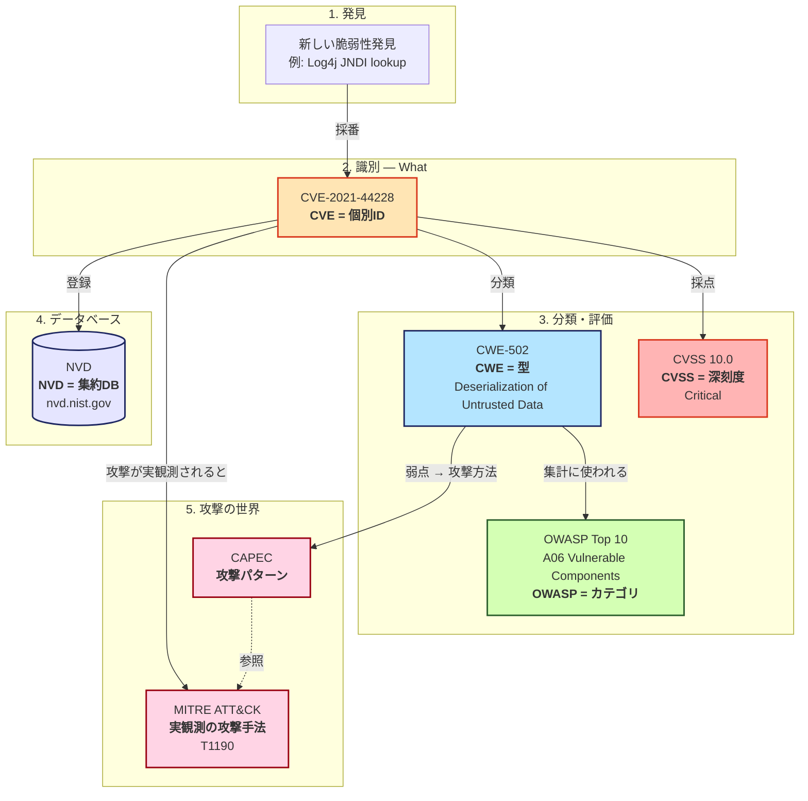
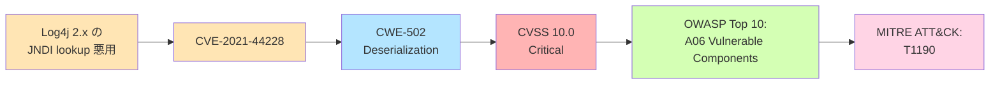

# セキュリティ識別子の体系（CVE / CWE / CVSS / OWASP Top 10 ほか）

> [!summary]
> CVE / CWE / CVSS / OWASP Top 10 / MITRE ATT&CK / CAPEC / NVD は **それぞれ違う質問に答える** 識別子・分類体系。混乱の元は「全部脆弱性関連」と一緒くたにすること。各々が答える質問（What / Why / How bad / Where）で分けると一気に整理できる。

## 5W1H で整理（一覧）

| 識別子 / 分類 | 答える質問 | スコープ | 具体例 |
|---|---|---|---|
| **CVE** | **What** が起きた？ | 個別の脆弱性 | CVE-2021-44228（Log4Shell） |
| **CWE** | **Why**（どんな型）の弱点？ | 脆弱性の型・パターン | CWE-89（SQL Injection） |
| **CVSS** | **How bad** どれくらい危険？ | 深刻度スコア | 10.0 Critical |
| **OWASP Top 10** | **Where** どこに気をつける？ | Webアプリのカテゴリ | A03 Injection |
| **MITRE ATT&CK** | **How attacked** 実際どう攻めた？ | 実観測の攻撃手法 | T1190 Exploit Public-Facing App |
| **CAPEC** | **How to attack** 攻撃パターン | 抽象的な攻撃の型 | CAPEC-242 Code Injection |
| **NVD** | **Where stored** どこに集約？ | DB / 検索基盤 | nvd.nist.gov |

## 全体関係図（Mermaid）

> [!tip] 直感的な対応
> 「CVE = 罪状の事件番号 / CWE = 罪の種類 / CVSS = 量刑 / OWASP Top 10 = よくある罪のランキング」みたいな関係。**1 つの事件（CVE）に対して、複数のラベル（CWE/CVSS/OWASP）が付く**。

## 各概念の詳細（クイック解説）

### CVE（Common Vulnerabilities and Exposures）

- **役割**：個々に公表された脆弱性に世界共通で振られる固有ID
- **形式**：`CVE-YYYY-NNNN`（年-連番）
- **管理**：MITRE Corporation（CVE Numbering Authorities が採番）
- **詳細**：[[CVE]]

### CWE（Common Weakness Enumeration）

- **役割**：脆弱性の「**型**」のカタログ。一般的な弱点パターンを番号付けしたもの
- **形式**：`CWE-NNN`（例：CWE-79 XSS、CWE-89 SQLi、CWE-22 Path Traversal）
- **管理**：MITRE
- **使い所**：コード解析ツール、教育、CVE の分類タグ
- **CWE Top 25**：「最も危険な脆弱性タイプ TOP 25」が有名
- **詳細**：[[CWE]]（未作成）

### CVSS（Common Vulnerability Scoring System）

- **役割**：脆弱性の **深刻度を 0〜10 でスコア化** する世界標準
- **現行**：v3.1（2019）/ v4.0（2023）
- **3つのメトリクス群**：Base / Temporal / Environmental
- **重要な誤解**：CVSSは **深刻度の指標であって、リスクの指標ではない**。Critical でも自社で使ってない機能なら影響なし、Medium でも認証バイパスなら最優先になる
- **詳細**：[[CVSS]]

### OWASP Top 10

- **役割**：Webアプリで **頻発・致命的な脆弱性カテゴリ** のトップ10
- **現行**：2021年版（次版2025予定）
- **CVE/CWEとの関係**：OWASPは **CWE をいくつか束ねたカテゴリ**。例：A03 Injection は CWE-79（XSS）+ CWE-89（SQLi）+ CWE-77（Command Injection）等を内包
- **派生版**：API Security Top 10、Mobile Top 10、LLM Top 10
- **詳細**：[[OWASP Top 10]] / [[OWASP API Security Top 10]] / [[OWASP]]

### NVD（National Vulnerability Database）

- **役割**：CVE と CVSS スコアの集約データベース
- **管理**：NIST（米国立標準技術研究所）
- **使う時**：CVE-XXXX を見つけたら NVD で詳細・スコア・参照リンクを確認
- **URL**：https://nvd.nist.gov/

### MITRE ATT&CK

- **役割**：**実観測された攻撃手法のカタログ**（脆弱性ではなく "攻撃の仕方"）
- **階層**：Tactic（戦術）→ Technique（技法）→ Procedure（手順）
- **使い所**：SOC、Red Team、Threat Hunting、Detection エンジニアリング
- **詳細**：[[MITRE ATT&CK]]（未作成）

### CAPEC（Common Attack Pattern Enumeration and Classification）

- **役割**：**抽象的な攻撃パターン** のカタログ
- **CWE との関係**：「弱点（CWE）」を「どう突くか（CAPEC）」を結ぶ
- **MITRE ATT&CK との違い**：CAPEC = 抽象パターン、ATT&CK = 実観測の手法
- **管理**：MITRE

## 実例で繋ぐ：Log4Shell の場合

「**1つの脆弱性に、これら全ての識別子・分類が紐づく**」を実感する例：

| ステップ | 識別子 | 値 | 意味 |
|---|---|---|---|
| 1. 発見 | — | 2021年12月 Apache Log4j 2.x の JNDI lookup 悪用 | 「事件発生」 |
| 2. 採番 | **CVE** | CVE-2021-44228 | 個別ID付与 |
| 3. 分類 | **CWE** | CWE-502 Deserialization of Untrusted Data | 弱点の型 |
| 4. 採点 | **CVSS** | 10.0 Critical | 最高深刻度 |
| 5. 集約 | **NVD** | 上記すべてを記録 | 検索可能化 |
| 6. カテゴリ | **OWASP Top 10** | A06 Vulnerable and Outdated Components | Webアプリ視点 |
| 7. 攻撃観測 | **MITRE ATT&CK** | T1190 Exploit Public-Facing Application | 実攻撃手法 |

詳細は [[Log4Shell]] を参照。

## よくある混乱と対処

| 混乱パターン | 整理 |
|---|---|
| 「CVE と CWE どっち書けばいい？」 | **両方**書く。CVEは事件番号、CWEは型。両方ないと「何が起きたか・何の型か」が伝わらない |
| 「CVSS 10 だから絶対対応？」 | **No**。CVSSは深刻度、自社環境での影響度（リスク）は別途評価 |
| 「OWASP Top 10 の A03 と CWE-89 の違い？」 | OWASP Top 10 は **複数CWEを束ねたカテゴリ**、CWE は個別の型。A03 Injection は CWE-79/89/77 等を内包 |
| 「MITRE ATT&CK は脆弱性？」 | **No**、攻撃手法のカタログ。脆弱性 ≠ 攻撃 |
| 「CAPEC と ATT&CK は同じ？」 | 違う。CAPEC = 抽象的攻撃パターン、ATT&CK = 実観測手法 |

## 関連MOC

- [[MOC Security]]
- [[MOC DevSecOps]]
- [[MOC Learning]]

## 関連ノート

- [[CVE]]
- [[CVSS]]
- [[CWE]]
- [[OWASP Top 10]]
- [[OWASP API Security Top 10]]
- [[OWASP]]
- [[セキュリティ標準とフレームワーク]]
- [[セキュリティ学習ロードマップ]]
- [[Log4Shell]]
- [[脅威モデリング]]
- [[MITRE ATT&CK]]
